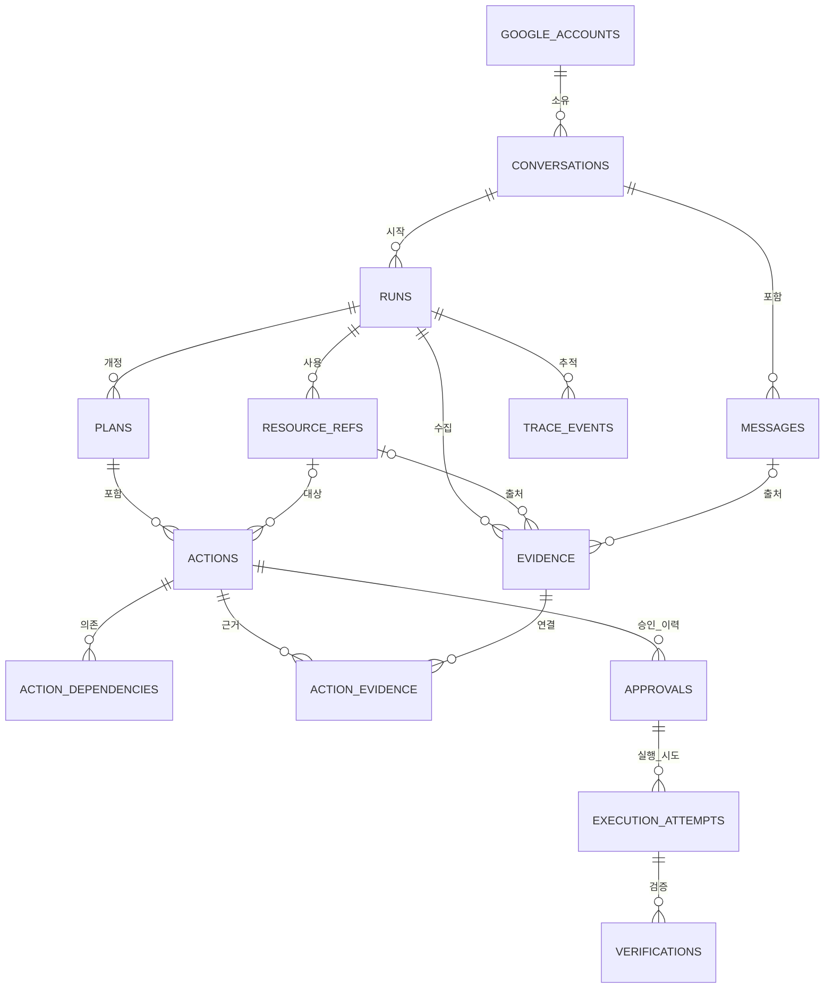

# 04. Google Work Agent 도메인 · 데이터베이스 설계서

> **문서 기준:** `01 PRD §1.1`의 Concern Owner 규칙을 따른다. 이 문서는 Domain 상태·영속 사실·DB 불변조건을 소유하며 현재 Canonical DB Schema v1.4와 상태 전이 계약 v1.4을 기준으로 한다.

## 0. 문서 정보

| 항목 | 내용 |
|---|---|
| 상태 | Draft v1.12 |
| 기준일 | 2026-08-09 |
| 대상 | P0 MVP |
| Database | SQLite |
| 저장 형태 | 하나의 제품 DB 파일 |
| Checkpoint | 같은 파일 내 LangGraph Library 관리 Table |
| Secret | SQLite 저장 금지 |

## 1. 목적과 범위

이 문서는 다음을 정의한다.

- Domain Aggregate, Entity, Value Object
- Table과 관계
- Run·Action 상태 전이
- Transaction과 동시성
- 승인·실행 멱등성
- Fetch Size, Batch, Disk I/O
- Google API Pagination과 로컬 Keyset Cursor
- DB·API N+1 방지
- Index와 Repository Query
- Migration·Backup·Restore·보존

LangGraph Checkpoint 내부 Schema, Tool별 JSON Schema, Google API 원본 Schema, Vector Index와 Experiment Result 저장소는 범위에서 제외한다.

## 2. 최종 결정

| ID | 결정 | 이유 |
|---|---|---|
| DB-001 | P0는 SQLite 파일 하나를 사용 | Domain과 Checkpoint를 함께 Backup·Restore하며 단일 사용자 부하에 충분하다. |
| DB-002 | Domain과 Checkpoint는 논리적으로 분리 | Checkpoint는 Workflow 재개, Domain은 승인·실행 사실의 기준점이다. |
| DB-003 | Google 목록과 Page Token은 React Client Session Cache에 둔다 | Google 전체 데이터를 로컬에 복제하지 않는다. |
| DB-004 | 실제 사용 Resource와 최소 Evidence만 저장 | 대화 복구·승인 근거를 유지하면서 원문 저장을 최소화한다. |
| DB-005 | 핵심 관계와 상태는 정규화한다 | Join, Constraint와 상태 전이를 DB에서 검증한다. |
| DB-006 | 가변 Arguments와 불변 Snapshot만 JSON으로 저장한다 | Tool별 구조 변화와 승인 당시 값을 보존한다. |
| DB-007 | 외부 호출과 DB Transaction을 분리한다 | Google API·LLM 호출 중 SQLite Write Lock을 유지하지 않는다. |
| DB-008 | 제한적 Optimistic Lock과 짧은 `BEGIN IMMEDIATE`를 사용한다 | 분산 Lock 없이 REST Retry·중복 클릭·브라우저 재연결·복합 작업 경쟁을 차단한다. |
| DB-009 | 로컬 Keyset Cursor와 Google Page Token을 분리한다 | 서로 다른 Pagination 계약을 혼용하지 않는다. |
| DB-010 | Aggregate 단위 Batch 조회를 사용한다 | N+1을 막되 거대한 Join의 Row 곱집합은 피한다. |

## 3. 저장 위치와 데이터 소유권

```text
%LOCALAPPDATA%/GoogleWorkAgent/
├─ data/
│  └─ google_work_agent.db
├─ backups/
│  ├─ pre-migration-<timestamp>.db
│  └─ manifest.json
├─ settings/
│  └─ app-settings.json
└─ logs/
   └─ sanitized-*.log
```

| 데이터 | 저장소 |
|---|---|
| Conversation·Run·Plan·Action | SQLite Domain Table |
| Approval·Execution·Verification | SQLite Domain Table |
| LangGraph State·Interrupt | 같은 SQLite 파일의 Library 관리 Table |
| Google Sidebar 목록·Page Token | React Client Session Cache |
| Agent 검색 중간 후보·전체 원문 | 현재 Run 메모리 |
| 실제 사용 Resource·Evidence excerpt | SQLite Domain Table |
| OAuth Token·API Key | OS Keyring 또는 Local Agent Process Memory |
| UI 비밀 아닌 설정 | `app-settings.json` |
| React Sidebar Page Cache | Browser Process Memory, 제품 DB 비저장 |
| API Command ID·Request ID | 요청 수명과 Trace Metadata, 필요할 때 Audit Metadata |
| SSE Cursor | UI Projection 재연결용, Domain 상태 기준점이 아님 |
| Experiment Raw Result | 제품 DB와 분리된 Artifact |

Backup Manifest는 DB가 열리지 않을 때도 복구 후보를 확인할 수 있도록 DB 외부에 둔다.

## 4. 도메인 경계와 Aggregate

### 4.1 Conversation Aggregate

**Aggregate Root:** `Conversation`

- `Conversation`
- `Message`
- `Run`

불변 조건:

- Conversation은 하나의 Google Account에 속한다.
- Conversation당 종료되지 않은 Run은 최대 하나다.
- Message는 Conversation에 속하며 선택적으로 관련 Run을 참조한다.

### 4.2 Planning Aggregate

**Aggregate Root:** `Plan`

- `Plan`
- `Action`
- `ActionDependency`
- `ActionEvidence`

불변 조건:

- Plan Revision은 같은 Run에서 1부터 증가한다.
- Action Position은 Plan에서 유일하다.
- 실행 가능한 Action은 최소 하나의 Evidence를 가져야 한다.
- Dependency는 자기 자신을 참조할 수 없으며 DAG Cycle은 Domain Validator가 차단한다.

### 4.3 Execution Aggregate

**Aggregate Root:** `Action`

- `Approval`
- `ExecutionAttempt`
- `Verification`

불변 조건:

- Action 수정과 상태 전이는 `version`을 증가시킨다.
- Action당 `ACTIVE` Approval은 최대 하나다.
- Approval당 `CLAIMED`, `EXECUTING`, `UNKNOWN_RESULT` Attempt는 최대 하나다.
- Approval Snapshot과 현재 Action이 일치할 때만 실행권을 획득한다.
- 성공한 Write Attempt는 GET Verification으로 종료한다.

### 4.4 Evidence Aggregate

- `ResourceRef`
- `Evidence`

`ResourceRef`는 Google 원본 복제본이 아니라 Run에서 실제로 사용한 최소 참조다. `Evidence`는 Action 판단과 승인 설명에 필요한 최소 excerpt만 저장한다.

### 4.5 Observability

- `TraceEvent`: 실행·성능·장애 진단, Run과 함께 30일 보존
- `AuditEvent`: 승인·수정·거절·차단·실행·검증의 안전 기록, 90일 보존

Audit는 더 긴 보존을 위해 Domain Foreign Key를 사용하지 않고 최소 식별자만 저장한다.

## 5. Entity와 Value Object

| 분류 | 구성 |
|---|---|
| Entity | GoogleAccount, Conversation, Message, Run, Plan, Action, ResourceRef, Evidence, Approval, ExecutionAttempt, Verification |
| Join Entity | ActionDependency, ActionEvidence |
| Append Event | TraceEvent, AuditEvent |
| Value Object | CanonicalArguments, ArgumentsHash, SourceSnapshot, IdempotencyKey, RecoveryFingerprint, Cursor, RunBudget, VerificationDiff |

ID와 시간 규칙:

- Domain ID는 Application이 생성한 UUID 문자열을 사용한다.
- `trace_events`, `audit_events`만 순차 Cursor 효율을 위해 `INTEGER PRIMARY KEY`를 사용한다.
- 모든 시간은 UTC Epoch Millisecond `INTEGER`로 저장한다.
- Timezone 변환은 Application·UI에서 수행한다.

## 6. ERD



## 7. P0 Table 목록

| 영역 | Table | 역할 |
|---|---|---|
| Migration | `schema_migrations` | Version, Checksum, 적용 시각 |
| Command | `command_receipts` | 상태 변경 Command 중복 방지와 기존 결과 복원 |
| Account | `google_accounts` | Google 계정 식별, Credential 비저장 |
| Conversation | `conversations` | 대화 Thread |
| Conversation | `messages` | 사용자·Agent Text |
| Run | `runs` | Agent 실행과 Runtime·Budget |
| Planning | `plans` | Plan Revision |
| Planning | `actions` | Tool Action 현재 상태 |
| Planning | `action_dependencies` | Action DAG Edge |
| Context | `resource_refs` | 사용된 Google Resource 최소 참조 |
| Context | `evidence` | 최소 근거 excerpt |
| Context | `action_evidence` | Action·Evidence 다대다 관계 |
| Approval | `approvals` | 승인 Revision·Snapshot·Hash |
| Execution | `execution_attempts` | Retry와 `UNKNOWN_RESULT` |
| Verification | `verifications` | GET expected·actual·diff |
| Observability | `trace_events` | Run Trace |
| Audit | `audit_events` | Append-only 안전 기록 |

LangGraph Checkpoint Table은 Library Adapter가 소유하며 Domain Migration이 직접 생성·변경하지 않는다.

## 8. 핵심 Table 설계

### 8.1 `runs`

- `entry_mode`: `AGENT_SEARCH` 또는 `RESOURCE_SELECTED`
- `status`: Workflow 현재 단계
- `langgraph_thread_id`: Checkpoint 재개 Key
- `budget_json`: 호출 수·Token·Retry·시간 상한 Snapshot
- `version`: 낙관적 상태 전이
- `finished_at_ms IS NULL`: Open Run

Partial UNIQUE Index로 Conversation당 Open Run 하나를 보장한다.

### 8.2 `plans`와 `actions`

Plan 수정은 기존 Revision을 덮어쓰지 않고 새 `revision_no`를 추가한다.

- 현재 Tool Arguments: `arguments_json`
- Canonical SHA-256: `arguments_hash`
- 실행 후 기대값: `expected_json`
- 중복·충돌·Evidence 기반 업무 마감·일정 위험: `risk_json`
- 동시 수정 제어: `version`
- 효과 유형: `effect_type`
- 승인 요구: `approval_requirement`
- 정상 검증: `verification_policy`
- 응답 유실 복구: `recovery_policy`

P0 고정 매핑:

| Effect | 승인 | 정상 검증 | Recovery |
|---|---|---|---|
| READ | NONE | NONE | NONE |
| CREATE | REQUIRED | GET_COMPARE | RESOURCE_SEARCH |
| UPDATE | REQUIRED | GET_COMPARE | GET_TARGET |
| SEND | REQUIRED | SENT_LOOKUP | MESSAGE_SEARCH |
| DELETE | REQUIRED | GET_ABSENT | GET_TARGET |

`SEND`는 Gmail 실제 전송, `DELETE`는 P0에서 Google Task 삭제와 Calendar Event 삭제에 사용한다. Task 완료와 Calendar 참석자 변경은 `UPDATE`다. Gmail Message·Thread 원문 삭제와 반복 Event 전체 일괄 수정은 Tool Allowlist에서 금지한다. 분석은 LangGraph Node와 Trace이며 실행 Action으로 저장하지 않는다.

Tool Registry가 정책의 원본이며 Plan 생성 시 값을 Action Row에 Snapshot한다.

Action 전체 Revision Table은 P0에서 만들지 않는다. 승인 당시 불변값은 Approval Snapshot으로, 변경 사실은 Audit로 보존한다.

### 8.3 `resource_refs`와 `evidence`

- Google 전체 원문과 Sidebar Cache는 저장하지 않는다.
- 동일 Run·Source·Resource Type·Resource ID는 한 번만 저장한다.
- FreeBusy 전체 응답은 Resource가 아니므로 저장하지 않고 필요한 결과만 Derived Evidence로 보존한다.
- `version_token`은 Gmail·Tasks·Calendar Adapter가 ETag·updated·history 값을 Source별로 정규화한다.

### 8.4 `approvals`

Approval은 Action 현재값과 분리된 승인 이력이다.

| Column | 역할 |
|---|---|
| `approval_no` | Action 내 승인 순번 |
| `action_version` | 승인된 Action Version |
| `status` | ACTIVE·EXPIRED·CONSUMED·REVOKED |
| `arguments_snapshot_json` | 승인 당시 Arguments |
| `source_snapshot_json` | Resource ID·Version Token 목록 |
| `idempotency_key` | 한 Approval 실행 문맥 |
| `recovery_fingerprint` | 응답 유실 시 기존 결과 탐색 |
| `approved_by_account_id` | 승인한 Google Account ID |
| `approved_by_display` | 승인 시점 표시 이름 Snapshot |

같은 Action Version도 만료 후 다시 승인할 수 있으므로 `(action_id, action_version)` UNIQUE는 사용하지 않는다. 대신 Action당 ACTIVE Approval 하나만 허용한다.

### 8.5 `execution_attempts`와 `verifications`

- P0 Write Approval 하나에는 실제 Google Write ExecutionAttempt를 최대 하나만 생성한다.
- `FAILED` 재시도는 기존 Approval을 재사용하지 않고 Action을 `MODIFIED`로 전환한 뒤 새 Approval·새 Idempotency Key·새 ExecutionAttempt를 만든다.
- `attempt_no`는 Approval 내부 순번이며 P0의 새 Approval에서 `1`로 시작한다. 재시도 이력의 전역 순서는 `approval_no`와 ExecutionAttempt ID로 추적한다.
- Approval에 실행 중·결과 불명 Attempt는 동시에 하나만 존재한다.
- `UNKNOWN_RESULT` 해결 전 새 Write Attempt를 만들지 않는다.
- 성공 Attempt는 하나 이상의 Verification을 가진다.

## 9. 상태 전이

### 9.1 Run

```text
CREATED
→ ANALYZING
→ RETRIEVING
→ WAITING_CONFIRMATION | PLANNING
→ WAITING_APPROVAL
→ EXECUTING
→ VERIFYING
→ COMPLETED
```

예외 흐름:

```text
CANCEL_REQUESTED → CANCELLED
REAUTH_REQUIRED → LangGraph Checkpoint의 안전한 Node에서 재개
RECOVERY_REQUIRED → VERIFYING | PLANNING | COMPLETED | FAILED | CANCELLED
Policy 위반 → BLOCKED
기술적 복구 불가 → FAILED
```

### 9.2 Action

```text
PROPOSED → MODIFIED | APPROVED | REJECTED | BLOCKED | CANCELLED
MODIFIED → APPROVED | REJECTED | BLOCKED | CANCELLED
APPROVED → EXPIRED | EXECUTING | CANCELLED
EXPIRED → MODIFIED | CANCELLED
EXECUTING → EXECUTED | UNKNOWN_RESULT | FAILED
UNKNOWN_RESULT → EXECUTED | FAILED
EXECUTED → VERIFIED | MISMATCH
선행 Action 실패 → DEPENDENCY_BLOCKED
```

상태 전이는 Repository Method와 조건부 UPDATE로 제한한다.

`resume_from_status` Column은 추가하지 않는다. 복귀 위치는 LangGraph Checkpoint가 기준이고 `REAUTH_REQUIRED`는 사용자에게 노출되는 Domain 상태다. Checkpoint가 없거나 손상된 경우 이전 상태를 추정하지 않고 `RECOVERY_REQUIRED`로 전환한다.

### 9.3 취소 상태 계약

이 절은 Domain 상태 전이 계약 v1.4의 취소 규칙을 소유한다. Action `CANCELLED` 추가는 Domain DB Schema v1.4 Migration 대상이다.

Run 취소는 `RequestCancel`과 `FinalizeCancellation`이 소유하며, 개별 Action을 임의 상태로 덮어쓰지 않는다.

- `RequestCancel`은 모든 비Terminal Run에서 허용하되 `command_id` 중복 판정과 `expected_version` 검증을 Approval·Plan·Action 변경보다 먼저 수행한다. Version Conflict 또는 같은 `command_id`의 다른 Hash Replay에서는 Domain 변경이 0건이어야 한다.
- 취소 요청이 수락되면 Run은 `CANCEL_REQUESTED`가 되고 이후 새 Action Claim과 새 Google Write를 시작하지 않는다.
- Plan이 아직 없거나 LLM·Retrieval·Confirmation 단계이면 Run만 `CANCEL_REQUESTED → CANCELLED`로 종료한다.
- 미실행 Action `PROPOSED | MODIFIED | APPROVED | EXPIRED`는 내부 `CancelPendingAction` Command로 `CANCELLED` 처리한다. ACTIVE Approval이 있으면 같은 Transaction에서 `REVOKED`로 전환한다. ExecutionAttempt·Verification은 새로 만들지 않는다.
- `EXECUTING`은 결과가 확정될 때까지 상태를 보존한다. 취소 요청 자체가 외부 Write를 중단하거나 실패로 간주하지 않는다.
- `EXECUTED`는 반드시 Effect별 Verification을 끝낸 뒤 취소를 마무리한다.
- `UNKNOWN_RESULT`가 하나라도 남아 있으면 Run을 `RECOVERY_REQUIRED`로 전환하며 blind resend를 금지한다. 결과 확정 후 기존 cancel intent를 이어서 처리한다.
- `VERIFIED | MISMATCH | FAILED | REJECTED | BLOCKED | DEPENDENCY_BLOCKED`는 이미 확정된 사실이므로 취소 과정에서 다른 상태로 덮어쓰지 않는다.
- 모든 in-flight 결과가 확정되면 Plan은 `CANCELLED`, Run은 `CANCELLED`가 된다. 이미 성공한 Write가 있으면 Projection 결과 분류는 `PARTIAL`이며 Google 상태를 Rollback하지 않는다.

### 9.4 Verification MISMATCH Recovery 계약

`StoreVerification`이 핵심 필드 불일치를 확정하면 Verification을 append-only로 저장하고 Action을 `MISMATCH`, Run을 `RECOVERY_REQUIRED`로 전환한다. `MISMATCH` Action은 terminal·immutable이다.

`ResolveRecovery`는 Recovery reason에 맞는 typed resolution만 허용한다.

- `ACCEPT_PARTIAL`: 기존 `MISMATCH`와 실제 Google 상태를 보존하고 미실행 Action을 `CANCELLED`로 처리한다. Plan 결과를 확정하고 Run은 `COMPLETED`, 결과 분류는 `PARTIAL`로 종료한다.
- `CREATE_CORRECTIVE_PLAN`: 실제 Google 상태를 최신 Source Snapshot으로 재조회하고 Run을 `PLANNING`으로 전환해 같은 Run의 새 Plan Revision을 만든다. 기존 MISMATCH Action·Approval·Attempt·Verification은 재사용하지 않는다. 새 Write는 Domain Validation → 새 Approval → 새 Claim → 새 Attempt를 거친다.

일반 사용자 취소는 Recovery resolution이 아니라 `RequestCancel`을 사용한다. `ResolveRecovery`가 기존 `MISMATCH` Action을 `EXECUTING`으로 되돌리거나 자동 수정·자동 Rollback을 수행하는 경로는 금지한다.

## 9-A. Local API와 Domain Store 경계

- FastAPI Route는 SQL을 실행하지 않고 Repository Port를 구현하지 않는다.
- Route는 Local Session과 Pydantic Schema를 검증한 뒤 Application Command를 호출한다.
- React의 `command_id`는 네트워크 중복 제출을 식별하지만 Google Write 멱등성의 최종 Key는 Approval의 `idempotency_key`다.
- SSE Event Cursor와 UI Projection Version은 Domain Table 상태를 대체하지 않는다.
- REST Timeout, Browser Refresh, Event 누락 후에는 Run·Action Snapshot을 Domain Store에서 다시 조회한다.
- Canonical Schema v1.4는 상태 변경 Command의 영속 멱등성을 위해 `command_receipts` Table을 두며 Action `CANCELLED`를 허용한다. Request ID와 UI Event 정보는 Trace Metadata이며 `command_id`만 Receipt의 영속 Key로 사용한다.

## 10. Transaction 경계

### 10.1 Run 시작

REST `StartRun` Command의 Local Session·Schema 검증은 Transaction 밖에서 끝낸다.

```text
BEGIN IMMEDIATE
→ Open Run 확인
→ Run INSERT
→ User Message INSERT
→ Conversation updated_at 갱신
→ COMMIT
```

### 10.2 Plan Aggregate 저장

```text
BEGIN IMMEDIATE
→ Plan INSERT
→ Action Batch INSERT
→ Dependency Batch INSERT
→ ResourceRef·Evidence Batch INSERT
→ ActionEvidence Batch INSERT
→ Run WAITING_APPROVAL
→ COMMIT
```

한 Row마다 Commit하지 않는다.

### 10.3 승인

```text
BEGIN IMMEDIATE
→ Action status·version·arguments_hash 확인
→ Source 최신 Snapshot 확인
→ 기존 ACTIVE Approval 만료·취소
→ Approval INSERT
→ Action APPROVED + version 증가
→ Audit INSERT
→ COMMIT
```

### 10.4 실행권 Claim

```text
BEGIN IMMEDIATE
→ Action APPROVED·version 조건부 UPDATE
→ ACTIVE Approval CONSUMED
→ ExecutionAttempt CLAIMED INSERT
→ Audit INSERT
→ COMMIT
```

변경 Row가 정확히 하나일 때만 COMMIT 이후 MCP Write를 호출한다.

### 10.5 외부 Write와 결과

```text
Google API Write
→ DB Transaction 없음

BEGIN IMMEDIATE
→ Result ResourceRef INSERT
→ Attempt SUCCEEDED 또는 UNKNOWN_RESULT
→ Action EXECUTED 또는 UNKNOWN_RESULT
→ Audit INSERT
→ COMMIT
```

### 10.6 GET Verification

```text
Google GET
→ DB Transaction 없음

BEGIN IMMEDIATE
→ Verification INSERT
→ Action VERIFIED 또는 MISMATCH
→ Dependency와 Run 상태 재계산
→ Audit INSERT
→ COMMIT
```

## 11. 동시성과 Lock

| 대상 | 전략 |
|---|---|
| Run | `version` 낙관적 Lock + Open Run Partial UNIQUE |
| Action | `version` 낙관적 Lock + `changed_rows = 1` |
| ExecutionAttempt | `version` 낙관적 Lock + Active Attempt Partial UNIQUE |
| Plan | Revision Append |
| Approval | 승인 이력 Insert + ACTIVE 하나 Partial UNIQUE |
| Verification·Audit | Append-only |
| Migration·Restore·Purge | 짧은 전용 `BEGIN IMMEDIATE` |

사용하지 않는 방식:

- Redis·분산 Lock
- 장시간 비관적 Row Lock
- Google API 호출 중 SQLite Lock
- Python Lock만으로 정합성 보장

`WriteCoordinator`는 같은 Process의 쓰기 순서를 보조한다. 최종 정합성은 DB UNIQUE·CHECK·Foreign Key·version 조건이 보장한다.

동일 Run 관계는 SQLite FK만으로 충분하지 않으므로 `save_plan_aggregate()`의 Domain Validator가 다음을 확인한다.

```text
Action.plan.run_id
= Action.target_resource_ref.run_id
= Evidence.run_id
= ResourceRef.run_id
```

USER_MESSAGE Evidence는 Run ID가 아니라 Conversation을 비교한다.

```text
Evidence.run.conversation_id
= Message.conversation_id
```

같은 Conversation의 과거 Message를 현재 Run 근거로 사용하는 것은 허용한다.

## 12. 멱등성

### 12.1 Idempotency Key

Approval 생성 시 다음 값을 Canonical 형태로 결합해 SHA-256을 생성한다.

```text
account_id
approval_id
action_id
action_version
tool_name
canonical_arguments_hash
policy_version
tool_schema_version
```

P0에서는 FAILED Write를 같은 Approval로 Retry하지 않는다. 새 Approval은 `approval_id`가 달라지므로 새 Idempotency Key를 생성한다. 기존 Key는 복구 조회와 감사에만 사용한다.

### 12.2 Recovery Fingerprint

Google API가 모든 Write에서 공통 Idempotency Header를 제공한다고 가정하지 않는다. 응답 유실 시 다음 정규화 값을 Hash해 기존 결과 후보를 찾는다.

```text
Tool 유형
Google 계정
대상 Thread·Task List·Calendar
정규화된 제목
핵심 시간·기한
수신자 집합
Arguments Hash 일부
```

### 12.3 보장 범위

- REST Command Retry·중복 클릭·브라우저 새로고침·앱 재시작의 동일 Action 중복 실행 차단
- `UNKNOWN_RESULT` 확인 전 재실행 차단
- 서로 다른 Action으로 생성된 의미상 중복은 중복·충돌 Validator가 처리

## 13. Fetch Size, Batch와 Disk I/O

Fetch Size와 Disk Write를 구분한다.

| 항목 | 제어 대상 |
|---|---|
| Cursor Fetch Size | SELECT 결과를 Python으로 전달하는 Row 묶음 |
| Google Page Size | 목록 API가 반환하는 Resource 수 |
| Write Batch Size | 한 Transaction에서 저장하는 Row 수 |
| SQLite Page Write | WAL·Transaction·Commit·DB Page와 Cache 영향 |

SELECT Fetch Size를 키워 Disk Write를 줄인다고 정의하지 않는다. Disk I/O는 Row별 Commit을 금지하고 Use Case 단위 Batch Write로 줄인다.

P0 초기값:

| 경로 | 초기값 |
|---|---:|
| Google Sidebar 목록 | 10개 |
| Conversation·Message Page | 20개 |
| 내부 ID Batch Query | 최대 50개 |
| Plan·Action·Evidence Batch Write | 최대 50 Row |
| Trace·Audit Export Fetch | 200 Row |
| Agent 상세 Resource | Run Budget Config 상한 |

## 14. Pagination과 API 조회

### 14.1 Google Source

Google API가 반환하는 Opaque Page Token을 사용한다.

```text
목록 API
→ items + nextPageToken
→ React Client Session Cache
→ 다음 페이지에 pageToken 사용
```

### 14.2 Local DB

Conversation·Message·Run·Audit은 `(timestamp_ms, id)` Keyset Cursor를 사용한다.

```sql
SELECT id, title, updated_at_ms
FROM conversations
WHERE account_id = :account_id
  AND (
       updated_at_ms < :cursor_time
       OR (updated_at_ms = :cursor_time AND id < :cursor_id)
  )
ORDER BY updated_at_ms DESC, id DESC
LIMIT :limit;
```

Cursor는 Version·Time·ID JSON을 URL-safe Base64로 인코딩하며 DB에 저장하지 않는다.

### 14.3 복합 Agent 검색

```text
요청 구조화
→ 첫 목록 페이지
→ Metadata 후보 축소
→ 부족할 때만 다음 페이지
→ 필요한 Resource만 상세 조회
```

전체 페이지와 전체 상세를 미리 내려받지 않는다.

## 15. N+1 방지

### 15.1 DB

Python·SQLite에서는 JPA Fetch Join 대신 SQL JOIN, CTE, `WHERE id IN (...)`, 고정 개수 Batch Query를 사용한다.

| Plan Bundle 조회 | 최대 SQL 수 |
|---|---:|
| Plan + Actions | 1 |
| Dependencies | 1 |
| Evidence + ActionEvidence | 1 |
| Approval + 최신 Attempt | 1 |
| Verification | 1 |
| 전체 Bundle | 최대 5 |

Action×Evidence×Attempt×Verification을 한 JOIN으로 합쳐 Row 곱집합을 만들지 않는다.

### 15.2 Google API

```text
Sidebar 목록 1회
→ Metadata 표시
→ 항목별 상세 자동 조회 금지
→ 클릭·선택한 Resource만 상세 조회
```

복수 선택은 Application에서 Resource를 Source별로 그룹화한 뒤 `get_gmail_threads`, `get_tasks`, `get_calendar_events` 중 해당 Batch Read Port를 Source당 한 번 호출한다. Google 서비스가 개별 상세 Endpoint만 제공하면 MCP 내부 HTTP 요청은 여러 번일 수 있으나 다음을 적용한다.

- Resource ID 중복 제거
- 제한된 동시성
- 동일 Run 메모리 재사용
- 후보 수 상한
- 실패 항목 개별 반환

## 16. Repository Port

```text
load_conversation_page(account_id, cursor, limit)
load_message_page(conversation_id, cursor, limit)
load_run_overview(run_id)
load_plan_bundle(plan_id)
load_recovery_candidates(limit)
save_plan_aggregate(plan_bundle)
approve_action(command)
claim_action_execution(action_id, expected_version)
save_execution_result(attempt_id, expected_version, result)
save_verification_bundle(verification)
purge_expired_data(cutoff)
```

Google MCP 조회 Port:

```text
list_gmail(query, page_token, page_size)
get_gmail_threads(thread_ids)
list_tasks(filter, page_token, page_size)
get_tasks(task_ids)
list_calendar_events(filter, page_token, page_size)
get_calendar_events(event_ids)
get_freebusy(calendars, time_range)
```

Port 이름과 MCP Tool 매핑은 `07. Tool·MCP·내부 인터페이스 명세서`를 기준으로 한다.

## 17. Index 원칙

- 실제 `WHERE`, `JOIN`, `ORDER BY`와 Query Plan을 기준으로 생성한다.
- Conversation·Message·Run·Audit는 Keyset 정렬 복합 Index를 가진다.
- Open Run, ACTIVE Approval, Active Attempt는 Partial UNIQUE Index를 가진다.
- Recovery 상태는 Partial Index로 조회한다.
- Dependency 역방향, Evidence Origin, Join Table 역방향 Index를 둔다.
- 사용되지 않는 Column과 Index를 미리 대량 생성하지 않는다.

## 18. SQLite Runtime Config

```text
foreign_keys = ON
journal_mode = WAL
synchronous = FULL
busy_timeout = 5000ms
```

- 모든 Connection은 하나의 초기화 함수를 사용한다.
- `SQLITE_BUSY`는 5초 대기 후 상위 Use Case에서 최대 한 번만 재시도한다.
- 승인·실행권 Claim Commit 유실은 중복 Google Write 위험이 있으므로 P0 기본은 `FULL`이다.
- 실제 성능 측정 없이 `NORMAL`로 낮추지 않는다.

## 19. Migration·Backup·Restore

### 19.1 Migration

1. App Schema Version과 DB Version 비교
2. Migration 필요 시 SQLite Backup API로 사전 Backup
3. Migration별 Transaction 실행
4. `schema_migrations`에 Version·Checksum 기록
5. `PRAGMA quick_check`
6. `PRAGMA foreign_key_check`
7. 실패 시 Safe Mode

SQLAlchemy·Alembic은 P0 고정 기술로 강제하지 않는다. 명시적 SQL Migration과 Checksum을 기준으로 한다.

### 19.2 Backup

- Migration 전 자동 Backup
- 사용자 수동 Backup
- Backup SHA-256·App Version·Schema Version을 외부 Manifest에 기록
- CI Restore Test
- P0에는 백그라운드 정기 Backup Scheduler를 추가하지 않는다.

### 19.3 Restore

1. Domain·Google Write 차단
2. 현재 DB를 별도 이름으로 보존
3. 사용자가 Backup 선택
4. 새 파일로 복원
5. Schema Version·`quick_check`·`foreign_key_check`
6. 통과 시 정상 모드

## 20. 보존과 삭제

| 대상 | 기본 보존 |
|---|---|
| Run·Plan·Action·ResourceRef·Evidence·Trace | 30일 |
| LangGraph Checkpoint | Run과 함께 30일 |
| Audit | 90일 |
| Conversation·Message | 사용자 삭제 시까지 |
| Google Sidebar Cache | 세션 종료 시 |
| Secret | Keyring, 연결 해제 시 삭제 |

모든 Table에 `deleted_at`을 일괄 추가하지 않는다. Conversation 삭제 시 Message와 하위 Domain 데이터는 실제 삭제하며 Audit에는 업무 원문 없이 최소 ID만 남긴다.

## 21. P0 보류

- SQLCipher·Column Encryption
- Domain DB와 Checkpoint DB 물리 분리
- Vector Index·Embedding Cache
- Local Full-text Search
- Remote Sync·Multi-user Tenant
- Distributed Lock
- Read Replica
- 대규모 Archive·자동 Vacuum 고도화

## 22. 테스트 완료 조건

- Schema를 새 SQLite 파일에 적용할 수 있다.
- `quick_check = ok`, Foreign Key 위반은 0건이다.
- Conversation당 Open Run 두 개 생성이 차단된다.
- Action당 ACTIVE Approval 두 개 생성이 차단된다.
- Approval당 Active Attempt 두 개 생성이 차단된다.
- 동일 Action 실행권 Claim 경쟁에서 하나만 성공한다.
- 동일 `command_id` 또는 같은 expected version으로 중복 제출된 승인·수정 Command가 한 번만 적용된다.
- SSE Event 재전달과 Browser Snapshot 재조회가 Domain Row를 변경하지 않는다.
- 만료된 Approval 이후 같은 Action Version 재승인은 허용된다.
- `UNKNOWN_RESULT` 해결 전 새 Attempt가 차단된다.
- Plan Bundle 조회가 Query Budget을 넘지 않는다.
- Google 목록 20개 조회 후 20개 상세 자동 호출이 발생하지 않는다.
- Migration 실패 시 원본 DB와 Backup이 보존되고 Safe Mode로 전환한다.

## 23. Schema 파일

전체 DDL은 다음 파일을 기준으로 한다.

- `0001_initial.sql`: Schema v1.2 baseline
- `0002_action_effect_send_delete.sql`: SEND·DELETE Effect를 추가해 Schema v1.3으로 승격
- Runtime E2E 계약의 Action `CANCELLED` 반영은 다음 Migration에서 Schema v1.4로 승격한다. Repository Migration 반영 전 Notion Canonical이 더 최신이다.
- Connection 초기화는 `foreign_keys=ON`, WAL, `synchronous=FULL`, `busy_timeout=5000`을 모든 Domain/Checkpointer Connection에 적용

## 24. DB 구현 필수 계약

### 24.1 Audit 주체와 조회

`audit_events`에 다음 Column을 추가한다.

- `account_id`
- `actor_id`
- `actor_display`

`actor_id`는 `account:<local_account_id>`, `system`, `agent`, `mcp`처럼 안정된 값으로 저장한다. Audit는 Run보다 오래 보존하므로 Account·Run·Action Foreign Key를 사용하지 않는다.

추가 Index:

```sql
CREATE INDEX ix_audit_events_run_created
    ON audit_events(run_id, created_at_ms, id)
    WHERE run_id IS NOT NULL;

CREATE INDEX ix_audit_events_action_created
    ON audit_events(action_id, created_at_ms, id)
    WHERE action_id IS NOT NULL;

CREATE INDEX ix_audit_events_account_created
    ON audit_events(account_id, created_at_ms, id)
    WHERE account_id IS NOT NULL;
```

### 24.2 저장 크기와 민감정보

크기는 UTF-8 Byte 기준으로 제한한다.

| 데이터 | 최대 |
|---|---:|
| Message content | 64 KiB |
| Evidence excerpt | 8 KiB |
| Resource metadata JSON | 32 KiB |
| Action arguments·expected | 각 64 KiB |
| Action risk JSON | 16 KiB |
| Approval arguments·source snapshot | 각 64 KiB |
| Execution metadata·error JSON | 각 32 KiB |
| Verification expected·actual·diff | 각 64 KiB |
| Trace·Audit metadata | 각 16 KiB |
| Run budget·Evidence locator | 각 16 KiB |

저장 금지 Key:

```text
access_token
refresh_token
api_key
authorization
cookie
set-cookie
client_secret
raw_headers
raw_email_body
full_thread_body
```

Message와 Evidence는 DB CHECK로 제한하고, JSON은 Application Validator와 Schema CHECK를 함께 적용한다.

### 24.3 Domain DB와 Checkpointer

Domain Repository와 LangGraph Checkpointer의 모든 Connection에 같은 초기화 설정을 적용한다.

```text
foreign_keys = ON
journal_mode = WAL
synchronous = FULL
busy_timeout = 5000ms
```

Migration·Backup·Restore 중에는 `MaintenanceGate`를 닫아 신규 Run, Domain Write와 Checkpointer Write를 모두 차단한다.

Restore 후 다음을 검사한다.

- Checkpoint는 있으나 Run·Action이 없는 상태
- Run·Action은 있으나 Checkpoint가 없는 상태
- Checkpoint Node와 Domain 상태가 충돌하는 상태

불일치 시 자동 추정하지 않고 `RECOVERY_REQUIRED`로 전환한다.

### 24.4 추가 테스트 완료 조건

- READ·CREATE·UPDATE·SEND·DELETE의 Effect별 고정 정책 조합 외 Action INSERT가 차단된다.
- Approval에 승인 계정과 표시 주체가 저장된다.
- Run·Action·Account Audit 조회가 전용 Index를 사용한다.
- 다른 Run의 ResourceRef·Evidence 연결이 Domain Validator에서 차단된다.
- 같은 Conversation의 과거 Message Evidence는 허용된다.
- Message·Evidence·JSON 크기 초과가 차단된다.
- 민감 Key가 저장 전에 제거 또는 차단된다.
- Checkpoint Write와 Action Claim 경쟁에서 Busy Loop가 발생하지 않는다.
- Migration·Restore 중 Checkpointer Write가 차단된다.
- Restore 후 Domain·Checkpoint가 함께 복구된다.
- 재인증 성공 시 Checkpoint에서 재개한다.
- Checkpoint 유실 시 `RECOVERY_REQUIRED`로 전환한다.


# 25. Domain 상태 전이 규칙

이 절은 SQLite Domain Store가 소유하는 영속 상태 전이 규칙을 정의한다. LangGraph Node·Edge·Interrupt·Checkpoint 상세는 `06. Agent · Workflow 설계서`가 담당하며, Workflow는 여기서 정의한 Domain Command만 호출한다.

## 25.1 책임 경계

```text
LangGraph Node
→ Application Command
→ Domain Transition Service
→ Repository 조건부 UPDATE
→ Audit Event
→ LangGraph 다음 Edge
```

- UI와 LangGraph Node는 `status`를 직접 수정하지 않는다.
- Domain Transition Service가 현재 상태, Version, Approval, Dependency, Policy, Source Snapshot을 검증한다.
- Repository는 허용된 전이만 조건부 UPDATE로 저장한다.
- 전이 성공은 영향 Row가 정확히 1개인지로 판단한다.
- Domain 상태는 업무 사실의 기준점이고 LangGraph Checkpoint는 재개 위치의 기준점이다.

## 25.2 공통 규칙

1. Mutable Aggregate 전이는 예상 `version`을 요구한다.
2. 성공한 전이는 `version + 1`로 갱신한다.
3. 동일 상태 반복 전이는 기본적으로 허용하지 않는다.
4. Terminal 상태는 일반 Command로 되돌리지 않는다.
5. 외부 API·LLM·MCP 호출 중 DB Transaction을 유지하지 않는다.
6. 함께 변경되는 Action·Approval·Attempt·Audit는 같은 짧은 Transaction에 저장한다.
7. 정책·Schema·승인 오류는 자동 재시도하지 않는다.
8. `SQLITE_BUSY`는 상위 Use Case에서 최대 1회만 재시도한다.

공통 Result Code:

```text
TRANSITION_APPLIED
STATE_CONFLICT
VERSION_CONFLICT
POLICY_BLOCKED
APPROVAL_REQUIRED
APPROVAL_EXPIRED
APPROVAL_INVALID
DEPENDENCY_BLOCKED
ACTIVE_ATTEMPT_EXISTS
SOURCE_CHANGED
CHECKPOINT_MISSING
RECOVERY_REQUIRED
```

## 25.3 Terminal 상태

| Aggregate | Terminal 상태 |
|---|---|
| Run | COMPLETED, CANCELLED, FAILED, BLOCKED |
| Plan | SUPERSEDED, CANCELLED, COMPLETED |
| Action | REJECTED, VERIFIED, FAILED, BLOCKED, DEPENDENCY_BLOCKED, MISMATCH, CANCELLED |
| Approval | EXPIRED, CONSUMED, REVOKED |
| ExecutionAttempt | SUCCEEDED, FAILED |
| Verification | VERIFIED, MISMATCH, NOT_FOUND, ERROR |

`UNKNOWN_RESULT`, `RECOVERY_REQUIRED`, `REAUTH_REQUIRED`는 Terminal이 아니다.

## 25.4 Run 상태 전이 매트릭스

| 현재 | Command·Event | Guard | 다음 | 주요 동시 변경 | Audit Event |
|---|---|---|---|---|---|
| CREATED | StartAnalysis | Open Run, Runtime 사용 가능 | ANALYZING | 시작 상태 기록 | RUN_ANALYSIS_STARTED |
| ANALYZING | BeginRetrieval | 구조화 요청 유효 | RETRIEVING | Retrieval Trace | RUN_RETRIEVAL_STARTED |
| ANALYZING | BlockRun | Policy 위반 | BLOCKED | `finished_at_ms` | RUN_BLOCKED |
| RETRIEVING | RequestConfirmation | 모호성 존재 | WAITING_CONFIRMATION | Checkpoint Interrupt | RUN_CONFIRMATION_REQUIRED |
| RETRIEVING | BeginPlanning | Context 충분 | PLANNING | Context 확정 | RUN_PLANNING_STARTED |
| WAITING_CONFIRMATION | SubmitConfirmation | 유효한 응답 | RETRIEVING 또는 PLANNING | Message 저장 | RUN_CONFIRMATION_RESOLVED |
| PLANNING | PublishPlan | Plan Aggregate 검증 성공 | WAITING_APPROVAL | Plan·Action Batch 저장 | RUN_WAITING_APPROVAL |
| WAITING_APPROVAL | BeginExecution | 승인 Action 존재 | EXECUTING | Plan ACTIVE | RUN_EXECUTION_STARTED |
| WAITING_APPROVAL | RequestCancel | 비Terminal·Version/Receipt 유효 | CANCEL_REQUESTED | 신규 Claim 차단 | RUN_CANCEL_REQUESTED |
| EXECUTING | BeginVerification | 검증 대상 존재 | VERIFYING | 없음 | RUN_VERIFICATION_STARTED |
| EXECUTING | RequestCancel | Write 진행 가능성 존재 | CANCEL_REQUESTED | 취소 요청 | RUN_CANCEL_REQUESTED |
| CANCEL_REQUESTED | FinalizeCancellation | 결과 확정 완료 | CANCELLED 또는 VERIFYING | 종료 또는 검증 대상 | RUN_CANCEL_FINALIZED |
| VERIFYING | CompleteRun | 모든 Action Terminal | COMPLETED | Plan COMPLETED, 종료 시각 | RUN_COMPLETED |
| VERIFYING | RequireRecovery | UNKNOWN_RESULT·Checkpoint 불일치 | RECOVERY_REQUIRED | Recovery 후보 | RUN_RECOVERY_REQUIRED |
| RECOVERY_REQUIRED | ResumeVerification | Recovery 결과 확보 | VERIFYING | Attempt·Resource 보정 | RUN_RECOVERY_RESOLVED |
| RECOVERY_REQUIRED | AcceptPartialRecovery | MISMATCH 실제 상태 수용 | COMPLETED | 미실행 Action CANCELLED, 결과 PARTIAL | RUN_RECOVERY_ACCEPTED_PARTIAL |
| RECOVERY_REQUIRED | CreateCorrectivePlan | MISMATCH 교정 작업 필요 | PLANNING | 최신 Source 재조회, 새 Plan Revision | RUN_RECOVERY_REPLAN |
| RECOVERY_REQUIRED | CancelRecovery | 사용자 명시 취소 | CANCELLED | 신규 Write 금지 | RUN_RECOVERY_CANCELLED |
| RECOVERY_REQUIRED | FailRecovery | 복구 불가 | FAILED | 종료 시각 | RUN_RECOVERY_FAILED |
| 진행 상태 | RequireReauth | Credential 만료 | REAUTH_REQUIRED | Checkpoint 저장 | RUN_REAUTH_REQUIRED |
| REAUTH_REQUIRED | ResumeAfterReauth | Credential 유효, Checkpoint 존재 | Checkpoint의 안전 상태 | Source 재조회 | RUN_REAUTH_RESUMED |
| REAUTH_REQUIRED | CheckpointMissing | Checkpoint 없음·손상 | RECOVERY_REQUIRED | 정합성 오류 | RUN_CHECKPOINT_MISSING |

`finished_at_ms`는 COMPLETED, CANCELLED, FAILED, BLOCKED에서만 설정한다.

## 25.5 Plan 상태 전이

### Action Modify 이후 Plan 재검토 Gate

- Persisted Write Plan은 `review_status`와 단조 증가하는 `review_version`을 가진다.
- 최초 저장되는 Plan은 기존 Planning→Review PASS를 통과했으므로 `PASSED`다.
- Action Modify와 같은 Transaction에서 Plan은 `REQUIRED`가 되고 `review_version`이 증가한다.
- `review_status != PASSED`인 동안 새 Approval 생성은 금지한다.
- 재검토 결과는 시작 시 읽은 `review_version`과 현재 값이 같을 때만 저장한다. Review 중 다른 Modify가 발생하면 오래된 결과는 적용하지 않는다.
- LLM Review는 DB Write Transaction 밖에서 실행하며, PASS도 최신 Domain Validation 이후에만 `PASSED`로 확정한다.
- `REVISE`/`RETRIEVE_MORE`는 기존 Plan을 `SUPERSEDED`로 닫고 Run을 `PLANNING`으로 되돌린 뒤, 새 Plan·Action·Evidence ID와 증가한 `revision_no`로 저장한다. 이전 Action과 Approval은 재사용하지 않는다.

| 현재 | Event | Guard | 다음 | 규칙 |
|---|---|---|---|---|
| DRAFT | RequestApproval | Action·Evidence·DAG 유효 | WAITING_APPROVAL | 기존 Revision 수정 금지 |
| DRAFT·WAITING_APPROVAL | Replan | 사용자 수정·Context 변경 | SUPERSEDED | 새 Revision DRAFT 추가 |
| WAITING_APPROVAL | ActivatePlan | 승인 Action 존재 | ACTIVE | 다른 Revision SUPERSEDED |
| DRAFT·WAITING_APPROVAL·ACTIVE | CancelPlan | 새 Write Claim 없음 | CANCELLED | 미실행 Action 차단 |
| ACTIVE | CompletePlan | 모든 Action Terminal | COMPLETED | 부분 실패 포함 가능 |

Plan COMPLETED는 모든 Action 성공이 아니라 모든 Action 결과 확정을 뜻한다.

## 25.6 Action 상태 전이

| 현재 | Command·Event | Guard | 다음 | 동시 변경 | Audit |
|---|---|---|---|---|---|
| PROPOSED | ModifyAction | 허용 필드·Schema·Policy 유효 | MODIFIED | Hash·Version 갱신, Approval REVOKED | ACTION_MODIFIED |
| PROPOSED·MODIFIED | ApproveAction | Write·Evidence·중복·충돌·Snapshot 유효 | APPROVED | Approval ACTIVE INSERT | ACTION_APPROVED |
| PROPOSED·MODIFIED·APPROVED | RejectAction | 사용자 거절·Version 일치 | REJECTED | ACTIVE Approval REVOKED, 종속 Action 재계산 | ACTION_REJECTED |
| PROPOSED·MODIFIED | BlockAction | 금지 Tool·Policy 위반 | BLOCKED | 종속 Action 차단 | ACTION_BLOCKED |
| APPROVED | ExpireApproval | 시간·Source·Policy·Schema 변경 | EXPIRED | Approval EXPIRED | ACTION_APPROVAL_EXPIRED |
| EXPIRED | RefreshExpiredAction | Version·최신 Source·Policy·Schema·중복·충돌 재검증 | MODIFIED | Hash·expected·risk 최신화, Version 증가 | ACTION_REFRESHED_AFTER_EXPIRY |
| APPROVED | ClaimExecution | Version·Hash·Approval·Dependency·Attempt 검사 | EXECUTING | Approval CONSUMED, Attempt CLAIMED | ACTION_EXECUTION_CLAIMED |
| EXECUTING | MarkWriteSucceeded | 응답·Resource ID 확보 | EXECUTED | Attempt SUCCEEDED, ResourceRef | ACTION_EXECUTED |
| EXECUTING | MarkUnknownResult | 전달 가능성 있으나 결과 불명 | UNKNOWN_RESULT | Attempt UNKNOWN_RESULT | ACTION_RESULT_UNKNOWN |
| EXECUTING | MarkExecutionFailed | Google 미변경 확실 | FAILED | Attempt FAILED | ACTION_EXECUTION_FAILED |
| UNKNOWN_RESULT | RecoverExistingResult | 기존 결과 확인 | EXECUTED | Attempt SUCCEEDED | ACTION_UNKNOWN_RECOVERED |
| UNKNOWN_RESULT | ResolveAsFailed | 미실행 확실 또는 복구 불가 | FAILED | Attempt FAILED | ACTION_UNKNOWN_FAILED |
| EXECUTED | RecordVerificationMatch | expected·actual 일치 | VERIFIED | Verification INSERT | ACTION_VERIFIED |
| EXECUTED | RecordVerificationMismatch | 핵심 필드 불일치 | MISMATCH | Verification INSERT | ACTION_VERIFICATION_MISMATCH |
| PROPOSED·MODIFIED·APPROVED·EXPIRED | CancelPendingAction | Run cancel 확정, 실행 미시작 | CANCELLED | ACTIVE Approval REVOKED, Attempt·Verification 생성 0 | ACTION_CANCELLED |
| PROPOSED·MODIFIED·APPROVED | BlockByDependency | 선행 Terminal 실패 | DEPENDENCY_BLOCKED | Approval REVOKED | ACTION_DEPENDENCY_BLOCKED |

### READ Action

P0 권장안:

- 사용자에게 표시·재개가 필요한 주요 READ만 Action으로 저장한다.
- 내부 보조 조회는 Trace Event로만 기록한다.
- 영속 READ Action은 Approval·ExecutionAttempt·Verification Row를 만들지 않는다.
- 조회 완료 사실은 Action 상태와 Trace Event로 기록한다.

```text
PROPOSED
→ ClaimReadAction
→ EXECUTING
→ CompleteReadAction
→ EXECUTED
→ FinalizeReadAction
→ VERIFIED
```

`ClaimReadAction` Guard:

- `effect_type = READ`
- `approval_requirement = NONE`
- `verification_policy = NONE`
- `recovery_policy = NONE`
- 현재 상태 `PROPOSED`
- 예상 Version 일치
- Tool Allowlist와 Input Schema 통과

원자적 Claim:

```text
Action PROPOSED → EXECUTING
Action version + 1
Audit ACTION_READ_CLAIMED
```

READ의 `VERIFIED`는 조회 결과가 정상 반환되고 Output Schema Validation을 통과해 사용자 응답 또는 후속 판단에 반영됐다는 뜻이다. Google Write의 GET_COMPARE 검증을 의미하지 않으며 Write Verification 통계에 포함하지 않는다.

READ 실패 처리:

- API 호출 전 실패: `EXECUTING → FAILED`
- 일부 Source만 실패하고 의미 있는 결과가 존재: `EXECUTED → VERIFIED`, Trace에 Degraded 결과 기록
- 인증 만료: Run은 `REAUTH_REQUIRED`; Action 상태는 Checkpoint 재개 결과로 확정

## 25.7 Approval 상태 전이

| 현재 | Event | Guard | 다음 |
|---|---|---|---|
| ACTIVE | ConsumeApproval | 실행권 Claim 성공 | CONSUMED |
| ACTIVE | ExpireApproval | 시간·Source·Policy·Schema 만료 | EXPIRED |
| ACTIVE | RevokeApproval | Action 수정·사용자 취소·Plan 교체 | REVOKED |

기존 Approval을 ACTIVE로 되돌리지 않고 새로운 `approval_no`로 INSERT한다.

## 25.8 ExecutionAttempt 상태 전이

| 현재 | Event | Guard | 다음 |
|---|---|---|---|
| CLAIMED | BeginToolCall | Claim Commit 완료 | EXECUTING |
| CLAIMED | AbortBeforeSend | 요청 미전달 확실 | FAILED |
| EXECUTING | StoreSuccess | 정상 응답 | SUCCEEDED |
| EXECUTING | StoreUnknown | 전달 가능성, 응답 불명 | UNKNOWN_RESULT |
| EXECUTING | StoreFailure | Google 미변경 확실 | FAILED |
| UNKNOWN_RESULT | RecoverSuccess | 기존 결과 확인 | SUCCEEDED |
| UNKNOWN_RESULT | RecoverFailure | 미실행 확인 또는 복구 불가 | FAILED |

기존 Attempt가 FAILED이고 사용자가 Retry 준비를 선택한 경우 Action을 MODIFIED로 전환한다. 이후 새 Approval에 새 ExecutionAttempt를 생성하며 `attempt_no = 1`로 시작한다. UNKNOWN_RESULT에서는 Retry를 금지한다.

## 25.9 Verification 규칙

Verification은 Append-only다.

| 상태 | 의미 | Action 반영 |
|---|---|---|
| VERIFIED | 핵심 필드 일치 | VERIFIED |
| MISMATCH | 핵심 필드 불일치 | MISMATCH |
| NOT_FOUND | Resource 없음 | RECOVERY_REQUIRED 판단 |
| ERROR | 검증 호출 실패 | 제한적 Retry 또는 RECOVERY_REQUIRED |

NOT_FOUND와 ERROR만으로 Action을 즉시 FAILED로 확정하지 않는다.

## 25.10 Dependency 전파

- 선행 VERIFIED → 종속 Action 실행 가능
- 선행 REJECTED·FAILED·BLOCKED·DEPENDENCY_BLOCKED·MISMATCH·CANCELLED → 종속 DEPENDENCY_BLOCKED
- 선행 UNKNOWN_RESULT·EXECUTING·EXECUTED → 종속 대기
- 독립 Action은 다른 Branch 실패와 무관하게 실행 가능
- 선행 결과가 Arguments에 영향을 주면 새 Plan Revision 생성
- Reject 성공 시 아직 미실행인 직접·간접 종속 `PROPOSED·MODIFIED·APPROVED` Action은 `DEPENDENCY_BLOCKED`가 되고 ACTIVE Approval은 같은 Transaction에서 `REVOKED`된다. 이미 Terminal인 Action은 변경하지 않으며 그 뒤의 DAG 전파도 해당 Terminal 사실을 넘어가지 않는다.
- Reject 결과로 Plan의 모든 Action이 Terminal이면 기존 revision에서 Plan과 Run을 `COMPLETED`로 확정한다. 독립적인 미완료 Action이 남아 있으면 Plan/Run 상태를 유지한다. Reject는 Run을 `CANCELLED`로 만들지 않는다.

## 25.11 상위 상태 재계산

Action 전이 후 상위 상태를 재계산한다.

Run:

- 승인 대기 Action 존재 → WAITING_APPROVAL
- 실행 중·결과 불명 Action 존재 → EXECUTING
- 검증 대기 Action 존재 → VERIFYING
- 미해결 UNKNOWN_RESULT·Checkpoint 불일치 → RECOVERY_REQUIRED
- 모든 Action Terminal → COMPLETED

Plan:

- 검증 전 → DRAFT
- 승인 대기 → WAITING_APPROVAL
- 실행 가능한 승인 Action 존재 → ACTIVE
- 새 Revision 활성화 → 이전 SUPERSEDED
- 모든 Action Terminal → COMPLETED

## 25.12 Repository Command 계약

```text
start_run
begin_retrieval
request_confirmation
submit_confirmation
publish_plan
approve_action
modify_action
reject_action
refresh_expired_action
claim_read_action
complete_read_action
finalize_read_action
claim_action_execution
mark_attempt_executing
store_execution_success
store_execution_unknown
store_execution_failure
store_verification_result
request_run_cancel
require_reauth
require_recovery
complete_run
```

공통 반환:

```text
applied
result_code
current_status
current_version
next_allowed_commands
conflict_detail
```

## 25.13 조건부 UPDATE

```sql
UPDATE actions
SET status = :next_status,
    version = version + 1,
    updated_at_ms = :now_ms
WHERE id = :action_id
  AND status = :expected_status
  AND version = :expected_version;
```

- Row 1개: 성공
- Row 0개: 상태·Version 충돌, 외부 호출 금지
- Row 2개 이상: 무결성 오류, Safe Mode

## 25.14 금지 구현

- LangGraph Node의 SQL 직접 실행
- React Client State·Browser Storage·SSE Event를 Domain 기준점으로 사용
- Version 없는 상태 UPDATE
- Terminal Row 재활성화
- UNKNOWN_RESULT에서 새 Write
- Approval Row 재활용
- 외부 호출 중 DB Transaction 유지
- Audit 없는 Write 상태 전이
- Checkpoint Node 이름을 Domain Status로 저장

## 25.15 테스트 완료 조건

- 허용 전이만 예상 상태·Version에서 성공
- 금지 전이는 STATE_CONFLICT
- 실행권 경쟁 하나만 성공
- Claim 시 Approval CONSUMED + Attempt CLAIMED 원자 저장
- Action 수정 시 Approval REVOKED
- `EXPIRED → APPROVED` 직접 전이 차단
- `EXPIRED → MODIFIED → APPROVED` 재승인 경로 허용
- 만료 후 Refresh에서 기존 Approval 재활성화 금지
- READ Claim은 Approval 없이 한 요청만 성공
- READ Action에 ExecutionAttempt·Verification Row 비생성
- READ VERIFIED가 Write Verification 통계에서 제외
- UNKNOWN_RESULT 해결 전 Retry 차단
- MISMATCH 선행 Action의 종속 Action 차단
- 독립 Branch 계속 실행
- 모든 Action Terminal 시 상위 상태 재계산
- REAUTH 복귀는 Checkpoint 존재 시만 허용
- Checkpoint 유실 시 RECOVERY_REQUIRED

## 25.16 06 문서 계약

06 문서는 이 문서의 상태값과 Command를 바꾸지 않고 다음만 설계한다.

- LangGraph State Schema
- Node·Edge·Conditional Edge
- Node별 Domain Command
- Interrupt·Checkpoint 시점
- Result Code별 다음 Node
- 재검색·재인증·Recovery 경로
- Action DAG 순회

새 Domain 상태가 필요하면 먼저 04 문서와 Schema 영향을 검토한다.

## 26. 상태 전이 계약 확장

이 절은 25장의 상태 전이 규칙을 구체화한다. 이 절의 기존 READ 보완은 Schema v1.3에서 추가 Column을 요구하지 않았으며, Runtime E2E의 Action `CANCELLED` 계약 반영 후 현재 Canonical Schema는 v1.4다.

## 26.1 만료된 Action 재승인

Action이 `EXPIRED`가 된 뒤에는 직접 `APPROVED`로 되돌리지 않는다.

```text
EXPIRED
→ RefreshExpiredAction
→ MODIFIED
→ ApproveAction
→ APPROVED
```

`RefreshExpiredAction` Guard:

- 현재 Action 상태가 `EXPIRED`
- 예상 Version 일치
- 실행 중이거나 `UNKNOWN_RESULT`인 Attempt 없음
- 최신 Tool Schema와 Policy 통과
- 대상 Resource 최신 재조회 완료
- Arguments가 현재 허용 필드와 Schema를 통과
- 중복·충돌·Evidence 조건 재검증 완료

원자적 변경:

```text
Action EXPIRED → MODIFIED
Arguments·expected·risk·hash 최신화
Action version + 1
기존 ACTIVE Approval이 있다면 REVOKED
Audit ACTION_REFRESHED_AFTER_EXPIRY
```

Arguments가 바뀌지 않았더라도 최신 Source Snapshot과 Policy를 기준으로 새 Approval을 발급한다. 기존 Approval Row를 재활성화하지 않는다.

## 26.2 READ Action 실행

READ Action에는 Approval과 ExecutionAttempt를 생성하지 않는다. 조회 완료 사실은 Action 상태와 Trace로 기록하고 Verification Row도 생성하지 않는다.

```text
PROPOSED
→ ClaimReadAction
→ EXECUTING
→ CompleteReadAction
→ EXECUTED
→ FinalizeReadAction
→ VERIFIED
```

READ의 `VERIFIED`는 Google Write 검증이 아니라 조회 결과의 Output Schema Validation과 업무 반영 완료를 의미한다.

## 26.3 Repository Command 추가

```text
refresh_expired_action
claim_read_action
complete_read_action
finalize_read_action
```

두 Claim 계열 Command는 예상 Version과 영향 Row 1개를 요구한다.

## 26.4 추가 테스트 완료 조건

- `EXPIRED → APPROVED` 직접 전이는 차단된다.
- `EXPIRED → MODIFIED → APPROVED`만 허용된다.
- 만료 후 Refresh 시 기존 Approval은 재활성화되지 않는다.
- Refresh 결과는 새로운 Approval Number와 Idempotency Key를 사용한다.
- READ Claim은 Approval 없이 한 요청만 성공한다.
- READ Action에는 ExecutionAttempt와 Verification Row가 생성되지 않는다.
- READ Output Schema 실패는 `FAILED`로 종료한다.
- READ의 `VERIFIED`가 Write Verification 통계에 포함되지 않는다.
- CREATE·UPDATE의 승인·Attempt·GET_COMPARE 규칙은 변경되지 않는다.


# 27. Multi-Agent 상태 소유권

- Multi-Agent 전환으로 Domain Table과 상태 Enum은 변경하지 않는다.
- 모든 전문 Agent는 하나의 `run_id`, `conversation_id`, `langgraph_thread_id`를 공유한다.
- Agent 역할, Subgraph 재개 위치와 Handoff 중간 결과는 LangGraph Checkpoint Namespace와 Trace Metadata가 소유한다.
- 승인·실행·검증·복구 사실의 기준점은 기존 SQLite Domain Store다.
- Agent별 독립 DB, Approval, ExecutionAttempt를 만들지 않는다.

# 28. Domain 실행 계약

## 28.1 일반 Retrieval
일반 Google 검색·조회는 Action Row가 아니라 Trace·Checkpoint·Run Retrieval Cache 대상이다.

## 28.2 Answer-only Run
`complete_answer_only_run`: `ANALYZING | RETRIEVING | PLANNING → COMPLETED`.
Open Write, 실행 중 READ, UNKNOWN_RESULT, REAUTH_REQUIRED, RECOVERY_REQUIRED가 없어야 한다.

## 28.3 READ-only Plan
`publish_read_only_plan`: Plan `DRAFT → ACTIVE`, Run `→ EXECUTING`. 승인 단계는 없다.

## 28.4 READ 실패
`fail_read_action`: READ Action `EXECUTING → FAILED`. Approval·ExecutionAttempt·Verification Row는 없다.

## 28.5 Write 재시도
`prepare_write_retry`: Write Action `FAILED → MODIFIED`.
새 Approval·Idempotency Key·Source Snapshot·ExecutionAttempt ID를 사용하며 새 Approval의 `attempt_no`는 1로 시작한다.
`FAILED → EXECUTING`, `UNKNOWN_RESULT → EXECUTING` 직접 전이를 금지한다.

## 28.6 추가 Repository Command
- `complete_answer_only_run`
- `publish_read_only_plan`
- `fail_read_action`
- `prepare_write_retry`

이 실행 계약 자체는 추가 Column을 요구하지 않는다. 현재 Canonical Schema v1.4의 Action `CANCELLED` CHECK 확장을 따른다.

# 29. Command Receipt Aggregate

## 29.1 목적

`command_receipts`는 HTTP 응답 유실, Browser Retry, Service 재시작 이후에도 동일 상태 변경 Command를 한 번만 적용한다.

## 29.2 필드

```text
command_id              TEXT PRIMARY KEY
command_type            TEXT
request_hash            CHAR(64)
aggregate_type          TEXT
aggregate_id            TEXT?
status                  RECEIVED | APPLIED | REJECTED
result_code             TEXT?
result_version          INTEGER?
response_json           JSON?
created_at_ms            INTEGER
completed_at_ms          INTEGER?
```

## 29.3 처리

1. Canonical Request에서 `request_hash`를 계산한다.
2. `BEGIN IMMEDIATE` 후 `command_id`를 조회한다.
3. 기존 ID·같은 Hash·Terminal Receipt면 기존 결과를 반환한다.
4. 기존 ID·다른 Hash면 `DUPLICATE_COMMAND`를 반환한다.
5. 신규 Receipt `RECEIVED`를 Insert한다.
6. Domain Guard·변경·필수 Audit을 실행한다.
7. Receipt를 `APPLIED` 또는 `REJECTED`와 결과 Snapshot으로 완료한다.
8. 같은 Transaction으로 Commit한다.

`RECEIVED` 상태가 장시간 남으면 같은 Request가 해당 Aggregate 상태를 조회해 적용 여부를 결정하며 Domain Command를 무조건 반복하지 않는다.

# 30. 상태·Projection 계약

- 취소 중 일부 Action이 이미 성공했어도 Run Domain Status는 `CANCELLED`다.
- 부분 결과는 API·SSE Projection의 `result_kind=PARTIAL`로 표현하며 새로운 Run Status를 만들지 않는다.
- 새 Approval의 첫 ExecutionAttempt `attempt_no`는 1이다.
- 실패 재시도 전역 순서는 `approval_no`, `execution_attempt_id`, 시각으로 추적한다.
- Repository 현재 baseline은 v1.3 = `0001_initial.sql` v1.2 + `0002_action_effect_send_delete.sql`이며, Runtime E2E Canonical은 Action `CANCELLED` Migration 적용 후 v1.4다.

# 31. 승인형 Effect · Transaction · Recovery 계약

## 31.1 현행 DB Schema
`0001_initial.sql`은 Schema v1.2 baseline으로 보존하고 `0002_action_effect_send_delete.sql`을 적용한다.

```text
READ   → NONE     / NONE        / NONE
CREATE → REQUIRED / GET_COMPARE / RESOURCE_SEARCH
UPDATE → REQUIRED / GET_COMPARE / GET_TARGET
SEND   → REQUIRED / SENT_LOOKUP / MESSAGE_SEARCH
DELETE → REQUIRED / GET_ABSENT  / GET_TARGET
```
Task 완료·Calendar 참석자 변경은 UPDATE다. DELETE는 P0에서 Calendar Event 삭제에만 사용한다.

## 31.2 외부 호출 Transaction 경계
Google/MCP/LLM 응답 대기 중 SQLite Write Transaction을 유지하지 않는다. 외부 호출 전 Snapshot Transaction과 호출 후 결과 저장 Transaction을 분리하며 두 번째 Transaction에서 Version·Action·Attempt 상태를 재검사한다.

## 31.3 Recovery Command 경계
Application은 Repository setter로 Run 상태를 직접 변경하지 않는다. `RequireRecovery`·`ResolveRecovery` Domain Command와 조건부 UPDATE·Audit·Command Receipt를 사용한다.

## Claim V2·Attachment Domain 저장 경계

- `actions.arguments_hash`는 승인 대상 Canonical Business Arguments의 Domain 기준점이며 `07`의 `approval_arguments_hash`에 대응한다.
- 실제 MCP Dispatch Payload의 `execution_arguments_hash`는 Claim 발급 시점의 짧은 수명 실행 무결성 값이다. 별도 Domain DB Column을 추가하지 않는다.
- 첨부파일 bytes·Staging 파일 원문·Local Path는 SQLite Domain Store에 저장하지 않는다.
- Action/Approval에는 필요할 때 Attachment Descriptor(`staged_attachment_id`, filename, MIME Type, size, SHA-256)만 포함한다.
- Schema v1.4는 `0001 v1.2 + 0002 SEND/DELETE + 0003 Action CANCELLED`을 적용한 상태다. 이번 R8.4 Claim/Attachment 변경으로 추가 DB Migration은 필요하지 않다.
