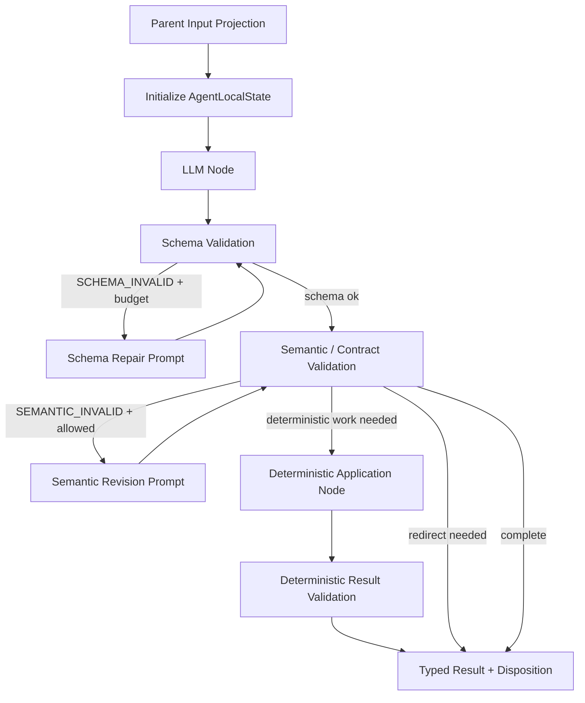

# 06. Google Work Agent · Agent · Workflow 설계서

> **문서 기준:** `01 PRD v2.8`, `01-A v2.9`, `01-B v2.8`, `02 UI·UX v2.8`, `03 Architecture v3.0`, `04 Database v1.12`, `05 Retrieval v2.6`, `07 Interface v2.10`, Domain 상태 전이 계약 v1.4와 테스트 매트릭스 v1.4을 기준으로 한다.
>
> **상태:** Draft v6.1 · **DB Schema:** v1.4 · **대상:** P0 MVP
>
> 결정적 Supervisor + 최대 6개 전문 Agent Subgraph Baseline + 결정적 실행·검증 Engine을 사용한다. 각 Agent Subgraph는 invocation 범위 Local State와 bounded validation·repair/revision loop를 가지며 Typed Result만 Main Graph에 반환한다. Agent별 장기 Memory는 없고 승인·실행·검증 사실은 SQLite Domain Store가 소유한다.

## 0. 먼저 이해할 것

- Main Graph는 **결정적 Supervisor**다.
- Agent는 한 번의 호출 동안만 Local State를 갖는 **LangGraph Subgraph**다.
- `SINGLE=1`, `THREE=3`, `SIX=6`은 Agent 수이며 LLM Call 수와 다르다.
- Agent 간 직접 대화는 없고 Typed Result를 Parent에 반환한다.
- 모든 Profile은 동일한 요청 이해·Source·Evidence·분석·계획·품질 점검 책임을 가진다.
- Write는 어떤 Agent도 직접 실행하지 않는다.


## 1. 확정 사항

- 요청 이해, API 탐색·수집, Context Retrieval, 업무 분석, 해결책·계획, 계획 검토의 6개 전문 Agent Subgraph를 초기 Baseline으로 정의
- 6개 역할의 분리 자체는 제품 불변조건이 아니며 Graph Profile 비교 후 Release Graph 확정
- Supervisor는 결정적 Router
- Handoff는 Versioned Typed State와 Resource·Evidence·Segment ID
- Retrieval API 호출은 Action Row를 만들지 않음
- 승인 이후 LLM이 Tool·Arguments·대상을 변경하지 않음
- Prompt는 Agent별 단일 문자열이 아니라 Node·상태·목적별 PromptRef

## 1.1 Graph Profile

| Profile | 구조 | 목적 |
|---|---|---|
| `SINGLE_BASELINE` | 통합 Agent Subgraph 1개. 요청 이해·Source 계획·결정적 Read·Evidence·분석·계획·통합 self-review 책임을 한 invocation 안에서 소유한다. | 단일 Agent Baseline |
| `THREE_STAGE` | Agent Subgraph 3개. ① 요청 이해+Source 계획+결정적 Read ② Evidence+분석+계획 ③ 독립 계획 검토 | 계층형 3-Agent 후보 |
| `SIX_ROLE_BASELINE` | Agent Subgraph 6개. 요청 이해, API 탐색·수집, Context Retrieval, 업무 분석, 해결책·계획, 계획 검토 | 최대 전문화 Multi-Agent Baseline |

공통 불변조건:

- Domain·Policy·승인·Claim·실행·검증·복구 코드는 모든 Profile에서 동일하다.
- E06-A 제품 후보 비교에서는 Model·Policy·Tool Schema·Fixture를 고정하고 각 Profile의 자연스러운 Agent 실행 비용을 측정한다.
- E06-B 통제 비교는 전체 1/3/6 제품 Graph를 다시 비교하지 않는다. `CONTEXT_READY_V1` 경계의 동일 Intent·ContextBundle·Evidence Snapshot을 고정하고 **post-retrieval reasoning Subgraph 분해**만 비교한다.
- Agent 제거·Node Skip 실험에서 새로운 휴리스틱 비즈니스 로직을 추가하지 않는다.
- 제거된 Node의 입력은 기존 공통 변환 함수, 이전 Node Output 또는 상한 분석용 Gold 입력으로 연결한다.
- Gold 입력을 사용하는 Oracle 실험은 제품 후보가 아니라 성능 상한 분석으로만 기록한다.

## 1.2 Agent Subgraph 공통 정의

### 1.2.1 Agent와 LLM Call

- **Agent:** Main Supervisor Graph가 호출하는 LangGraph Subgraph다. 하나의 Agent Subgraph는 LLM Node뿐 아니라 자신의 책임 수행에 필요한 결정적 Validation·Read Application Node를 포함할 수 있다.
- **Role:** 해당 Agent가 소유하는 안정적인 책임 계약이다.
- **LLM Call:** 모델 추론 1회다. 하나의 Agent가 내부 bounded loop 때문에 복수 호출을 사용할 수 있다.
- **PromptRef:** Agent 내부 Node·상태·목적별 실행 지시 Artifact다. PromptRef 개수는 Agent 수가 아니다.
- **Agent Local State:** 해당 invocation 안에서만 존재하는 단편 상태다. 장기 Memory가 아니며 다음 Agent invocation으로 자동 승계하지 않는다.

### 1.2.2 공통 Subgraph 골격



Subgraph 내부 Loop는 자기 출력의 Schema Repair 또는 허용된 Semantic Revision에 한정한다. `NEEDS_MORE_DATA`, `NEEDS_CONFIRMATION`, `RETRIEVE_MORE`처럼 다른 업무 단계가 필요한 경우 Agent가 다른 Agent를 직접 호출하지 않고 disposition을 반환하며 Supervisor가 다음 Edge를 선택한다.

### 1.2.3 AgentLocalState

```python
class AgentLocalState:
    schema_version: int
    agent_role: str
    invocation_id: str
    node_state: str
    input_projection: dict
    candidate_output: dict | None
    prompt_ref: dict | None
    attempt_no: int
    schema_repair_count: int
    semantic_revision_count: int
    failure_record: dict | None
    disposition: str | None
    typed_result: dict | None
```

규칙:
- Local State는 invocation 종료 후 장기 기억으로 승격하지 않는다.
- Parent Checkpoint에는 공식 Typed Result, budget counter, PromptRef metadata, trace correlation만 반영한다.
- Prompt 원문·Completion 원문·임시 candidate 전체를 장기 Checkpoint에 복제하지 않는다.
- Approval·ExecutionAttempt·Verification·Domain 상태는 Local State에 존재해도 권위가 없으며 반드시 Domain Store를 재조회한다.

## 1.3 구현 순서

```text
1. Domain 상태 전이·SQLite·Command Receipt
2. Fake Google Gateway·Fixture
3. Answer-only 단일 Workflow
4. READ-only Workflow
5. 단일 WRITE 승인·실행·GET 검증
6. UNKNOWN_RESULT 복구
7. Request Understanding
8. Acquisition·Context Retrieval
9. Analysis·Planning
10. Plan Review
11. THREE_STAGE Profile
12. SIX_ROLE_BASELINE Profile
```

6개 Agent Subgraph와 Prompt Artifact를 한 번에 구현하지 않는다. 각 수직 흐름의 Domain·Tool·Trace 계약과 Subgraph isolation test가 통과한 후 다음 Agent를 추가한다.

## 2. 책임

| 구성 | 책임 | 금지 |
|---|---|---|
| Supervisor | Phase·Result·Budget Routing | SQL·Write·계획 내용 생성 |
| 요청 이해 | 목표·완료 조건·제약·모호성 | Google 조회·Action 생성 |
| API 탐색·수집 | 최소 호출 전략·Source·Budget | Raw Query 실행·Write |
| Context Retriever | Segment·Evidence·충분성 | MCP·Google 직접 호출 |
| 업무 분석 | 관계·누락·중복 후보·일정 위험 | 정책 최종 판정 |
| 해결책·계획 | Answer 또는 Action DAG 초안 | 승인·실행 |
| 계획 검토 | 목표·근거·과잉·모순 검토 | 실행 허용 최종 판정 |
| 실행 Engine | 승인 인자 Claim·MCP Write | LLM 재계획 |
| 검증·복구 | Google GET·Comparator·Recovery | LLM 성공 판정 |

### 2.1 Tasks 시간 의미

- Request Understanding은 `~까지`를 실제 업무 `business_deadline` 후보로, `~에 하다`를 Task `scheduled_date` 후보로 구분해 구조화한다. 이는 문자열 규칙을 하드코딩하는 요구가 아니라 RequestIntent·Analysis·Planning의 의미 계약이다.
- 두 값이 함께 있으면 자동으로 같게 만들지 않는다. 업무 마감만 확인되면 Task 예정일이나 Google `due`를 생성하지 않으며, 필요한 의미 보존은 notes·Evidence·Approval Summary에 제안한다.
- 정확한 시간 구간이 필요한 요청은 Tasks API가 시간을 설정했다고 성공 선언하지 않는다. Planning은 날짜 예정일 또는 승인형 Calendar Event 대안을 제시하고, Event 생성은 별도 Action·Approval을 따른다.
- Work Analysis는 예정일 경과를 완료로 해석하지 않는다. 완료 상태는 실제 Provider status이며 Policy·Domain·Verification이 최종 판정한다.

## 2.2 전문 Agent Subgraph 설계

| Agent Subgraph | 핵심 내부 Node | Local Loop | Parent 반환 |
|---|---|---|---|
| Request Understanding | classify / clarify / validate | schema repair, 허용된 clarification revision | `RequestIntentV1` 또는 confirmation disposition |
| Acquisition | plan_sources / validate_plan / execute_read / finalize_acquisition | schema repair, partial-plan revision | `SourceFetchPlanV1[]` + `AcquisitionResultV1` 및 acquisition disposition |
| Context Retriever | select_evidence / assess_sufficiency / validate | schema repair, evidence reassessment | `EvidenceSelectionResultV1`, `SufficiencyResultV1` |
| Work Analysis | analyze / validate | schema repair, bounded reassess | `WorkAnalysisResultV1` |
| Planning | answer_only 또는 draft_plan / validate | schema repair, bounded plan revision | `AnswerDraftV1` 또는 `ActionPlanDraftV1` |
| Review | inspect / validate | schema repair, planning revision 이후 recheck | `PlanReviewResultV1` |

**Acquisition 경계:** LLM은 Source·순서·Budget 전략만 제안한다. 실제 Query Builder, Page Token 검증, MCP Read, Google Adapter 호출은 **Acquisition Agent Subgraph 내부의 결정적 Application Node**가 수행한다. 외부 Read가 진행되는 동안에도 같은 Agent invocation이 유지되며, `SourceFetchPlanV1[]`과 `AcquisitionResultV1`을 함께 검증한 뒤 Parent에 반환한다. LLM이 MCP Tool을 직접 호출하는 경로는 없다.

**WRITE 경계:** 어떤 Agent Subgraph도 Google Write를 직접 실행하지 않는다. Agent는 Write Action을 제안할 수 있지만 실제 CREATE·UPDATE·SEND·DELETE는 `DOMAIN_VALIDATION → WAITING_APPROVAL → PREFLIGHT → ACTION_EXECUTION → VERIFICATION` 공통 경로만 사용한다.

**Semantic Responsibility Parity:** E06-A의 세 Profile은 요청 이해, Source 판단, Evidence 판단, 업무 분석, 계획 생성, 계획 품질 점검이라는 동일한 의미 책임 범위를 가져야 한다. `SINGLE_BASELINE`의 품질 점검은 별도 Review Agent가 아니라 같은 Unified Agent Subgraph 내부 `self_review` 단계로 수행한다. `THREE_STAGE`와 `SIX_ROLE_BASELINE`은 독립 Review Agent Subgraph를 사용한다. 따라서 E06-A에서 Review 책임의 존재 여부가 독립변수로 섞이지 않는다.
Profile 전용 fused/self-review Prompt Artifact는 기존 6-role Prompt를 연속 호출하는 wrapper로 대체하지 않는다. 해당 Prompt가 검증·승격되기 전에는 그 Profile을 `RUNTIME_ACTIVE`로 만들지 않는다.

**E06-B Replay 경계:** Controlled 실험은 `CONTEXT_READY_V1`을 고정 입력 경계로 사용한다. 이 Lane에서는 Request·Acquisition·Context Agent를 실행하거나 채점하지 않는다. 동일 `RequestIntentV1 + ContextBundleV1 + EvidenceSetV1 + PolicySummaryV1`을 주입한 뒤 다음 세 post-retrieval 후보만 비교한다.

```text
B1_INTEGRATED = Analysis + Planning + Self-review Agent Subgraph 1개
B2_STAGED     = Analysis+Planning Agent + Review Agent 2개
B3_SPECIALIZED= Analysis Agent + Planning Agent + Review Agent 3개
```

E06-B 결과를 `SINGLE/THREE/SIX` 전체 제품 비용으로 해석하지 않는다. 제품 후보 선택은 E06-A가 소유하고 E06-B는 전문화·Handoff 원인 분석용이다.

## 3. Graph State

```python
class MultiAgentGraphState:
    schema_version: int
    run_id: str
    conversation_id: str
    thread_id: str
    workflow_phase: str
    request_intent: dict | None
    source_fetch_plans: list[dict]
    acquisition_result: dict | None
    context_result: dict | None
    analysis_result: dict | None
    plan_draft: dict | None
    plan_review: dict | None
    approved_plan_id: str | None
    execution_summary: dict | None
    verification_summary: dict | None
    user_interrupt: dict | None
    retry_budget: dict
    prompt_context: dict
    trace_context: dict
```

대용량 원문은 State에 넣지 않고 Run Cache Handle을 사용한다.

## 4. Workflow Phase

```text
INITIALIZE
REQUEST_ANALYSIS
WAITING_CONFIRMATION
SOURCE_PLANNING
API_ACQUISITION
CONTEXT_RETRIEVAL
CONTEXT_EVALUATION
WORK_ANALYSIS
SOLUTION_PLANNING
PLAN_REVIEW
DOMAIN_VALIDATION
WAITING_APPROVAL
PREFLIGHT
ACTION_EXECUTION
VERIFICATION
RESPONSE_SYNTHESIS
RECOVERY
FINALIZE
```

Run Status는 CREATED, ANALYZING, RETRIEVING, WAITING_CONFIRMATION, PLANNING, WAITING_APPROVAL, EXECUTING, VERIFYING, CANCEL_REQUESTED, CANCELLED, REAUTH_REQUIRED, RECOVERY_REQUIRED, COMPLETED, BLOCKED, FAILED를 사용한다.

## 5. 상위 흐름

```text
Initialize
→ 요청 이해
→ 확인 필요 시 Interrupt
→ API Source 계획·수집
→ Context Retrieval·충분성
→ 업무 분석
→ 해결책·계획
→ 계획 검토
→ Domain Validation
→ Answer-only | READ-only | WAITING_APPROVAL
→ Preflight
→ 실행
→ GET Verification
→ Recovery 또는 Finalize
```

## 6. Node 결과

- 요청 이해: COMPLETE | NEEDS_CONFIRMATION | INVALID
- Acquisition Agent: PLAN_READY | NO_FETCH_NEEDED | NEEDS_CONFIRMATION | COMPLETE | PARTIAL | AUTH_REQUIRED | RATE_LIMITED | BUDGET_EXHAUSTED | BLOCKED | FAILED
  - `PLAN_READY` 이후 같은 Subgraph invocation 안의 결정적 Read Node가 실행되고 최종적으로 `AcquisitionResultV1`을 반환한다.
- Context: SUFFICIENT | NEEDS_MORE_DATA | NEEDS_CONFIRMATION | PARTIAL | BLOCKED
- 분석: COMPLETE | NEEDS_MORE_DATA | NEEDS_CONFIRMATION | BLOCKED
- 계획: ANSWER_ONLY | PLAN_READY | NEEDS_CONFIRMATION | BLOCKED
- 검토: PASS | REVISE | RETRIEVE_MORE | CONFIRM | BLOCK
- Domain: ALLOW_READ | REQUIRE_APPROVAL | BLOCK

## 7. Prompt Registry

Prompt 선택 Key:

```text
agent_role
subgraph_name
node_name
node_state
purpose
input_schema_version
output_schema_version
```

PromptRef:

```text
prompt_bundle_version
prompt_id
prompt_version
content_hash
agent_role
subgraph_name
node_name
node_state
purpose
input_schema_version
output_schema_version
```

규칙:
- Supervisor는 다음 Node를 결정적으로 Routing하고 Prompt 원문을 읽거나 선택하지 않는다.
- 선택된 Agent·Application Node가 Prompt Registry에서 PromptRef를 확정한 뒤 LLM Adapter를 호출한다.
- LLM Router와 Model은 Prompt를 선택하지 않는다.
- Repair·Revision·Sufficiency는 별도 Prompt ID를 사용한다.
- Prompt 원문은 Graph State·Trace·Audit에 저장하지 않음
- 실행·검증·승인·정책 판정에는 LLM Prompt를 사용하지 않음

초기 Prompt Template 19개:

| Agent | Purpose Key | 수량 |
|---|---|---:|
| 요청 이해 | `classify`, `clarify`, `repair` | 3 |
| API 탐색·수집 | `plan_sources`, `revise_partial`, `repair` | 3 |
| Context Retriever | `select_evidence`, `assess_sufficiency`, `repair` | 3 |
| 업무 분석 | `analyze`, `reassess`, `repair` | 3 |
| 해결책·계획 | `answer_only`, `draft_plan`, `revise_plan`, `repair` | 4 |
| 계획 검토 | `inspect`, `recheck`, `repair` | 3 |

## 7.1 Prompt 구현 우선순위

- **Tier A · 우선 완성·실험:** `request_understanding.classify`, `acquisition.plan_sources`, `context.select_evidence`, `planning.draft_plan`, `review.inspect`
- **Tier B · Baseline 작성:** `context.assess_sufficiency`, `analysis.analyze`, `planning.answer_only`, `planning.revise_plan`, `review.recheck`
- **Tier C · 실패 사례 후 작성:** 모든 `repair`, `reassess`, `revise_partial`

19개 Prompt Manifest와 ID 예약은 유지하지만, Tier C Prompt는 실제 실패 유형과 Trace가 확보되기 전 과도하게 튜닝하지 않는다.

## 8. Budget

```text
Structured Output Repair: 호출당 최대 1회
추가 수집: 최대 2회
계획 Revision: 최대 2회
기본 LLM 호출: Run당 최대 8회
```

하드 상한 초과 시 Partial·Confirmation·Blocked 중 하나로 종료한다.

## 9. Answer-only

```text
ANALYZING | RETRIEVING | PLANNING
→ complete_answer_only_run
→ COMPLETED
```

Plan·Action 없이 Assistant Message·Trace·Run Terminal을 원자 저장한다.

## 10. READ-only

```text
publish_read_only_plan
→ claim_read_action
→ complete_read_action
→ finalize_read_action
```

READ Action은 Approval·ExecutionAttempt·Verification Row를 만들지 않는다.

## 11. WRITE

```text
PROPOSED | MODIFIED
→ approve_action
→ APPROVED
→ claim_action_execution
→ EXECUTING
→ MCP Write
→ EXECUTED | FAILED | UNKNOWN_RESULT
→ GET Verification
→ VERIFIED | MISMATCH
```

Claim 전 Write 금지. 승인 이후 인자를 LLM이 재생성하지 않는다.

## 12. Retry와 Recovery

FAILED:
```text
FAILED → prepare_write_retry → MODIFIED → 새 승인 → 새 Attempt
```

UNKNOWN_RESULT:
```text
CREATE → Recovery Fingerprint Search
UPDATE → Target GET
```

UNKNOWN_RESULT에서 새 Attempt·Write를 금지한다.

## 13. Interrupt

- WAITING_CONFIRMATION
- WAITING_APPROVAL
- REAUTH_REQUIRED
- RECOVERY_REQUIRED

Interrupt 전에 Checkpoint를 저장하고 같은 Thread로 재개한다.

## 14. Runtime

- API_ONLY: API Provider만
- LOCAL_CAPABLE: API Provider + Ollama Adapter
- AUTO: Local 기술 실패 시 외부 전송 동의가 있을 때 API Fallback 최대 1회
- LOCAL_GPU: 자동 API 전환 금지
- 실행·검증은 LLM 미사용


## 15. Typed State 계약

Graph State의 주요 필드는 범용 `dict`가 아니라 Versioned Schema를 사용한다.

```python
request_intent: RequestIntentV1 | None
source_fetch_plans: list[SourceFetchPlanV1]
acquisition_result: AcquisitionResultV1 | None
evidence_selection_result: EvidenceSelectionResultV1 | None
sufficiency_result: SufficiencyResultV1 | None
analysis_result: WorkAnalysisResultV1 | None
plan_draft: ActionPlanDraftV1 | None
plan_review: PlanReviewResultV1 | None
execution_summary: ExecutionSummaryV1 | None
verification_summary: VerificationSummaryV1 | None
user_interrupt: UserInterruptV1 | None
retry_budget: RunBudgetV1
prompt_context: PromptContextV1
trace_context: TraceContextV1
```

## 16. Node Registry

| node_id | agent_role | phase | purpose | output | 주요 결과 | 최대 호출 |
|---|---|---|---|---|---|---:|
| `request_understanding.classify` | request_understanding | REQUEST_ANALYSIS | classify | RequestIntentV1 | COMPLETE·NEEDS_CONFIRMATION·INVALID | 1 |
| `request_understanding.clarify` | request_understanding | WAITING_CONFIRMATION | clarify | ClarificationQuestionV1 | QUESTION_READY | 1 |
| `request_understanding.repair` | request_understanding | REQUEST_ANALYSIS | repair | RequestIntentV1 | COMPLETE·INVALID | 1 |
| `acquisition.plan_sources` | api_discovery_acquisition | SOURCE_PLANNING | plan_sources | SourceFetchPlanV1[] | PLAN_READY·NO_FETCH_NEEDED·CONFIRM·BLOCKED | 1 |
| `acquisition.revise_partial` | api_discovery_acquisition | SOURCE_PLANNING | revise_partial | SourceFetchPlanV1[] | PLAN_READY·PARTIAL·BLOCKED | 1 |
| `acquisition.repair` | api_discovery_acquisition | SOURCE_PLANNING | repair | SourceFetchPlanV1[] | PLAN_READY·BLOCKED | 1 |
| `context.select_evidence` | context_retriever | CONTEXT_RETRIEVAL | select_evidence | EvidenceSelectionResultV1 | SELECTED·PARTIAL·BLOCKED | 1 |
| `context.assess_sufficiency` | context_retriever | CONTEXT_EVALUATION | assess_sufficiency | SufficiencyResultV1 | SUFFICIENT·NEEDS_MORE_DATA·NEEDS_CONFIRMATION·PARTIAL·BLOCKED | 1 |
| `context.repair` | context_retriever | CONTEXT_EVALUATION | repair | ContextRetrievalResultV1 | SUFFICIENT·BLOCKED | 1 |
| `analysis.analyze` | work_analysis | WORK_ANALYSIS | analyze | WorkAnalysisResultV1 | COMPLETE·NEEDS_MORE_DATA·NEEDS_CONFIRMATION·BLOCKED | 1 |
| `analysis.reassess` | work_analysis | WORK_ANALYSIS | reassess | WorkAnalysisResultV1 | COMPLETE·BLOCKED | 1 |
| `analysis.repair` | work_analysis | WORK_ANALYSIS | repair | WorkAnalysisResultV1 | COMPLETE·BLOCKED | 1 |
| `planning.answer_only` | solution_planning | SOLUTION_PLANNING | answer_only | AnswerDraftV1 | ANSWER_ONLY·NEEDS_CONFIRMATION·BLOCKED | 1 |
| `planning.draft_plan` | solution_planning | SOLUTION_PLANNING | draft_plan | ActionPlanDraftV1 | PLAN_READY·NEEDS_CONFIRMATION·BLOCKED | 1 |
| `planning.revise_plan` | solution_planning | SOLUTION_PLANNING | revise_plan | ActionPlanDraftV1 | PLAN_READY·BLOCKED | 2 |
| `planning.repair` | solution_planning | SOLUTION_PLANNING | repair | ActionPlanDraftV1 | PLAN_READY·BLOCKED | 1 |
| `review.inspect` | plan_review | PLAN_REVIEW | inspect | PlanReviewResultV1 | PASS·REVISE·RETRIEVE_MORE·CONFIRM·BLOCK | 1 |
| `review.recheck` | plan_review | PLAN_REVIEW | recheck | PlanReviewResultV1 | PASS·BLOCK | 1 |
| `review.repair` | plan_review | PLAN_REVIEW | repair | PlanReviewResultV1 | PASS·BLOCK | 1 |

- `purpose`를 Prompt Manifest·Trace의 공통 필드명으로 사용한다.
- `repair_prompt_id`는 Node Registry에서 연결한다.
- Supervisor는 Registry의 허용 Edge만 선택하고 Agent가 임의 Node를 호출하지 않는다.

---

## 17. Agent Failure·Prompt·Budget 계약

이 절은 `15. Agent Capability · Failure · Prompt 공통 계약 v1.5`를 적용한다.

### 24.1 Failure Record

```python
class AgentFailureRecord:
    failure_reason_code: str
    failure_origin: str
    detected_by: str
    runtime_disposition: Literal[
        "RETRYABLE", "REDIRECT", "DETERMINISTIC", "TERMINAL", "NOT_AVAILABLE"
    ]
    experiment_disposition: str
    affected_field_paths: list[str]
```

실험 Grader가 발견한 오류와 제품 Runtime이 자체 감지 가능한 오류를 구분한다. `REVIEW_FALSE_PASS` 같은 평가 오류를 Runtime이 자동으로 감지한다고 가정하지 않는다.

### 24.2 Retry Kind

```text
SCHEMA_REPAIR
SEMANTIC_REVISION
WORKFLOW_REDIRECTION
DETERMINISTIC_RETRY
DETERMINISTIC_RECOVERY
```

- Schema Repair는 구조만 교정하며 Goal·Evidence·Action 의미를 바꾸지 않는다.
- Semantic Revision은 실패 이유와 변경 허용 범위를 입력으로 받는다.
- Workflow Redirection은 Supervisor가 다른 Node·Interrupt·종료 Edge를 선택하는 것이다.
- 401·429·5xx·Timeout은 일반 코드 Retry·Reauth 대상이며 LLM Repair 대상이 아니다.
- `UNKNOWN_RESULT`와 Verification `MISMATCH`는 LLM 재계획 대상이 아니다.

### 24.3 확정 Budget Profile

```text
SCHEMA_REPAIR_PER_NODE_CALL=1
SEMANTIC_REVISION_SAME_FAILURE=1
PLANNING_REVISION_PER_RUN=2
REVIEW_RECHECK_PER_PLANNING_REVISION=1
MAX_ADDITIONAL_ACQUISITIONS=2
NORMAL_MAX_LLM_CALLS=8
RETRIEVAL_HEAVY_MAX_LLM_CALLS=14
REVISION_HEAVY_MAX_LLM_CALLS=12
ABSOLUTE_MAX_LLM_CALLS=16
```

단일 `MAX_LLM_CALLS=8`을 모든 Route에 적용하지 않는다. Budget Profile 승격은 Supervisor의 결정적 규칙으로 수행하며 절대 상한 16회를 넘지 않는다.

### 24.4 Prompt 선택과 활성화

Prompt Runtime Slot 선택 Key는 다음과 같이 고정한다.

```text
agent_role + subgraph_name + node_name + node_state + purpose
+ input_schema_version + output_schema_version
```

`failure_reason_code`는 Runtime Prompt Slot 식별 Key가 아니다. 이미 선택된 Base Prompt에 결합할 Failure-specific Instruction Block을 선택하는 metadata이며, 조립이 끝난 최종 Prompt의 `content_hash`를 계산한다.

Prompt는 Base Role Contract, Node Purpose, Failure-specific Block, Allowed Change Scope, Output Schema를 조립한다. Node DEV, Node HOLDOUT, Safety Gate, Prompt Manifest 승인을 통과한 Prompt만 `RUNTIME_ACTIVE`가 된다.


## 18. 승인형 Effect · Clarification
- Planning Effect는 `READ | CREATE | UPDATE | SEND | DELETE`다.
- SEND는 Gmail 실제 전송, DELETE는 정확한 Google Task 삭제와 Calendar Event 삭제, Task 완료·Calendar 참석자 변경은 UPDATE다.
- 승인 후 Tool·Effect·Arguments·Target을 LLM이 변경하지 않는다.
- `UNKNOWN_RESULT`의 SEND/DELETE 자동 재실행은 금지한다.

### 모호성 발견 시점
```text
요청 자체에서 명확 → Request Understanding → NEEDS_CONFIRMATION
검색 후 후보 복수/저신뢰 → Acquisition/Context → NEEDS_CONFIRMATION
분석 후 관계/충돌 불명 → Work Analysis → NEEDS_CONFIRMATION
```
모든 경로는 `request_understanding.clarify`에서 후보·차이·선택지를 만들고 같은 Run·Thread를 Resume한다. Request Understanding이 검색 전부터 후보 수를 안다고 가정하지 않는다.

## 19. 정보 부족 Supervisor Guard

Agent의 `NEEDS_MORE_DATA`, `NEEDS_CONFIRMATION`, `PARTIAL`, `BLOCKED`는 제안 결과이며 최종 Route는 결정적 Supervisor가 `05`의 `SufficiencyIssue` 계약으로 확정한다.

```text
required POLICY/safety-critical issue
→ BLOCKED

required USER issue
→ NEEDS_CONFIRMATION

required GOOGLE issue + acquisition budget 남음
→ RETRIEVE_MORE

budget exhausted + read-only + evidence-supported partial 가능
→ PARTIAL

budget exhausted + Write 필수 Target/Argument/Evidence 부족
→ USER가 해결 가능한 경우 NEEDS_CONFIRMATION
→ 그 외 BLOCKED
```

- Profile별로 별도 휴리스틱을 두지 않는다.
- LLM confidence 하나로 안전 Route를 결정하지 않는다.
- `PARTIAL`은 근거가 있는 Read-only 응답의 축약 완료이며 Write 필수 정보 부족을 우회하는 수단이 아니다.
- `NEEDS_CONFIRMATION`은 같은 Run·Thread의 typed Interrupt로 재개한다.

## Attachment Agent 경계

- 첨부파일 기능을 별도 Agent Capability로 만들지 않는다.
- Agent는 파일명·MIME Type·크기·Attachment/Stage Descriptor 같은 Metadata만 사용할 수 있다.
- 첨부파일 bytes는 `AgentLocalState`, `ContextBundle`, `Evidence`, Prompt 입력에 포함하지 않는다.
- 실제 Download·Staging·MIME 조립은 결정적 Application·MCP 경계가 수행한다.
- ClaimContextV2 생성·검증은 Agent Node가 아니라 공통 결정적 Execution Engine 책임이다.
