# 08. Google Work Agent · 시퀀스 설계서

> **문서 기준:** `01. 요구사항 정의서·PRD v2.9`, `01-A. 기능 정의서 v2.15`, `01-B. 정책 정의서 v2.10`, `02. UI·UX 설계서 v2.11`, `03. 시스템 아키텍처 설계서 v3.4`, `04. 도메인·데이터베이스 설계서 Draft v1.15`, `05. Context·Retrieval 설계서 Draft v2.10`, `06. Agent·Workflow 설계서 Draft v7.5`, `07. Tool·MCP·내부 인터페이스 명세서 Draft v2.16`, Domain 상태 전이 계약 v1.4를 기준으로 한다. `09~14`는 본 문서의 시퀀스를 보안·인프라·관측·테스트·평가·운영 절차로 구체화한다.

> **상태:** Draft v3.8 · **기준일:** 2026-08-13
> **대상:** P0 MVP  
> **구조:** 결정적 Supervisor + 1/3/6 Agent Subgraph Profile + 결정적 실행·검증 Engine  
> **상태 기준:** SQLite Domain Store가 승인·실행·검증 사실의 기준점이며 LangGraph Checkpoint는 재개 위치, SSE는 UI Projection이다.

## 1. 목적과 범위

이 문서는 주요 Use Case에서 React, FastAPI, Application, LangGraph Supervisor, 전문 Agent, Domain Service, MCP Server, MCP 내부 Google Provider Adapter와 SQLite가 **어떤 순서로 상호작용하는지** 정의한다.

이 문서가 소유하는 내용:

- 요청 시작과 SSE 연결 순서
- Tool Route와 Retrieval/RAG 순서
- 사용자 확인 Interrupt와 재개
- Answer-only, WRITE Plan 분기와 Legacy/호환 READ-only Plan 경계
- 승인·수정·거절·만료
- Action DAG·부분 승인·부분 실패
- Write 실패 재시도와 `UNKNOWN_RESULT` 복구
- OAuth 재인증, 취소, 새로고침, 앱 재시작, MCP 장애
- 외부 호출과 DB Transaction의 분리

이 문서가 소유하지 않는 내용:

- LangGraph Node·상태 Schema 상세 → `06`
- REST·MCP Pydantic Schema 상세 → `07`
- Domain Guard·Table·Index 상세 → `04`
- 운영자 대응 절차 → `14`

## 2. 공통 참여자

<table fit-page-width="true" header-row="true">
	<tr>
		<td>표기</td>
		<td>구성</td>
		<td>책임</td>
	</tr>
	<tr>
		<td>U</td>
		<td>사용자</td>
		<td>요청, 확인, 승인, 수정, 거절, 복구 선택</td>
	</tr>
	<tr>
		<td>FE</td>
		<td>React 프런트엔드</td>
		<td>REST Command·Query, SSE Projection, Inline Card</td>
	</tr>
	<tr>
		<td>API</td>
		<td>FastAPI 로컬 에이전트 서비스</td>
		<td>Local Session·Schema 검증, Route·SSE Adapter</td>
	</tr>
	<tr>
		<td>APP</td>
		<td>Application Service</td>
		<td>Use Case·Transaction·LangGraph invoke·resume 조정</td>
	</tr>
	<tr>
		<td>SUP</td>
		<td>결정적 Supervisor</td>
		<td>Phase·Agent Result·Domain Result 기반 Routing</td>
	</tr>
	<tr>
		<td>LLM</td>
		<td>Prompt Registry·LLM Router</td>
		<td>Agent·Application Node가 확정한 PromptRef와 입력 Schema로 API LLM 또는 Ollama Structured Output 호출</td>
	</tr>
	<tr>
		<td>DOM</td>
		<td>Domain·Policy Service</td>
		<td>Guard, 상태 전이, 승인·무결성·Dependency 판정</td>
	</tr>
	<tr>
		<td>DB</td>
		<td>SQLite Domain Store·Checkpointer</td>
		<td>영속 사실과 Graph 재개 상태 저장</td>
	</tr>
	<tr>
		<td>MCP</td>
		<td>MCP Client·Google Work MCP Server</td>
		<td>검증된 Google Tool 호출</td>
	</tr>
	<tr>
		<td>G</td>
		<td>Google Provider APIs</td>
		<td>Google Work MCP Server 내부 Adapter만 접근하는 Gmail·Tasks·Calendar 원본 시스템</td>
	</tr>
</table>

## 3. 공통 순서 원칙

1. React는 Google Provider API, MCP, SQLite를 직접 호출하지 않는다.
2. FastAPI Route는 SQL과 Domain 상태 전이를 직접 수행하지 않는다.
3. Agent는 다른 Agent를 직접 호출하지 않고 Supervisor로 결과를 반환한다.
4. LLM Agent는 MCP Tool을 직접 호출하지 않는다. 검증된 Application Node가 MCP Port를 호출한다.
5. **Google Workspace 접근 단일 경계:** FastAPI Route·Application·LangGraph·Agent·Domain은 Gmail·Tasks·Calendar Provider API/SDK를 직접 호출하거나 Provider Client를 구성하지 않는다. 모든 Browse·Count·Detail·Retrieval·Write·Verification·Recovery 조회는 `MCP Client/Port → Google Work MCP Server`를 통과하고, 실제 Provider API 호출은 MCP Server 내부 Adapter만 수행한다. MCP 장애 시 Core가 Provider API로 직접 fallback하지 않는다.
6. MCP·MCP 내부 Provider API·LLM 외부 호출 중 SQLite Transaction을 유지하지 않는다.
7. 상태 변경은 Domain Command Result가 `applied=true`일 때만 다음 단계로 진행한다.
8. SSE 전송 실패는 Domain 실패가 아니다.
9. 승인 이후 LLM은 Tool·Arguments·대상 Resource·Dependency를 변경하지 않는다.
10. 일반 Retrieval 호출은 Action Row를 만들지 않는다.
11. Release Graph의 일반 Google READ는 `InputRoutePlanV1 → Retrieval`이 소유한다. Legacy READ Action은 호환 경계에만 남고 새 SIX Planning 결과로 만들지 않는다.
12. Supervisor는 Node만 Routing하며, 선택된 Agent·Application Node가 각 LLM 호출 전에 `agent_role + subgraph_name + node_name + node_state + purpose`로 PromptRef를 확정한다.
13. Repair·Revision은 원 호출 Prompt를 묵시적으로 재사용하지 않고 등록된 별도 PromptRef를 사용할 수 있다.
14. Confirmation은 공통 재시작이 아니라 LangGraph interrupt다. `interrupt_id + owner_subgraph + RegisteredResumeTargetRefV1`을 보존하고 사용자 응답 후 발생 Subgraph checkpoint에서 재개한다. 응답이 upstream 의미를 바꾸는 경우에만 Supervisor가 해당 State Owner로 Back-edge한다.
15. 모든 공식 Subgraph disposition은 정확히 하나의 Supervisor Edge·Interrupt·Terminal 경로를 가진다. 알 수 없는 Enum·Version·Disposition은 fail-closed다.

## 4. 앱 시작·Local Session·상태 복원

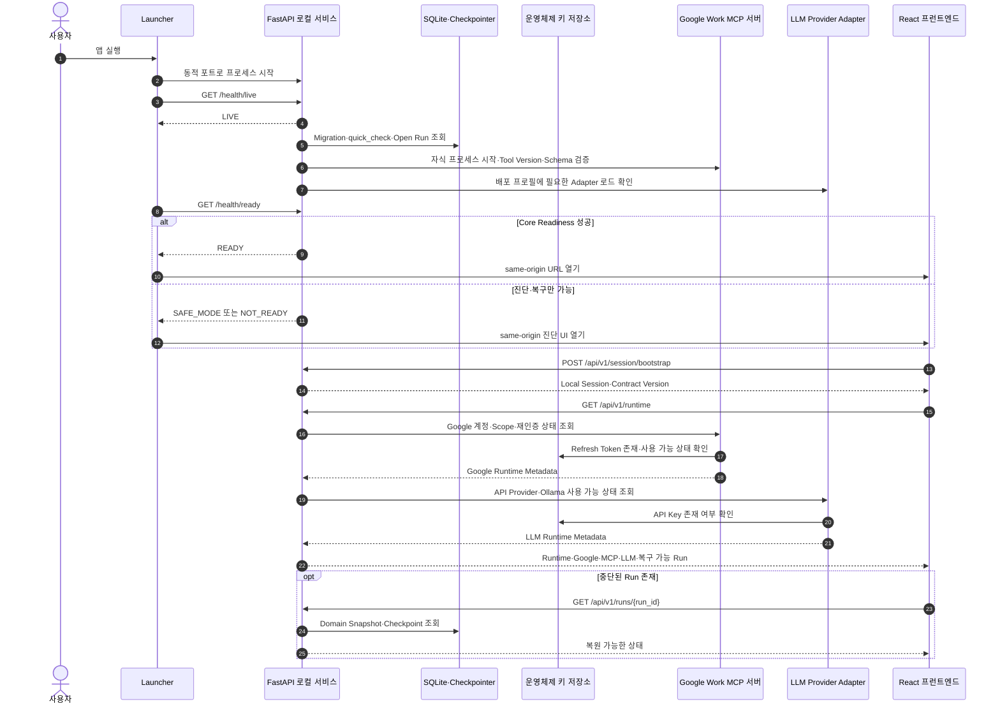
```mermaid
sequenceDiagram
    autonumber
    actor U as 사용자
    participant L as Launcher
    participant API as FastAPI 로컬 서비스
    participant DB as SQLite·Checkpointer
    participant K as 운영체제 키 저장소
    participant MCP as Google Work MCP 서버
    participant LLM as LLM Provider Adapter
    participant FE as React 프런트엔드

    U->>L: 앱 실행
    L->>API: 동적 포트로 프로세스 시작
    L->>API: GET /health/live
    API-->>L: LIVE
    API->>DB: Migration·quick_check·Open Run 조회
    API->>MCP: 자식 프로세스 시작·Tool Version·Schema 검증
    API->>LLM: 배포 프로필에 필요한 Adapter 로드 확인
    L->>API: GET /health/ready
    alt Core Readiness 성공
        API-->>L: READY
        L->>FE: same-origin URL 열기
    else 진단·복구만 가능
        API-->>L: SAFE_MODE 또는 NOT_READY
        L->>FE: same-origin 진단 UI 열기
    end
    FE->>API: POST /api/v1/session/bootstrap
    API-->>FE: Local Session·Contract Version
    FE->>API: GET /api/v1/runtime
    API->>MCP: Google 계정·Scope·재인증 상태 조회
    MCP->>K: Refresh Token 존재·사용 가능 상태 확인
    MCP-->>API: Google Runtime Metadata
    API->>LLM: API Provider·Ollama 사용 가능 상태 조회
    LLM->>K: API Key 존재 여부 확인
    LLM-->>API: LLM Runtime Metadata
    API-->>FE: Runtime·Google·MCP·LLM·복구 가능 Run
    opt 중단된 Run 존재
        FE->>API: GET /api/v1/runs/{run_id}
        API->>DB: Domain Snapshot·Checkpoint 조회
        API-->>FE: 복원 가능한 상태
    end
```

- `/health/ready`는 DB·Migration·정적 Asset·API Contract·Keyring Adapter·MCP Executable·Tool Schema 같은 Core Readiness를 판정한다.
- Google Credential, API LLM Key, Ollama와 Model 사용 가능 여부는 `/api/v1/runtime` 진단 결과이며 누락 자체가 Core Service 시작 실패를 의미하지 않는다.
- Bootstrap Secret은 한 번 교환한 뒤 폐기한다.
- Checkpoint와 Domain 상태가 충돌하면 자동 추정하지 않고 `RECOVERY_REQUIRED`로 표시한다.

## 5. Run 시작과 SSE 연결

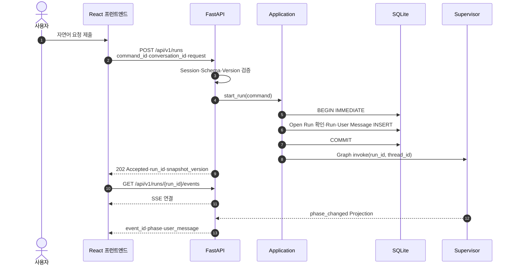
```mermaid
sequenceDiagram
    autonumber
    actor U as 사용자
    participant FE as React 프런트엔드
    participant API as FastAPI
    participant APP as Application
    participant DB as SQLite
    participant SUP as Supervisor

    U->>FE: 자연어 요청 제출
    FE->>API: POST /api/v1/runs<br>command_id·conversation_id·request
    API->>API: Session·Schema·Version 검증
    API->>APP: start_run(command)
    APP->>DB: BEGIN IMMEDIATE
    APP->>DB: Open Run 확인·Run·User Message INSERT
    APP->>DB: COMMIT
    APP->>SUP: Graph invoke(run_id, thread_id)
    API-->>FE: 202 Accepted·run_id·snapshot_version
    FE->>API: GET /api/v1/runs/{run_id}/events
    API-->>FE: SSE 연결
    SUP-->>API: phase_changed Projection
    API-->>FE: event_id·phase·user_message
```

- 동일 `command_id` 재전송은 기존 Run Result를 반환하거나 Version Conflict로 종료한다.
- Graph 실행 시작과 HTTP 응답 순서는 구현상 비동기일 수 있으나 Run Row Commit 이후에만 Graph를 시작한다.

## 6. AGENT_SEARCH 전체 조회·분석 시퀀스

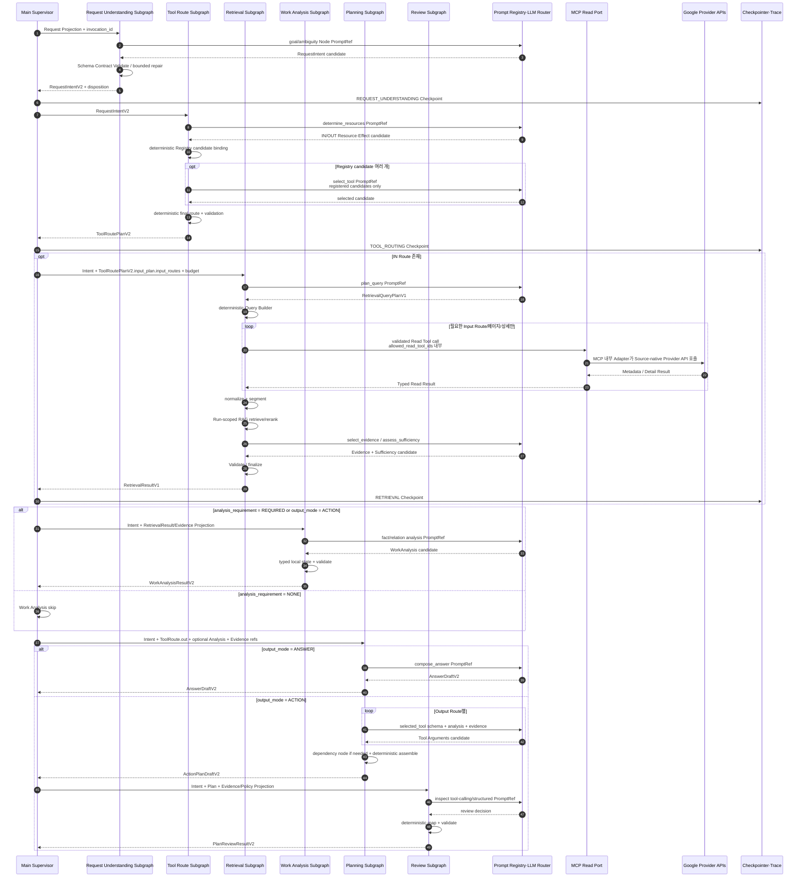
```mermaid
sequenceDiagram
    autonumber
    participant SUP as Main Supervisor
    participant REQ as Request Understanding Subgraph
    participant ROUTE as Tool Route Subgraph
    participant RET as Retrieval Subgraph
    participant ANA as Work Analysis Subgraph
    participant PLAN as Planning Subgraph
    participant REV as Review Subgraph
    participant LLM as Prompt Registry·LLM Router
    participant MCP as MCP Read Port
    participant G as Google Provider APIs
    participant DB as Checkpointer·Trace

    SUP->>REQ: Request Projection + invocation_id
    REQ->>LLM: goal/ambiguity Node PromptRef
    LLM-->>REQ: RequestIntent candidate
    REQ->>REQ: Schema·Contract Validate / bounded repair
    REQ-->>SUP: RequestIntentV2 + disposition
    SUP->>DB: REQUEST_UNDERSTANDING Checkpoint

    SUP->>ROUTE: RequestIntentV2
    ROUTE->>LLM: determine_resources PromptRef
    LLM-->>ROUTE: IN/OUT Resource·Effect candidate
    ROUTE->>ROUTE: deterministic Registry candidate binding
    opt Registry candidate 여러 개
        ROUTE->>LLM: select_tool PromptRef<br>registered candidates only
        LLM-->>ROUTE: selected candidate
    end
    ROUTE->>ROUTE: deterministic final route + validation
    ROUTE-->>SUP: ToolRoutePlanV2
    SUP->>DB: TOOL_ROUTING Checkpoint

    opt IN Route 존재
        SUP->>RET: Intent + ToolRoutePlanV2.input_plan.input_routes + budget
        RET->>LLM: plan_query PromptRef
        LLM-->>RET: RetrievalQueryPlanV1
        RET->>RET: deterministic Query Builder
        loop 필요한 Input Route/페이지/상세만
            RET->>MCP: validated Read Tool call<br>allowed_read_tool_ids 내부
            MCP->>G: MCP 내부 Adapter가 Source-native Provider API 호출
            G-->>MCP: Metadata / Detail Result
            MCP-->>RET: Typed Read Result
        end
        RET->>RET: normalize + segment
        RET->>RET: Run-scoped RAG retrieve/rerank
        RET->>LLM: select_evidence / assess_sufficiency
        LLM-->>RET: Evidence + Sufficiency candidate
        RET->>RET: Validate / finalize
        RET-->>SUP: RetrievalResultV1
        SUP->>DB: RETRIEVAL Checkpoint
    end

    alt analysis_requirement = REQUIRED or output_mode = ACTION
        SUP->>ANA: Intent + RetrievalResult/Evidence Projection
        ANA->>LLM: fact/relation analysis PromptRef
        LLM-->>ANA: WorkAnalysis candidate
        ANA->>ANA: typed local state + validate
        ANA-->>SUP: WorkAnalysisResultV2
    else analysis_requirement = NONE
        SUP->>SUP: Work Analysis skip
    end

    SUP->>PLAN: Intent + ToolRoute.out + optional Analysis + Evidence refs
    alt output_mode = ANSWER
        PLAN->>LLM: compose_answer PromptRef
        LLM-->>PLAN: AnswerDraftV2
        PLAN-->>SUP: AnswerDraftV2
    else output_mode = ACTION
        loop Output Route별
            PLAN->>LLM: selected_tool schema + analysis + evidence
            LLM-->>PLAN: Tool Arguments candidate
        end
        PLAN->>PLAN: dependency node if needed + deterministic assemble
        PLAN-->>SUP: ActionPlanDraftV2
        SUP->>REV: Intent + Plan + Evidence/Policy Projection
        REV->>LLM: inspect tool-calling/structured PromptRef
        LLM-->>REV: review decision
        REV->>REV: deterministic map + validate
        REV-->>SUP: PlanReviewResultV2
    end
```

- Supervisor는 Agent Subgraph 단위로 Routing하고 Agent 내부 Node를 직접 호출하지 않는다.
- Tool Route는 한 번 Main State에 저장되며 Retrieval·Planning이 Tool 종류를 다시 선택하지 않는다.
- Retrieval은 고정 IN Route 안에서 Query→Read→Run-scoped RAG→Evidence→Sufficiency를 완료한다.
- Planning은 고정 OUT Route의 `selected_tool_id`와 해당 Tool Schema만 사용해 Arguments를 작성한다.
- Query candidate·Page Token·RAG score·LLM candidate는 Subgraph Local State/Run Cache에 두고 Parent에는 공식 Typed Result와 필요한 Typed Workflow Signal만 반환한다.


### Policy Precondition · Scope/Override Confirmation 공통 시퀀스
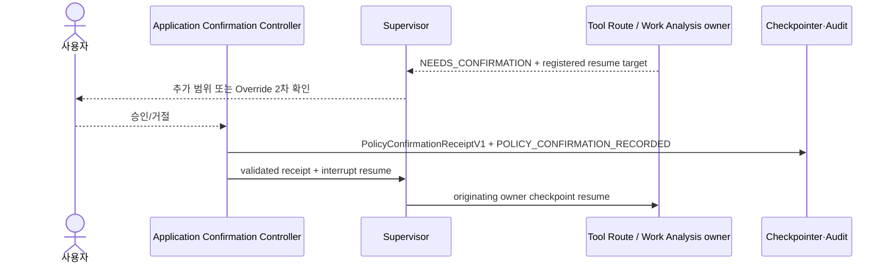
```mermaid
sequenceDiagram
    actor U as 사용자
    participant C as Application Confirmation Controller
    participant S as Supervisor
    participant R as Tool Route / Work Analysis owner
    participant DB as Checkpointer·Audit
    R-->>S: NEEDS_CONFIRMATION + registered resume target
    S-->>U: 추가 범위 또는 Override 2차 확인
    U-->>C: 승인/거절
    C->>DB: PolicyConfirmationReceiptV1 + POLICY_CONFIRMATION_RECORDED
    C->>S: validated receipt + interrupt resume
    S->>R: originating owner checkpoint resume
```
- `SCOPE_EXPANSION_REQUIRED`: Policy Precondition READ가 사용자 지정 범위를 벗어날 때.
- `DUPLICATE_OVERRIDE_REQUIRED`: 정확 Task 중복을 인지하고도 추가 생성할 때.
- `CONFLICT_OVERRIDE_REQUIRED`: 검증된 Calendar 충돌을 Override할 때.
- Receipt는 active lineage/context hash에 바인딩하며 Approval Snapshot이 필요한 APPROVED Receipt를 참조한다.


## 7. RESOURCE_SELECTED 요청 시퀀스

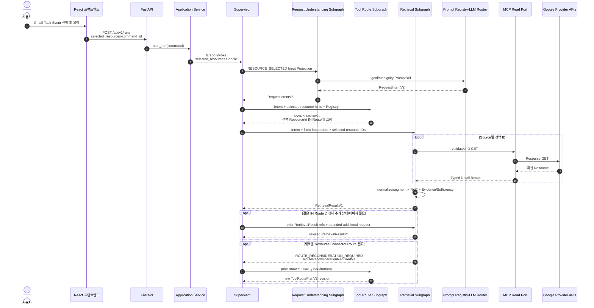
```mermaid
sequenceDiagram
    autonumber
    actor U as 사용자
    participant FE as React 프런트엔드
    participant API as FastAPI
    participant APP as Application Service
    participant SUP as Supervisor
    participant REQ as Request Understanding Subgraph
    participant ROUTE as Tool Route Subgraph
    participant RET as Retrieval Subgraph
    participant LLM as Prompt Registry·LLM Router
    participant MCP as MCP Read Port
    participant G as Google Provider APIs

    U->>FE: Gmail·Task·Event 선택 후 요청
    FE->>API: POST /api/v1/runs<br>selected_resources·command_id
    API->>APP: start_run(command)
    APP->>SUP: Graph invoke<br>selected_resources Handle
    SUP->>REQ: RESOURCE_SELECTED Input Projection
    REQ->>LLM: goal/ambiguity PromptRef
    LLM-->>REQ: RequestIntentV2
    REQ-->>SUP: RequestIntentV2

    SUP->>ROUTE: Intent + selected resource hints + Registry
    ROUTE-->>SUP: ToolRoutePlanV2<br>선택 Resource를 IN Route에 고정

    SUP->>RET: Intent + fixed input route + selected resource IDs
    loop Source별 선택 ID
        RET->>MCP: validated ID GET
        MCP->>G: Resource GET
        G-->>MCP: 최신 Resource
        MCP-->>RET: Typed Detail Result
    end
    RET->>RET: normalize/segment + RAG + Evidence/Sufficiency
    RET-->>SUP: RetrievalResultV1

    opt 같은 IN Route 안에서 추가 상세/페이지 필요
        SUP->>RET: prior RetrievalResult refs + bounded additional request
        RET-->>SUP: revised RetrievalResultV1
    end

    opt 새로운 Resource/Connector Route 필요
        RET-->>SUP: ROUTE_RECONSIDERATION_REQUIRED<br>RouteReconsiderationRequiredV1
        SUP->>ROUTE: prior route + missing requirement
        ROUTE-->>SUP: new ToolRoutePlanV2 revision
    end
```

- 선택 Resource를 검색 Query로 다시 추측하지 않고 최신 상세 GET한다.
- 추가 조회가 같은 IN Route 안이면 Retrieval Subgraph 재진입, 새 Resource/Connector가 필요하면 Tool Route Back-edge다.
- 이전 Subgraph Local State를 장기 Memory처럼 재사용하지 않고 Parent의 공식 Result와 Run Cache Handle만 사용한다.

## 8. 추가 Retrieval과 사용자 확인 Interrupt

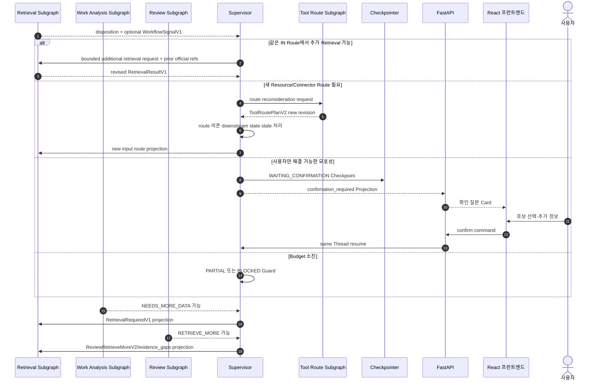
```mermaid
sequenceDiagram
    autonumber
    participant RET as Retrieval Subgraph
    participant ANA as Work Analysis Subgraph
    participant REV as Review Subgraph
    participant SUP as Supervisor
    participant ROUTE as Tool Route Subgraph
    participant DB as Checkpointer
    participant API as FastAPI
    participant FE as React 프런트엔드
    actor U as 사용자

    RET-->>SUP: disposition + optional WorkflowSignalV1
    alt 같은 IN Route에서 추가 Retrieval 가능
        SUP->>RET: bounded additional retrieval request + prior official refs
        RET-->>SUP: revised RetrievalResultV1
    else 새 Resource/Connector Route 필요
        SUP->>ROUTE: route reconsideration request
        ROUTE-->>SUP: ToolRoutePlanV2 new revision
        SUP->>SUP: route 의존 downstream state stale 처리
        SUP->>RET: new input route projection
    else 사용자만 해결 가능한 모호성
        SUP->>DB: WAITING_CONFIRMATION Checkpoint
        SUP-->>API: confirmation_required Projection
        API-->>FE: 확인 질문 Card
        U->>FE: 후보 선택·추가 정보
        FE->>API: confirm command
        API->>SUP: same Thread resume
    else Budget 소진
        SUP->>SUP: PARTIAL 또는 BLOCKED Guard
    end

    ANA-->>SUP: NEEDS_MORE_DATA 가능
    SUP->>RET: RetrievalRequiredV1 projection
    REV-->>SUP: RETRIEVE_MORE 가능
    SUP->>RET: ReviewRetrieveMoreV2/evidence_gaps projection
```

- 새 Route가 필요하지 않은 Query/Page/Detail 확장은 Retrieval 책임이다.
- Tool Route revision이 바뀌면 해당 Route에 의존한 Retrieval·Analysis·Planning·Review 결과를 stale 처리하고 다시 생성한다.
- Agent가 다른 Agent를 직접 호출하지 않는다.

## 9. Answer-only Run 완료


```mermaid
sequenceDiagram
    autonumber
    participant PLAN as Planning Subgraph
    participant REVIEW as 계획 검토 Agent
    participant SUP as Supervisor
    participant APP as Application
    participant DOM as Domain Service
    participant DB as SQLite
    participant API as FastAPI
    participant FE as React 프런트엔드

    PLAN-->>SUP: ANSWER_ONLY·answer_draft
    SUP->>REVIEW: 답변 근거·목표 충족 검토
    REVIEW-->>SUP: PASS
    SUP->>APP: complete_answer_only_run
    APP->>DOM: Open Action·Recovery Guard
    DOM-->>APP: ALLOW
    APP->>DB: BEGIN IMMEDIATE
    APP->>DB: Assistant Message·Trace·Run COMPLETED
    APP->>DB: COMMIT
    APP-->>SUP: applied=true
    SUP-->>API: completed Projection
    API-->>FE: 최종 답변·COMPLETED
```

Answer-only Run에는 Plan·Action·Approval·Attempt·Verification Row를 만들지 않는다.

## 10. READ-only Plan 실행

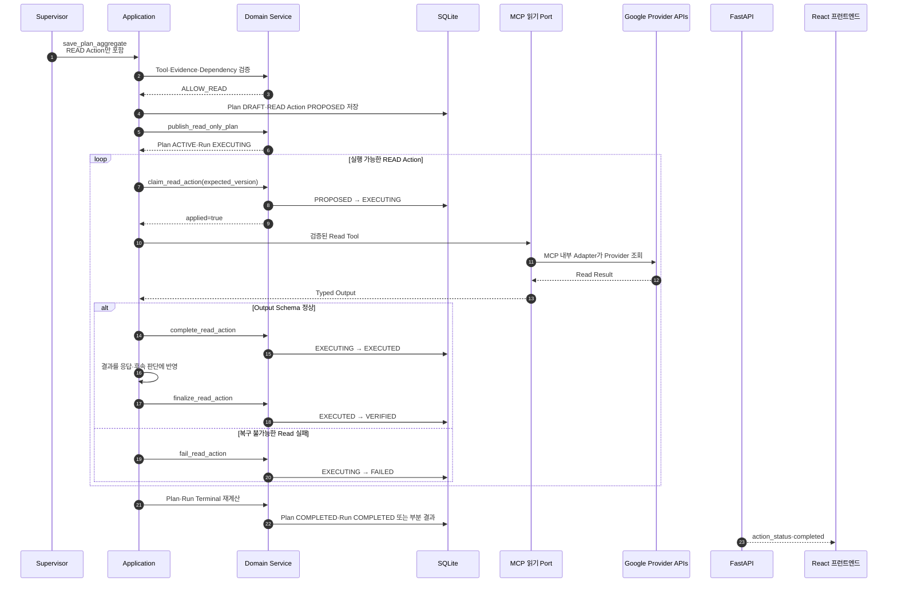
```mermaid
sequenceDiagram
    autonumber
    participant SUP as Supervisor
    participant APP as Application
    participant DOM as Domain Service
    participant DB as SQLite
    participant MCP as MCP 읽기 Port
    participant G as Google Provider APIs
    participant API as FastAPI
    participant FE as React 프런트엔드

    SUP->>APP: save_plan_aggregate<br>READ Action만 포함
    APP->>DOM: Tool·Evidence·Dependency 검증
    DOM-->>APP: ALLOW_READ
    APP->>DB: Plan DRAFT·READ Action PROPOSED 저장
    APP->>DOM: publish_read_only_plan
    DOM-->>APP: Plan ACTIVE·Run EXECUTING

    loop 실행 가능한 READ Action
        APP->>DOM: claim_read_action(expected_version)
        DOM->>DB: PROPOSED → EXECUTING
        DOM-->>APP: applied=true
        APP->>MCP: 검증된 Read Tool
        MCP->>G: MCP 내부 Adapter가 Provider 조회
        G-->>MCP: Read Result
        MCP-->>APP: Typed Output
        alt Output Schema 정상
            APP->>DOM: complete_read_action
            DOM->>DB: EXECUTING → EXECUTED
            APP->>APP: 결과를 응답·후속 판단에 반영
            APP->>DOM: finalize_read_action
            DOM->>DB: EXECUTED → VERIFIED
        else 복구 불가능한 Read 실패
            APP->>DOM: fail_read_action
            DOM->>DB: EXECUTING → FAILED
        end
    end

    APP->>DOM: Plan·Run Terminal 재계산
    DOM->>DB: Plan COMPLETED·Run COMPLETED 또는 부분 결과
    API-->>FE: action_status·completed
```

- READ `VERIFIED`는 Output Schema Validation과 결과 반영 완료를 의미한다.
- Write Verification 지표에 포함하지 않는다.

## 11. WRITE Plan 저장·승인·실행·검증

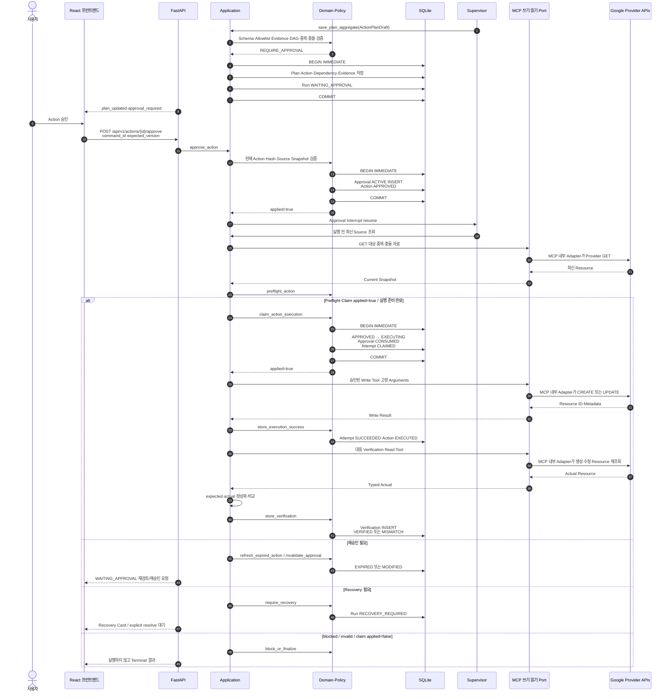
```mermaid
sequenceDiagram
    autonumber
    actor U as 사용자
    participant FE as React 프런트엔드
    participant API as FastAPI
    participant APP as Application
    participant DOM as Domain·Policy
    participant DB as SQLite
    participant SUP as Supervisor
    participant MCP as MCP 쓰기·읽기 Port
    participant G as Google Provider APIs

    SUP->>APP: save_plan_aggregate(ActionPlanDraft)
    APP->>DOM: Schema·Allowlist·Evidence·DAG·중복·충돌 검증
    DOM-->>APP: REQUIRE_APPROVAL
    APP->>DB: BEGIN IMMEDIATE
    APP->>DB: Plan·Action·Dependency·Evidence 저장
    APP->>DB: Run WAITING_APPROVAL
    APP->>DB: COMMIT
    API-->>FE: plan_updated·approval_required

    U->>FE: Action 승인
    FE->>API: POST /api/v1/actions/{id}/approve<br>command_id·expected_version
    API->>APP: approve_action
    APP->>DOM: 현재 Action·Hash·Source Snapshot 검증
    DOM->>DB: BEGIN IMMEDIATE
    DOM->>DB: Approval ACTIVE INSERT<br>Action APPROVED
    DOM->>DB: COMMIT
    DOM-->>APP: applied=true
    APP->>SUP: Approval Interrupt resume

    SUP->>APP: 실행 전 최신 Source 조회
    APP->>MCP: GET 대상·중복·충돌 자료
    MCP->>G: MCP 내부 Adapter가 Provider GET
    G-->>MCP: 최신 Resource
    MCP-->>APP: Current Snapshot
    APP->>DOM: preflight_action

    alt Preflight·Claim applied=true / 실행 준비 완료
        APP->>DOM: claim_action_execution
        DOM->>DB: BEGIN IMMEDIATE
        DOM->>DB: APPROVED → EXECUTING<br>Approval CONSUMED<br>Attempt CLAIMED
        DOM->>DB: COMMIT
        DOM-->>APP: applied=true
        APP->>MCP: 승인된 Write Tool·고정 Arguments
        MCP->>G: MCP 내부 Adapter가 CREATE 또는 UPDATE
        G-->>MCP: Resource ID·Metadata
        MCP-->>APP: Write Result
        APP->>DOM: store_execution_success
        DOM->>DB: Attempt SUCCEEDED·Action EXECUTED
        APP->>MCP: 대응 Verification Read Tool
        MCP->>G: MCP 내부 Adapter가 생성·수정 Resource 재조회
        G-->>MCP: Actual Resource
        MCP-->>APP: Typed Actual
        APP->>APP: expected·actual 정상화·비교
        APP->>DOM: store_verification
        DOM->>DB: Verification INSERT<br>VERIFIED 또는 MISMATCH
    else 재승인 필요
        APP->>DOM: refresh_expired_action / invalidate_approval
        DOM->>DB: EXPIRED 또는 MODIFIED
        API-->>FE: WAITING_APPROVAL·재검토/재승인 요청
    else Recovery 필요
        APP->>DOM: require_recovery
        DOM->>DB: Run RECOVERY_REQUIRED
        API-->>FE: Recovery Card / explicit resolve 대기
    else blocked / invalid / claim applied=false
        APP->>DOM: block_or_finalize
        API-->>FE: 실행하지 않고 Terminal 결과
    end
```

외부 Write와 GET 수행 중 DB Transaction을 유지하지 않는다.

### 11.1 Google Task 날짜·시간 의미

```text
Gmail·사용자 요청에서 업무 마감만 확인
→ Request Understanding: business_deadline 후보
→ Task scheduled_date 없음
→ Plan: notes·Evidence·Approval Summary에 업무 마감 보존 제안
→ 사용자 Approval
→ tasks_create_task(due 없음)
→ GET Verification: 제목·notes·예정일 부재 비교

사용자가 수행 예정일도 명시
→ Request Understanding: scheduled_date 후보
→ 승인된 tasks_create_task(due = scheduled_date)
→ GET Verification: 예정일 비교

정확한 시간 구간 요청
→ Tasks 시간 설정 성공 선언 금지
→ 날짜 예정일 또는 별도 승인형 Calendar Event 대안 제시
```

Provider `needsAction`·`completed`는 Local API Projection에서 사용자 상태 `미완료`·`완료`로 정규화한다. 예정일 경과는 상태 전이나 자동 완료 시퀀스를 만들지 않는다.

## 12. 일부 승인과 Action DAG

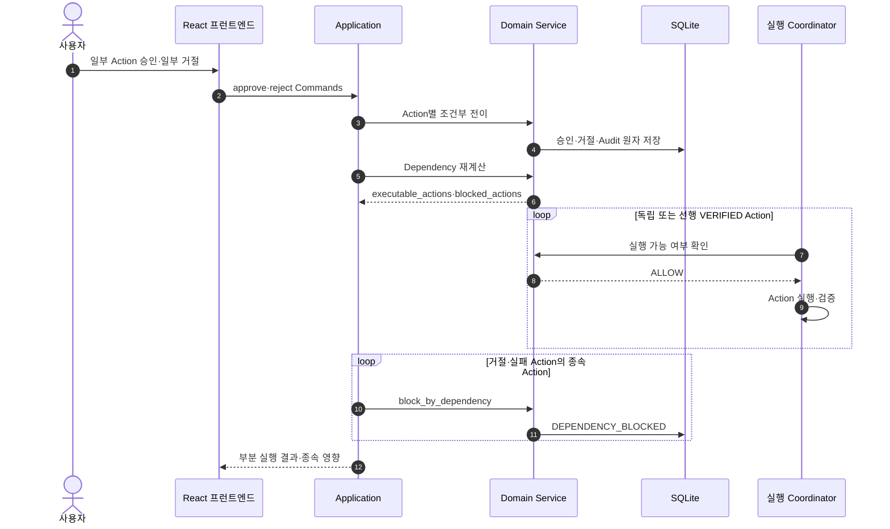
```mermaid
sequenceDiagram
    autonumber
    actor U as 사용자
    participant FE as React 프런트엔드
    participant APP as Application
    participant DOM as Domain Service
    participant DB as SQLite
    participant EXE as 실행 Coordinator

    U->>FE: 일부 Action 승인·일부 거절
    FE->>APP: approve·reject Commands
    APP->>DOM: Action별 조건부 전이
    DOM->>DB: 승인·거절·Audit 원자 저장
    APP->>DOM: Dependency 재계산
    DOM-->>APP: executable_actions·blocked_actions

    loop 독립 또는 선행 VERIFIED Action
        EXE->>DOM: 실행 가능 여부 확인
        DOM-->>EXE: ALLOW
        EXE->>EXE: Action 실행·검증
    end

    loop 거절·실패 Action의 종속 Action
        APP->>DOM: block_by_dependency
        DOM->>DB: DEPENDENCY_BLOCKED
    end

    APP-->>FE: 부분 실행 결과·종속 영향
```

- 성공한 Action은 자동 롤백하지 않는다.
- 종속 Action은 선행 Action의 `VERIFIED` 또는 계약된 성공 조건 이후에만 실행한다.

## 13. 승인 수정·거절·만료

Action Reject는 `PROPOSED·MODIFIED·APPROVED → REJECTED`만 허용한다. APPROVED Reject는 기존 ACTIVE Approval을 삭제하지 않고 `REVOKED`로 보존한다. Reject와 `ACTION_REJECTED` Audit, 미실행 transitive dependent의 `DEPENDENCY_BLOCKED`, dependent ACTIVE Approval revoke는 하나의 UoW에서 commit한다. 모든 Action이 Terminal이면 Plan/Run을 `COMPLETED`로 확정하고, 독립적인 미완료 Action이 있으면 계속 진행한다. 외부 Google/MCP Write와 새 ExecutionAttempt는 생성하지 않는다.

### 13.1 사용자 수정

Action 수정이 실제 Canonical Arguments를 변경하면 기존 Approval을 revoke한 뒤 같은 Transaction에서 Plan Review를 `REQUIRED`로 무효화한다. Commit 이후 기존 Profile의 Plan Review를 다시 실행하고, 최신 `review_version`에 대한 Review PASS와 Domain Validation이 모두 성공한 경우에만 새 Approval을 허용한다. Review 중 후속 Modify가 발생하면 이전 Review 결과는 version conflict로 폐기한다.

재검토가 `REVISE` 또는 `RETRIEVE_MORE`이면 기존 Plan을 `SUPERSEDED`로 전이하고 Run을 `PLANNING`으로 되돌린 후 기존 Planning/Retrieval 경로를 재사용한다. 후속 PASS는 기존 Plan의 gate를 열지 않고 새 revision을 저장하며 새 Action에 대해 Approval을 다시 받아야 한다. `BLOCK`은 Run을 `BLOCKED`로 종료한다.

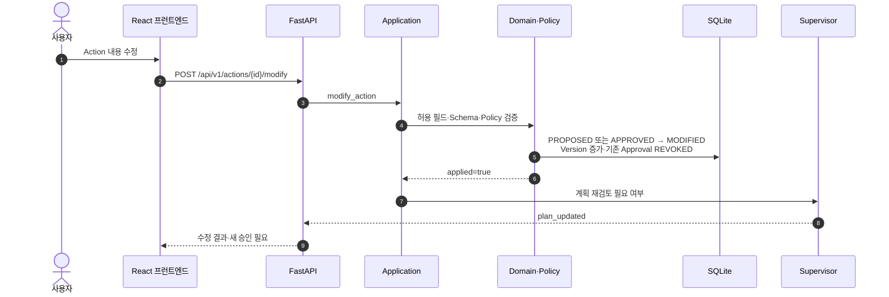
```mermaid
sequenceDiagram
    autonumber
    actor U as 사용자
    participant FE as React 프런트엔드
    participant API as FastAPI
    participant APP as Application
    participant DOM as Domain·Policy
    participant DB as SQLite
    participant SUP as Supervisor

    U->>FE: Action 내용 수정
    FE->>API: POST /api/v1/actions/{id}/modify
    API->>APP: modify_action
    APP->>DOM: 허용 필드·Schema·Policy 검증
    DOM->>DB: PROPOSED 또는 APPROVED → MODIFIED<br>Version 증가·기존 Approval REVOKED
    DOM-->>APP: applied=true
    APP->>SUP: 계획 재검토 필요 여부
    SUP-->>API: plan_updated
    API-->>FE: 수정 결과·새 승인 필요
```

### 13.2 승인 만료

```text
Approval 유효 시간 경과 또는 Source·Policy·Tool Schema 변경
→ Action EXPIRED
→ refresh_expired_action
→ 최신 Source·중복·충돌·Arguments 재검증
→ Action MODIFIED
→ 새 approval_no·idempotency_key
→ 사용자 재승인
```

기존 Approval을 다시 `ACTIVE`로 만들지 않는다.

## 14. Write 실패와 명시적 재시도

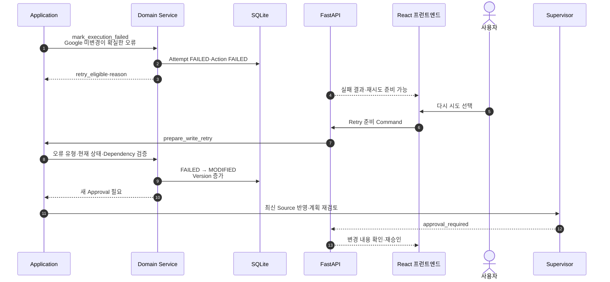
```mermaid
sequenceDiagram
    autonumber
    participant APP as Application
    participant DOM as Domain Service
    participant DB as SQLite
    participant API as FastAPI
    participant FE as React 프런트엔드
    actor U as 사용자
    participant SUP as Supervisor

    APP->>DOM: mark_execution_failed<br>Google 미변경이 확실한 오류
    DOM->>DB: Attempt FAILED·Action FAILED
    DOM-->>APP: retry_eligible·reason
    API-->>FE: 실패 결과·재시도 준비 가능

    U->>FE: 다시 시도 선택
    FE->>API: Retry 준비 Command
    API->>APP: prepare_write_retry
    APP->>DOM: 오류 유형·현재 상태·Dependency 검증
    DOM->>DB: FAILED → MODIFIED<br>Version 증가
    DOM-->>APP: 새 Approval 필요
    APP->>SUP: 최신 Source 반영·계획 재검토
    SUP-->>API: approval_required
    API-->>FE: 변경 내용 확인·재승인
```

금지 전이:

```text
FAILED → EXECUTING
UNKNOWN_RESULT → EXECUTING
```

재시도는 새 Approval, 새 Idempotency Key, 최신 Source Snapshot과 새 ExecutionAttempt ID를 사용하며 새 Approval의 `attempt_no`는 1로 시작한다.

## 15. Write 응답 유실·UNKNOWN_RESULT 복구

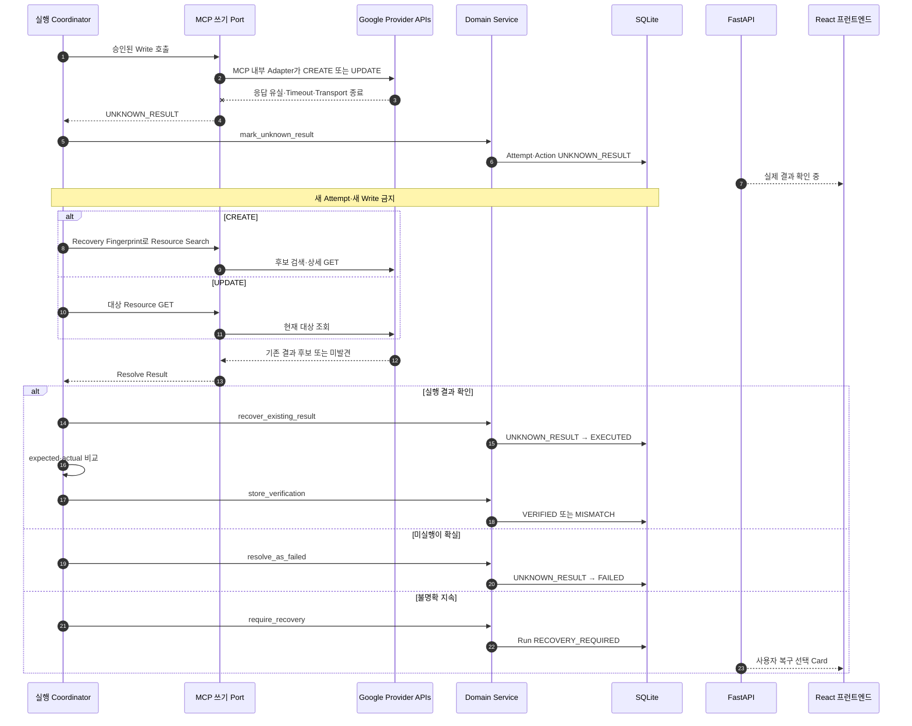
```mermaid
sequenceDiagram
    autonumber
    participant APP as 실행 Coordinator
    participant MCP as MCP 쓰기 Port
    participant G as Google Provider APIs
    participant DOM as Domain Service
    participant DB as SQLite
    participant API as FastAPI
    participant FE as React 프런트엔드

    APP->>MCP: 승인된 Write 호출
    MCP->>G: MCP 내부 Adapter가 CREATE 또는 UPDATE
    G--xMCP: 응답 유실·Timeout·Transport 종료
    MCP-->>APP: UNKNOWN_RESULT
    APP->>DOM: mark_unknown_result
    DOM->>DB: Attempt·Action UNKNOWN_RESULT
    API-->>FE: 실제 결과 확인 중

    Note over APP,DB: 새 Attempt·새 Write 금지

    alt CREATE
        APP->>MCP: Recovery Fingerprint로 Resource Search
        MCP->>G: 후보 검색·상세 GET
    else UPDATE
        APP->>MCP: 대상 Resource GET
        MCP->>G: 현재 대상 조회
    end
    G-->>MCP: 기존 결과 후보 또는 미발견
    MCP-->>APP: Resolve Result

    alt 실행 결과 확인
        APP->>DOM: recover_existing_result
        DOM->>DB: UNKNOWN_RESULT → EXECUTED
        APP->>APP: expected·actual 비교
        APP->>DOM: store_verification
        DOM->>DB: VERIFIED 또는 MISMATCH
    else 미실행이 확실
        APP->>DOM: resolve_as_failed
        DOM->>DB: UNKNOWN_RESULT → FAILED
    else 불명확 지속
        APP->>DOM: require_recovery
        DOM->>DB: Run RECOVERY_REQUIRED
        API-->>FE: 사용자 복구 선택 Card
    end
```

`NOT_FOUND` 한 번만으로 CREATE 미실행을 확정하지 않는다. 검색 범위·일관성 지연·권한 오류를 함께 판단한다.

Recovery는 Verification으로 자동 반복하지 않는다. 기존 결과가 회수되었거나 재검증이 필요한 경우에만 Verification으로 돌아간다. 실패가 확정되면 Terminal Result를 합성하고, Domain `RECOVERY_REQUIRED`가 유지되면 Graph는 안전 checkpoint에서 suspend하여 `/api/v1/runs/{run_id}/resolve-recovery` 또는 재인증·safe resume을 기다린다. blocked/cancelled는 FINALIZE한다.

## 16. OAuth 만료와 재인증 후 재개

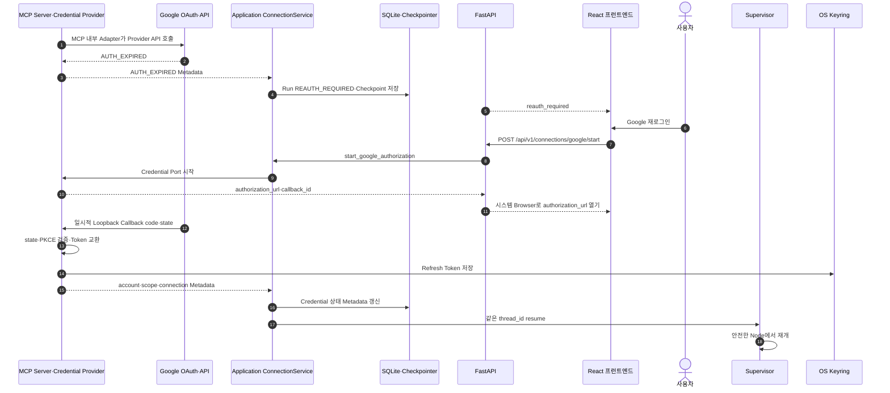
```mermaid
sequenceDiagram
    autonumber
    participant MCP as MCP Server·Credential Provider
    participant G as Google OAuth·API
    participant APP as Application ConnectionService
    participant DB as SQLite·Checkpointer
    participant API as FastAPI
    participant FE as React 프런트엔드
    actor U as 사용자
    participant SUP as Supervisor
    participant K as OS Keyring

    MCP->>G: MCP 내부 Adapter가 Provider API 호출
    G-->>MCP: AUTH_EXPIRED
    MCP-->>APP: AUTH_EXPIRED Metadata
    APP->>DB: Run REAUTH_REQUIRED·Checkpoint 저장
    API-->>FE: reauth_required
    U->>FE: Google 재로그인
    FE->>API: POST /api/v1/connections/google/start
    API->>APP: start_google_authorization
    APP->>MCP: Credential Port 시작
    MCP-->>API: authorization_url·callback_id
    API-->>FE: 시스템 Browser로 authorization_url 열기
    G->>MCP: 일시적 Loopback Callback code·state
    MCP->>MCP: state·PKCE 검증·Token 교환
    MCP->>K: Refresh Token 저장
    MCP-->>APP: account·scope·connection Metadata
    APP->>DB: Credential 상태 Metadata 갱신
    APP->>SUP: 같은 thread_id resume
    SUP->>SUP: 안전한 Node에서 재개
```

- Authorization Code와 Token 원문은 MCP Credential Provider 경계를 벗어나지 않는다.
- Write 전달 여부가 불명확한 시점의 인증 오류는 `UNKNOWN_RESULT` 규칙을 우선한다.
- Checkpoint가 없으면 자동 재실행하지 않고 `RECOVERY_REQUIRED`로 전환한다.

## 17. 취소

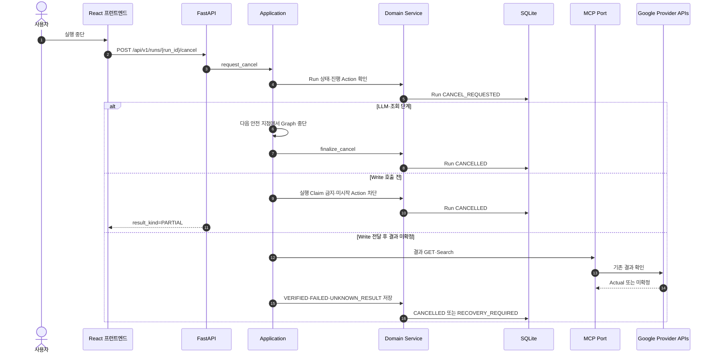
```mermaid
sequenceDiagram
    autonumber
    actor U as 사용자
    participant FE as React 프런트엔드
    participant API as FastAPI
    participant APP as Application
    participant DOM as Domain Service
    participant DB as SQLite
    participant MCP as MCP Port
    participant G as Google Provider APIs

    U->>FE: 실행 중단
    FE->>API: POST /api/v1/runs/{run_id}/cancel
    API->>APP: request_cancel
    APP->>DOM: Run 상태·진행 Action 확인
    DOM->>DB: Run CANCEL_REQUESTED

    alt LLM·조회 단계
        APP->>APP: 다음 안전 지점에서 Graph 중단
        APP->>DOM: finalize_cancel
        DOM->>DB: Run CANCELLED
    else Write 호출 전
        APP->>DOM: 실행 Claim 금지·미시작 Action 차단
        DOM->>DB: Run CANCELLED
        API-->>FE: result_kind=PARTIAL
    else Write 전달 후 결과 미확정
        APP->>MCP: 결과 GET·Search
        MCP->>G: 기존 결과 확인
        G-->>MCP: Actual 또는 미확정
        APP->>DOM: VERIFIED·FAILED·UNKNOWN_RESULT 저장
        DOM->>DB: CANCELLED 또는 RECOVERY_REQUIRED
    end
```

취소는 성공한 Google 변경을 롤백하지 않는다.

## 18. SSE 단절·브라우저 새로고침

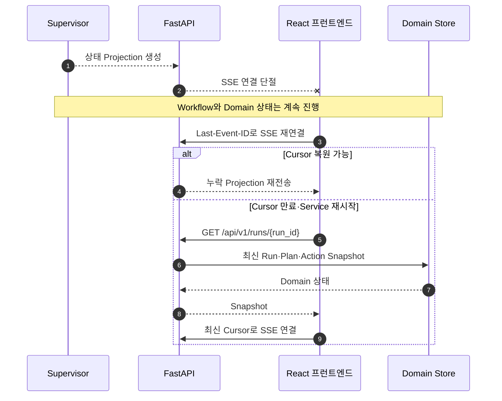
```mermaid
sequenceDiagram
    autonumber
    participant SUP as Supervisor
    participant API as FastAPI
    participant FE as React 프런트엔드
    participant DB as Domain Store

    SUP-->>API: 상태 Projection 생성
    API--xFE: SSE 연결 단절
    Note over SUP,DB: Workflow와 Domain 상태는 계속 진행
    FE->>API: Last-Event-ID로 SSE 재연결
    alt Cursor 복원 가능
        API-->>FE: 누락 Projection 재전송
    else Cursor 만료·Service 재시작
        FE->>API: GET /api/v1/runs/{run_id}
        API->>DB: 최신 Run·Plan·Action Snapshot
        DB-->>API: Domain 상태
        API-->>FE: Snapshot
        FE->>API: 최신 Cursor로 SSE 연결
    end
```

SSE 중복 Event는 `event_id`와 Aggregate Version으로 무시한다.

## 19. 앱 재시작과 Run 복구

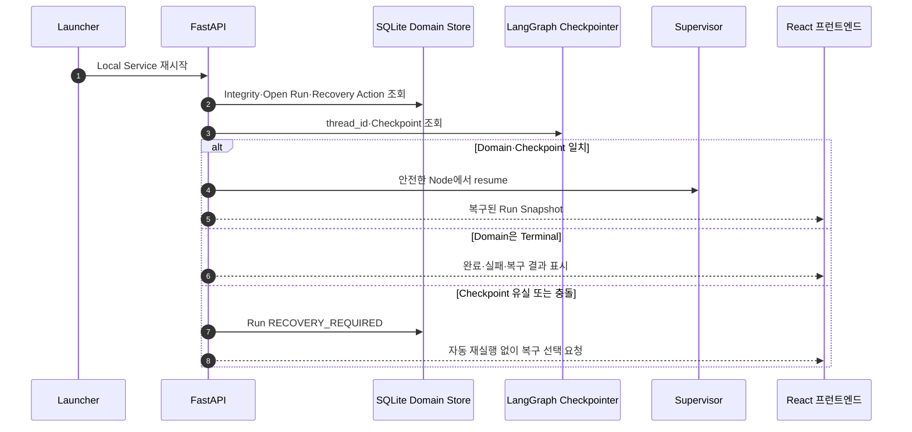
```mermaid
sequenceDiagram
    autonumber
    participant L as Launcher
    participant API as FastAPI
    participant DB as SQLite Domain Store
    participant CP as LangGraph Checkpointer
    participant SUP as Supervisor
    participant FE as React 프런트엔드

    L->>API: Local Service 재시작
    API->>DB: Integrity·Open Run·Recovery Action 조회
    API->>CP: thread_id·Checkpoint 조회
    alt Domain·Checkpoint 일치
        API->>SUP: 안전한 Node에서 resume
        API-->>FE: 복구된 Run Snapshot
    else Domain은 Terminal
        API-->>FE: 완료·실패·복구 결과 표시
    else Checkpoint 유실 또는 충돌
        API->>DB: Run RECOVERY_REQUIRED
        API-->>FE: 자동 재실행 없이 복구 선택 요청
    end
```

이미 `VERIFIED`인 Action과 `UNKNOWN_RESULT` 해결 전 Write는 재실행하지 않는다.

## 20. MCP 프로세스 장애

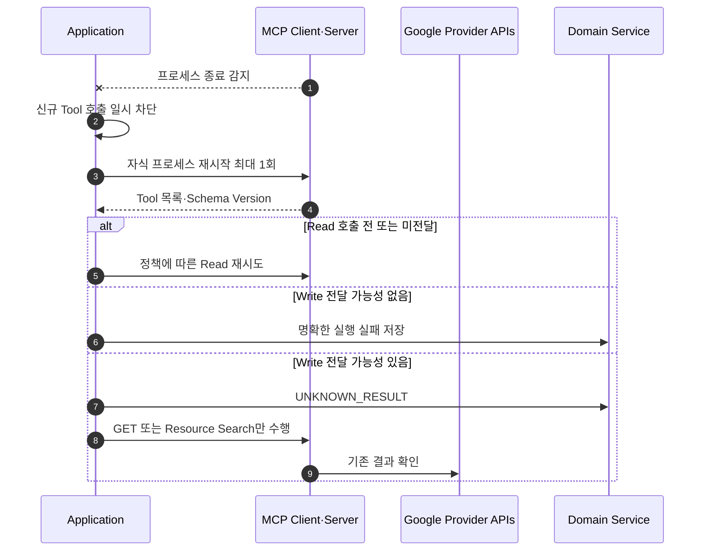
```mermaid
sequenceDiagram
    autonumber
    participant APP as Application
    participant MCP as MCP Client·Server
    participant G as Google Provider APIs
    participant DOM as Domain Service

    MCP--xAPP: 프로세스 종료 감지
    APP->>APP: 신규 Tool 호출 일시 차단
    APP->>MCP: 자식 프로세스 재시작 최대 1회
    MCP-->>APP: Tool 목록·Schema Version

    alt Read 호출 전 또는 미전달
        APP->>MCP: 정책에 따른 Read 재시도
    else Write 전달 가능성 없음
        APP->>DOM: 명확한 실행 실패 저장
    else Write 전달 가능성 있음
        APP->>DOM: UNKNOWN_RESULT
        APP->>MCP: GET 또는 Resource Search만 수행
        MCP->>G: 기존 결과 확인
    end
```

Write는 Transport 오류만으로 즉시 재전송하지 않는다.

## 21. LLM Runtime 선택·Fallback

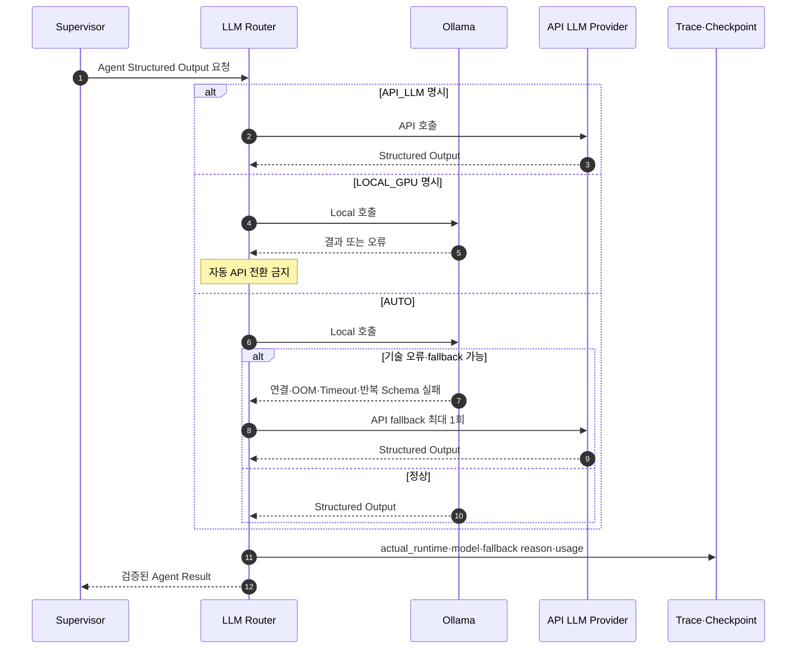
```mermaid
sequenceDiagram
    autonumber
    participant SUP as Supervisor
    participant LR as LLM Router
    participant O as Ollama
    participant P as API LLM Provider
    participant DB as Trace·Checkpoint

    SUP->>LR: Agent Structured Output 요청
    alt API_LLM 명시
        LR->>P: API 호출
        P-->>LR: Structured Output
    else LOCAL_GPU 명시
        LR->>O: Local 호출
        O-->>LR: 결과 또는 오류
        Note over LR: 자동 API 전환 금지
    else AUTO
        LR->>O: Local 호출
        alt 기술 오류·fallback 가능
            O-->>LR: 연결·OOM·Timeout·반복 Schema 실패
            LR->>P: API fallback 최대 1회
            P-->>LR: Structured Output
        else 정상
            O-->>LR: Structured Output
        end
    end
    LR->>DB: actual_runtime·model·fallback reason·usage
    LR-->>SUP: 검증된 Agent Result
```

## 22. 앱 정상 종료

```text
Launcher 종료 요청
→ 신규 Run·승인 Command 차단
→ 실행 중 Write의 전달 여부 확인
→ 결과 저장 또는 UNKNOWN_RESULT
→ LangGraph Checkpoint Flush
→ SQLite Connection 종료
→ MCP 자식 프로세스 종료
→ FastAPI 종료
→ Launcher 종료
```

브라우저 탭을 닫는 것만으로 Local Service를 강제 종료하지 않는다.

## 23. Workflow Phase·Run Status·주요 Event 매핑

<table fit-page-width="true" header-row="true">
	<tr>
		<td>Workflow Phase</td>
		<td>Run Status</td>
		<td>SSE Event</td>
	</tr>
	<tr>
		<td>`REQUEST_UNDERSTANDING`</td>
		<td>`ANALYZING`</td>
		<td>`phase_changed`</td>
	</tr>
	<tr>
		<td>`TOOL_ROUTING`</td>
		<td>`ANALYZING`</td>
		<td>`tool_routing`</td>
	</tr>
	<tr>
		<td>`RETRIEVAL`</td>
		<td>`RETRIEVING`</td>
		<td>`retrieval_progress`</td>
	</tr>
	<tr>
		<td>`WAITING_CONFIRMATION`</td>
		<td>`WAITING_CONFIRMATION`</td>
		<td>`confirmation_required`</td>
	</tr>
	<tr>
		<td>`WORK_ANALYSIS`</td>
		<td>`ANALYZING`</td>
		<td>`analysis_progress`</td>
	</tr>
	<tr>
		<td>`PLANNING`, `REVIEW`</td>
		<td>`PLANNING`</td>
		<td>`plan_updated`</td>
	</tr>
	<tr>
		<td>`WAITING_APPROVAL`</td>
		<td>`WAITING_APPROVAL`</td>
		<td>`approval_required`</td>
	</tr>
	<tr>
		<td>`PREFLIGHT`, `ACTION_EXECUTION`</td>
		<td>`EXECUTING`</td>
		<td>`action_status`</td>
	</tr>
	<tr>
		<td>`VERIFICATION`</td>
		<td>`VERIFYING`</td>
		<td>`verification_result`</td>
	</tr>
	<tr>
		<td>`RECOVERY`</td>
		<td>`RECOVERY_REQUIRED`</td>
		<td>`recovery_required`</td>
	</tr>
	<tr>
		<td>`FINALIZE`</td>
		<td>Terminal</td>
		<td>`completed` 또는 `error`</td>
	</tr>
</table>

## 24. Transaction 경계 요약

<table fit-page-width="true" header-row="true">
	<tr>
		<td>구간</td>
		<td>DB Transaction</td>
		<td>외부 호출</td>
	</tr>
	<tr>
		<td>Run 시작</td>
		<td>Run·User Message 원자 저장</td>
		<td>없음</td>
	</tr>
	<tr>
		<td>Agent LLM 호출</td>
		<td>없음</td>
		<td>API LLM 또는 Ollama</td>
	</tr>
	<tr>
		<td>MCP Read Tool</td>
		<td>없음</td>
		<td>MCP Tool·MCP 내부 Google Provider API</td>
	</tr>
	<tr>
		<td>Plan 저장</td>
		<td>Plan·Action·Evidence Batch</td>
		<td>없음</td>
	</tr>
	<tr>
		<td>승인</td>
		<td>Approval·Action·Audit</td>
		<td>없음</td>
	</tr>
	<tr>
		<td>실행 Claim</td>
		<td>Action·Approval·Attempt</td>
		<td>Commit 이후 Write</td>
	</tr>
	<tr>
		<td>Write 결과 저장</td>
		<td>Attempt·Action·ResourceRef</td>
		<td>Write 완료 이후</td>
	</tr>
	<tr>
		<td>검증 저장</td>
		<td>Verification·Action·상위 상태</td>
		<td>GET 완료 이후</td>
	</tr>
	<tr>
		<td>Answer-only 완료</td>
		<td>Message·Trace·Run Terminal</td>
		<td>없음</td>
	</tr>
</table>

## 25. 오류 처리 우선순위

```text
APPROVAL_INVALID·POLICY_BLOCKED·VERSION_CONFLICT
→ Write 호출 금지

AUTH_EXPIRED
→ REAUTH_REQUIRED·Checkpoint 재개

RATE_LIMITED·UPSTREAM_5XX
→ Read 제한 재시도 또는 부분 결과
→ Write는 전달 여부 확인 후 처리

TIMEOUT·MCP_UNAVAILABLE
→ Write 전달 가능성에 따라 FAILED 또는 UNKNOWN_RESULT

VERIFICATION_MISMATCH
→ 자동 수정 금지·사용자 Recovery
```

## 26. 정합성·테스트 완료 조건

- Tool Route Subgraph와 Retrieval Subgraph의 책임이 분리된다.
- Tool Route가 IN/OUT Tool을 한 번 확정하고 Retrieval·Planning이 재선택하지 않는다.
- Retrieval LLM이 MCP를 직접 호출하는 경로가 없고 결정적 Read Node만 허용 Tool 범위에서 호출한다.
- Retrieval은 Run-scoped RAG를 거쳐 Evidence를 반환한다.
- 일반 Retrieval이 Action Row를 생성하지 않는다.
- Answer-only Run이 Plan·Action 없이 완료된다.
- READ-only Plan은 승인 없이 실행된다.
- READ Action에는 Approval·Attempt·Verification Row가 없다.
- READ Output Schema 실패는 `FAILED`로 저장된다.
- Write는 Approval과 실행 Claim Commit 이후 한 번만 호출된다.
- 승인 이후 LLM이 Arguments를 다시 생성하지 않는다.
- `FAILED → MODIFIED → 새 승인`만 Write Retry로 허용된다.
- `UNKNOWN_RESULT`에서 새 Attempt·Write가 차단된다.
- 일부 승인·부분 실패 시 성공 Action을 보존한다.
- SSE 단절과 브라우저 새로고침이 Write 재실행을 만들지 않는다.
- OAuth 재인증은 같은 Thread의 안전한 Checkpoint에서 재개된다.
- 외부 호출 중 SQLite Transaction을 유지하지 않는다.
- MCP 장애에서 Write 전달 가능성을 확인하기 전 자동 재전송하지 않는다.
- `RESOURCE_SELECTED`는 React→FastAPI→Application→Supervisor 경계를 지킨다.
- 확인 응답 저장은 Application·Repository를 경유하며 FastAPI Route가 DB를 직접 수정하지 않는다.
- 07에 정의된 Source별 Read Port만 시퀀스에서 사용한다.
- Supervisor는 Node만 Routing하고 선택된 Agent·Application Node가 PromptRef를 확정하는지 검증한다.
- `/health/ready`와 `/api/v1/runtime`의 책임이 분리된다.

## 27. 후속 문서 제공 계약

- `09`: OAuth·Scope·Keyring·Local Session 보안 상세
- `10`: Installer·Launcher·Process·환경 설정 상세
- `11`: 본 문서 Event·Trace·Audit 필드 상세
- `12`: 각 시퀀스의 Unit·Integration·E2E 테스트 케이스
- `14`: 오류 코드별 운영·복구 절차


---

## 28. 문서 권위 규칙

문서 번호 순서가 아니라 `01 PRD §1.1`의 **Concern Owner 규칙**을 따른다. 이 문서는 자신의 책임 범위만 구체화하며 01-B 안전 정책, 04 Domain·상태 전이, 07 Tool 계약 같은 전문 권위 계약을 완화하지 않는다.


### 28.1 LLM 호출 전 PromptRef 선택

모든 LLM 호출 전에 Supervisor가 선택한 Agent·Application Node가 다음 Key로 PromptRef를 확정한다.

```text
agent_role + subgraph_name + node_name + node_state + purpose
```

Repair·Revision은 별도 PromptRef를 사용할 수 있으며 Prompt 선택 결과는 `prompt_id`·`prompt_version`·`content_hash`로 Trace한다.


## 29. Command Receipt 시퀀스

```text
Route가 Request 검증
→ Application이 Canonical Request Hash 생성
→ BEGIN IMMEDIATE
→ command_receipts 조회
→ 신규면 RECEIVED Insert
→ Domain 변경·Audit
→ Receipt APPLIED 또는 REJECTED
→ COMMIT
```

- 동일 `command_id`·동일 Hash면 저장된 응답을 반환한다.
- 동일 ID·다른 Hash면 `DUPLICATE_COMMAND`다.
- HTTP 응답 유실 후 재전송도 새 Run·Approval·Attempt를 만들지 않는다.

## 30. Claim Token 시퀀스

```text
claim_action_execution Commit
→ ExecutionClaimService가 30초 TTL Token 생성
→ MCP Write Tool 호출
→ MCP Signature·Binding·Nonce 검증
→ Nonce 소비
→ Google Write
```

검증 실패 시 MCP Write/Provider dispatch를 호출하지 않고 `APPROVAL_INVALID` 또는 Claim Token 오류를 반환한다.

## 31. Transaction · Recovery · SEND/DELETE 시퀀스
```text
Transaction A: 상태·Version·Snapshot 확보 → COMMIT
Google/MCP/LLM 호출: DB Write Transaction 없음
Transaction B: expected_version·현재 상태 재검사 → 결과·Verification·Audit 저장 → COMMIT
```
Recovery는 `RequireRecovery`·`ResolveRecovery` Domain Command를 사용한다.

### Gmail SEND
Plan(SEND) → Domain Validation → WAITING_APPROVAL → Claim → gmail_send → Sent Lookup → VERIFIED | MISMATCH | UNKNOWN_RESULT.

### Calendar DELETE
Plan(DELETE) → Domain Validation → WAITING_APPROVAL → Claim → calendar_delete_event → target absence 확인 → VERIFIED | MISMATCH | UNKNOWN_RESULT.
## 32. Agent Subgraph 호출·복귀 시퀀스

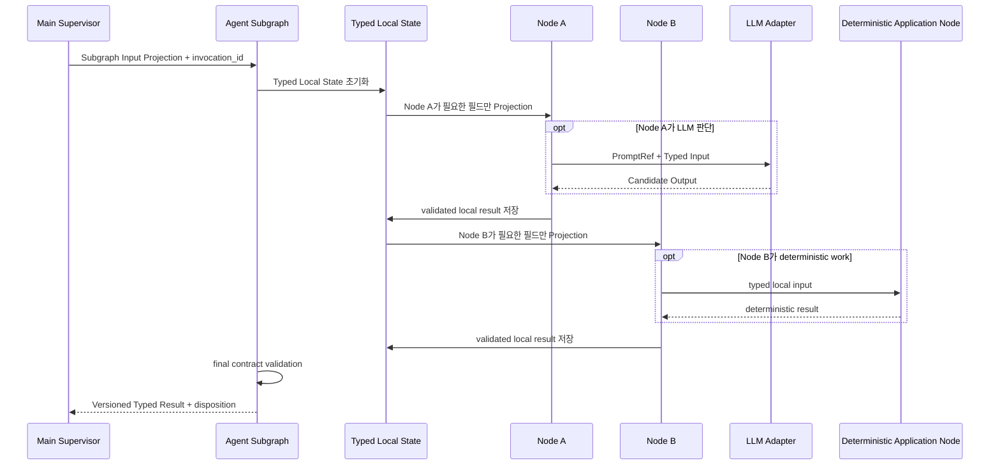
```mermaid
sequenceDiagram
    participant SUP as Main Supervisor
    participant AG as Agent Subgraph
    participant LS as Typed Local State
    participant N1 as Node A
    participant N2 as Node B
    participant LLM as LLM Adapter
    participant APP as Deterministic Application Node

    SUP->>AG: Subgraph Input Projection + invocation_id
    AG->>LS: Typed Local State 초기화
    LS->>N1: Node A가 필요한 필드만 Projection
    opt Node A가 LLM 판단
        N1->>LLM: PromptRef + Typed Input
        LLM-->>N1: Candidate Output
    end
    N1->>LS: validated local result 저장
    LS->>N2: Node B가 필요한 필드만 Projection
    opt Node B가 deterministic work
        N2->>APP: typed local input
        APP-->>N2: deterministic result
    end
    N2->>LS: validated local result 저장
    AG->>AG: final contract validation
    AG-->>SUP: Versioned Typed Result + disposition
```

- Subgraph 내부 Node마다 필요한 State가 다르며 전체 Parent State를 일괄 전달하지 않는다.
- Local State는 invocation 범위에서만 유지하고 Parent에는 공식 Typed Result만 병합한다.
- Retrieval Subgraph의 결정적 Read Node는 `ToolRoutePlanV2.input_plan.input_routes[].allowed_read_tool_ids`만 사용할 수 있다.
- Planning Subgraph는 `ToolRoutePlanV2.output_plan.output_routes[].selected_tool_id`를 읽고 Tool을 재선택하지 않는다.
- Agent가 다른 Agent를 직접 호출하지 않는다. 다른 단계가 필요하면 Supervisor에 disposition을 반환한다.
- 실제 Google Write는 공통 승인·Claim·실행·검증 경로에서만 수행한다.

## 33. Runtime E2E 취소·복구·전달 확실성

### 33.1 Cancel

```text
사용자 Cancel
→ API가 command_id / expected_version 검증
→ RequestCancel
→ Run CANCEL_REQUESTED
→ 신규 Claim·Write 차단
→ 미실행 Action CANCELLED + ACTIVE Approval REVOKED
→ EXECUTING/EXECUTED는 결과·Verification 확정
→ UNKNOWN_RESULT가 있으면 RECOVERY_REQUIRED
→ 모든 in-flight 결과 확정
→ Plan/Run CANCELLED
→ 이미 성공한 Write가 있으면 result_kind PARTIAL
```

취소는 성공한 Google 변경을 rollback하지 않는다.

### 33.2 Insufficient Data

```text
POLICY/safety-critical required issue → BLOCKED
USER required issue                  → NEEDS_CONFIRMATION
GOOGLE required issue + budget       → RETRIEVE_MORE
budget exhausted + read-only partial → PARTIAL
Write 필수 정보 부족                 → CONFIRMATION 또는 BLOCKED
```

모든 Graph Profile은 동일 Supervisor Guard를 사용한다.

### 33.3 Delivery Classification

```text
MCP/Google Write
→ NOT_SENT | MAY_HAVE_BEEN_SENT | SENT_RESPONSE_LOST
→ NOT_SENT만 FAILED 후보
→ 나머지는 UNKNOWN_RESULT + GET/Search Recovery
```

### 33.4 Verification MISMATCH

```text
Verification MISMATCH
→ Action MISMATCH 보존
→ Run RECOVERY_REQUIRED
→ 자동 수정·자동 rollback 금지
→ ACCEPT_PARTIAL
   → 미실행 Action CANCELLED
   → Run COMPLETED + result_kind PARTIAL
또는
→ CREATE_CORRECTIVE_PLAN
   → 실제 Google 상태 재조회
   → Run PLANNING
   → 새 Plan Revision
   → 새 Approval·Claim·Attempt·Verification
```

기존 MISMATCH Action이나 Approval을 교정 Write에 재사용하지 않는다.

## Claim V2·첨부파일 시퀀스

### Write
```text
Approval ACTIVE
→ ClaimExecution DB Transaction
→ Action EXECUTING + Attempt CLAIMED + Approval CONSUMED
→ COMMIT
→ Application 최종 MCP Payload 구성
→ execution_arguments_hash + ClaimContextV2
→ MCP 실제 인자 재해시·Claim 검증
→ Google Write
→ 기존 Effect Verification
```

### 수신 첨부파일
```text
사용자 Download 선택
→ FastAPI Local Session 검증
→ MCP get_gmail_attachment
→ Gmail users.messages.attachments.get
→ FastAPI Stream
→ 사용자 파일
```

### 발신 첨부파일
```text
사용자 파일 선택
→ /attachments/stage
→ Descriptor + SHA-256
→ Action/Approval
→ Claim V2
→ MCP 실제 bytes size/hash 재검증
→ MIME Draft/Send
→ Google 재조회 Verification
```

첨부파일 bytes는 어느 시퀀스에서도 LLM·Agent Context를 통과하지 않는다.
