# 08. Google Work Agent · 시퀀스 설계서

> **문서 기준:** `01. 요구사항 정의서·PRD v2.4`, `01-A. 기능 정의서 v2.3`, `01-B. 정책 정의서 v2.3`, `02. UI·UX 설계서 v2.3`, `03. 시스템 아키텍처 설계서 v2.6`, `04. 도메인·데이터베이스 설계서 Draft v1.9`, `05. Context·Retrieval 설계서 Draft v2.1`, `06. Agent·Workflow 설계서 Draft v5.5`, `07. Tool·MCP·내부 인터페이스 명세서 Draft v2.4`, Domain 상태 전이 계약 v1.3를 기준으로 한다. `09~14`는 본 문서의 시퀀스를 보안·인프라·관측·테스트·평가·운영 절차로 구체화한다.

> **상태:** Draft v2.6  
> **대상:** P0 MVP  
> **구조:** 결정적 Supervisor + 6개 전문 Agent + 결정적 실행·검증 Engine  
> **상태 기준:** SQLite Domain Store가 승인·실행·검증 사실의 기준점이며 LangGraph Checkpoint는 재개 위치, SSE는 UI Projection이다.

## 1. 목적과 범위

이 문서는 주요 Use Case에서 React, FastAPI, Application, LangGraph Supervisor, 전문 Agent, Domain Service, MCP Server, Google API와 SQLite가 **어떤 순서로 상호작용하는지** 정의한다.

이 문서가 소유하는 내용:

- 요청 시작과 SSE 연결 순서
- API 탐색·수집과 Context Retrieval 순서
- 사용자 확인 Interrupt와 재개
- Answer-only, READ-only Plan, WRITE Plan 분기
- 승인·수정·거절·만료
- Action DAG·부분 승인·부분 실패
- Write 실패 재시도와 `UNKNOWN_RESULT` 복구
- OAuth 재인증, 취소, 새로고침, 앱 재시작, MCP 장애
- 외부 호출과 DB Transaction의 분리

이 문서가 소유하지 않는 내용:

- LangGraph Node·상태 Schema 상세 → `06`
- REST·MCP Pydantic Schema 상세 → `07`
- Domain Guard·Table·Index 상세 → `04`
- 운영자 대응 절차 → `14`

## 2. 공통 참여자

| 표기 | 구성 | 책임 |
|---|---|---|
| U | 사용자 | 요청, 확인, 승인, 수정, 거절, 복구 선택 |
| FE | React 프런트엔드 | REST Command·Query, SSE Projection, Inline Card |
| API | FastAPI 로컬 에이전트 서비스 | Local Session·Schema 검증, Route·SSE Adapter |
| APP | Application Service | Use Case·Transaction·LangGraph invoke·resume 조정 |
| SUP | 결정적 Supervisor | Phase·Agent Result·Domain Result 기반 Routing |
| LLM | Prompt Registry·LLM Router | Agent·Application Node가 확정한 PromptRef와 입력 Schema로 API LLM 또는 Ollama Structured Output 호출 |
| DOM | Domain·Policy Service | Guard, 상태 전이, 승인·무결성·Dependency 판정 |
| DB | SQLite Domain Store·Checkpointer | 영속 사실과 Graph 재개 상태 저장 |
| MCP | MCP Client·Google Work MCP Server | 검증된 Google Tool 호출 |
| G | Google APIs | Gmail·Tasks·Calendar 원본 시스템 |

## 3. 공통 순서 원칙

1. React는 Google API, MCP, SQLite를 직접 호출하지 않는다.
2. FastAPI Route는 SQL과 Domain 상태 전이를 직접 수행하지 않는다.
3. Agent는 다른 Agent를 직접 호출하지 않고 Supervisor로 결과를 반환한다.
4. LLM Agent는 MCP Tool을 직접 호출하지 않는다. 검증된 Application Node가 Port를 호출한다.
5. Google API·LLM·MCP 외부 호출 중 SQLite Transaction을 유지하지 않는다.
6. 상태 변경은 Domain Command Result가 `applied=true`일 때만 다음 단계로 진행한다.
7. SSE 전송 실패는 Domain 실패가 아니다.
8. 승인 이후 LLM은 Tool·Arguments·대상 Resource·Dependency를 변경하지 않는다.
9. 일반 Retrieval 호출은 Action Row를 만들지 않는다.
10. READ Action은 Approval·ExecutionAttempt·Verification Row를 만들지 않는다.
11. Supervisor는 Node만 Routing하며, 선택된 Agent·Application Node가 각 LLM 호출 전에 `agent_role + subgraph_name + node_name + node_state + purpose`로 PromptRef를 확정한다.
12. Repair·Revision은 원 호출 Prompt를 묵시적으로 재사용하지 않고 등록된 별도 PromptRef를 사용할 수 있다.

## 4. 앱 시작·Local Session·상태 복원

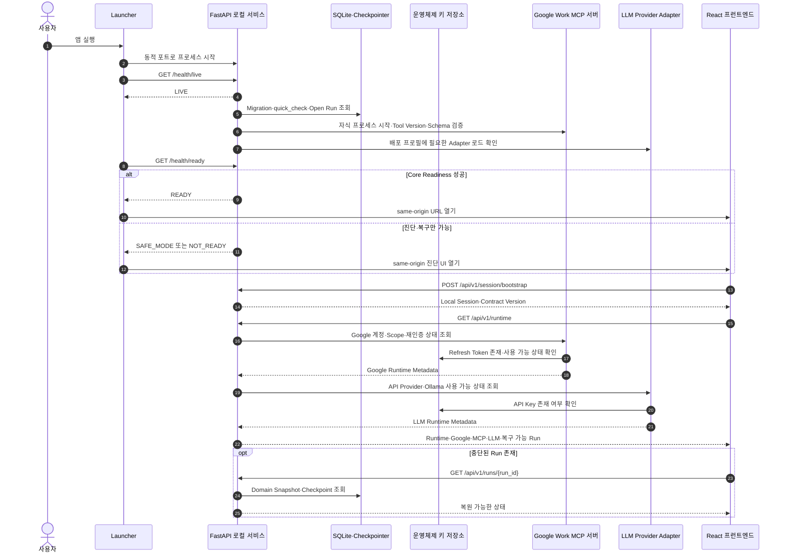
```mermaid
sequenceDiagram
    autonumber
    actor U as 사용자
    participant L as Launcher
    participant API as FastAPI 로컬 서비스
    participant DB as SQLite·Checkpointer
    participant K as 운영체제 키 저장소
    participant MCP as Google Work MCP 서버
    participant LLM as LLM Provider Adapter
    participant FE as React 프런트엔드

    U->>L: 앱 실행
    L->>API: 동적 포트로 프로세스 시작
    L->>API: GET /health/live
    API-->>L: LIVE
    API->>DB: Migration·quick_check·Open Run 조회
    API->>MCP: 자식 프로세스 시작·Tool Version·Schema 검증
    API->>LLM: 배포 프로필에 필요한 Adapter 로드 확인
    L->>API: GET /health/ready
    alt Core Readiness 성공
        API-->>L: READY
        L->>FE: same-origin URL 열기
    else 진단·복구만 가능
        API-->>L: SAFE_MODE 또는 NOT_READY
        L->>FE: same-origin 진단 UI 열기
    end
    FE->>API: POST /api/v1/session/bootstrap
    API-->>FE: Local Session·Contract Version
    FE->>API: GET /api/v1/runtime
    API->>MCP: Google 계정·Scope·재인증 상태 조회
    MCP->>K: Refresh Token 존재·사용 가능 상태 확인
    MCP-->>API: Google Runtime Metadata
    API->>LLM: API Provider·Ollama 사용 가능 상태 조회
    LLM->>K: API Key 존재 여부 확인
    LLM-->>API: LLM Runtime Metadata
    API-->>FE: Runtime·Google·MCP·LLM·복구 가능 Run
    opt 중단된 Run 존재
        FE->>API: GET /api/v1/runs/{run_id}
        API->>DB: Domain Snapshot·Checkpoint 조회
        API-->>FE: 복원 가능한 상태
    end
```

- `/health/ready`는 DB·Migration·정적 Asset·API Contract·Keyring Adapter·MCP Executable·Tool Schema 같은 Core Readiness를 판정한다.
- Google Credential, API LLM Key, Ollama와 Model 사용 가능 여부는 `/api/v1/runtime` 진단 결과이며 누락 자체가 Core Service 시작 실패를 의미하지 않는다.
- Bootstrap Secret은 한 번 교환한 뒤 폐기한다.
- Checkpoint와 Domain 상태가 충돌하면 자동 추정하지 않고 `RECOVERY_REQUIRED`로 표시한다.

## 5. Run 시작과 SSE 연결

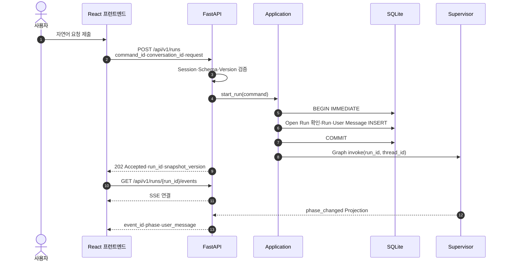
```mermaid
sequenceDiagram
    autonumber
    actor U as 사용자
    participant FE as React 프런트엔드
    participant API as FastAPI
    participant APP as Application
    participant DB as SQLite
    participant SUP as Supervisor

    U->>FE: 자연어 요청 제출
    FE->>API: POST /api/v1/runs<br>command_id·conversation_id·request
    API->>API: Session·Schema·Version 검증
    API->>APP: start_run(command)
    APP->>DB: BEGIN IMMEDIATE
    APP->>DB: Open Run 확인·Run·User Message INSERT
    APP->>DB: COMMIT
    APP->>SUP: Graph invoke(run_id, thread_id)
    API-->>FE: 202 Accepted·run_id·snapshot_version
    FE->>API: GET /api/v1/runs/{run_id}/events
    API-->>FE: SSE 연결
    SUP-->>API: phase_changed Projection
    API-->>FE: event_id·phase·user_message
```

- 동일 `command_id` 재전송은 기존 Run Result를 반환하거나 Version Conflict로 종료한다.
- Graph 실행 시작과 HTTP 응답 순서는 구현상 비동기일 수 있으나 Run Row Commit 이후에만 Graph를 시작한다.

## 6. AGENT_SEARCH 전체 조회·분석 시퀀스

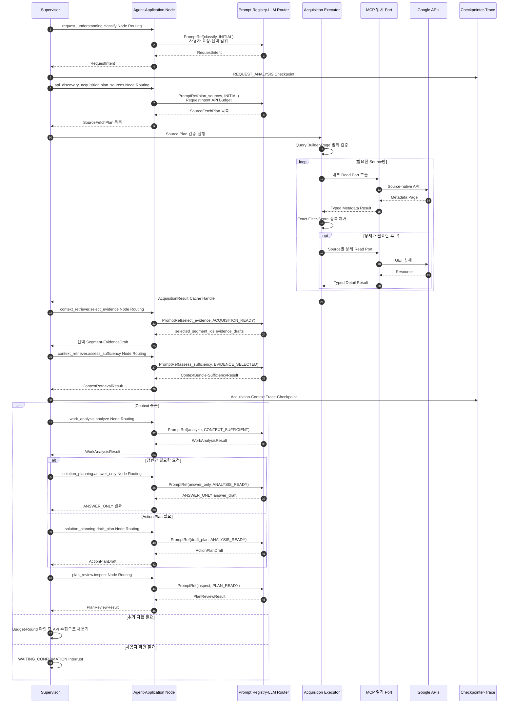
```mermaid
sequenceDiagram
    autonumber
    participant SUP as Supervisor
    participant NODE as Agent·Application Node
    participant LLM as Prompt Registry·LLM Router
    participant APP as Acquisition Executor
    participant MCP as MCP 읽기 Port
    participant G as Google APIs
    participant DB as Checkpointer·Trace

    SUP->>NODE: request_understanding.classify Node Routing
    NODE->>LLM: PromptRef(classify, INITIAL)<br>사용자 요청·선택 범위
    LLM-->>NODE: RequestIntent
    NODE-->>SUP: RequestIntent
    SUP->>DB: REQUEST_ANALYSIS Checkpoint

    SUP->>NODE: api_discovery_acquisition.plan_sources Node Routing
    NODE->>LLM: PromptRef(plan_sources, INITIAL)<br>RequestIntent·API Budget
    LLM-->>NODE: SourceFetchPlan 목록
    NODE-->>SUP: SourceFetchPlan 목록
    SUP->>APP: Source Plan 검증·실행
    APP->>APP: Query Builder·Page·범위 검증

    loop 필요한 Source만
        APP->>MCP: 내부 Read Port 호출
        MCP->>G: Source-native API
        G-->>MCP: Metadata Page
        MCP-->>APP: Typed Metadata Result
        APP->>APP: Exact Filter·Score·중복 제거
        opt 상세가 필요한 후보
            APP->>MCP: Source별 상세 Read Port
            MCP->>G: GET 상세
            G-->>MCP: Resource
            MCP-->>APP: Typed Detail Result
        end
    end

    APP-->>SUP: AcquisitionResult·Cache Handle
    SUP->>NODE: context_retriever.select_evidence Node Routing
    NODE->>LLM: PromptRef(select_evidence, ACQUISITION_READY)
    LLM-->>NODE: selected_segment_ids·evidence_drafts
    NODE-->>SUP: 선택 Segment·EvidenceDraft
    SUP->>NODE: context_retriever.assess_sufficiency Node Routing
    NODE->>LLM: PromptRef(assess_sufficiency, EVIDENCE_SELECTED)
    LLM-->>NODE: ContextBundle·SufficiencyResult
    NODE-->>SUP: ContextRetrievalResult
    SUP->>DB: Acquisition·Context Trace·Checkpoint

    alt Context 충분
        SUP->>NODE: work_analysis.analyze Node Routing
        NODE->>LLM: PromptRef(analyze, CONTEXT_SUFFICIENT)
        LLM-->>NODE: WorkAnalysisResult
        NODE-->>SUP: WorkAnalysisResult
        alt 답변만 필요한 요청
            SUP->>NODE: solution_planning.answer_only Node Routing
            NODE->>LLM: PromptRef(answer_only, ANALYSIS_READY)
            LLM-->>NODE: ANSWER_ONLY·answer_draft
            NODE-->>SUP: ANSWER_ONLY 결과
        else Action Plan 필요
            SUP->>NODE: solution_planning.draft_plan Node Routing
            NODE->>LLM: PromptRef(draft_plan, ANALYSIS_READY)
            LLM-->>NODE: ActionPlanDraft
            NODE-->>SUP: ActionPlanDraft
        end
        SUP->>NODE: plan_review.inspect Node Routing
        NODE->>LLM: PromptRef(inspect, PLAN_READY)
        LLM-->>NODE: PlanReviewResult
        NODE-->>SUP: PlanReviewResult
    else 추가 자료 필요
        SUP->>SUP: Budget·Round 확인 후 API 수집으로 재분기
    else 사용자 확인 필요
        SUP->>SUP: WAITING_CONFIRMATION Interrupt
    end
```

- Supervisor는 다음 Node만 결정하고 Prompt 원문·Prompt ID를 선택하지 않는다.
- 선택된 Agent·Application Node가 PromptRef를 확정한 뒤 LLM Adapter를 호출한다.
- API 탐색·수집 Agent는 전략을 제안하며 실제 Query와 MCP Arguments는 일반 코드가 확정한다.
- Context Retriever Agent는 MCP·Google API를 호출하지 않는다.

## 7. RESOURCE_SELECTED 요청 시퀀스

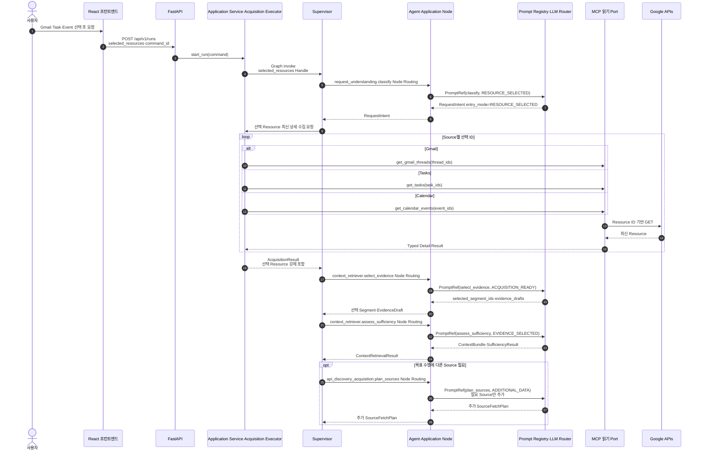
```mermaid
sequenceDiagram
    autonumber
    actor U as 사용자
    participant FE as React 프런트엔드
    participant API as FastAPI
    participant APP as Application Service·Acquisition Executor
    participant SUP as Supervisor
    participant NODE as Agent·Application Node
    participant LLM as Prompt Registry·LLM Router
    participant MCP as MCP 읽기 Port
    participant G as Google APIs

    U->>FE: Gmail·Task·Event 선택 후 요청
    FE->>API: POST /api/v1/runs<br>selected_resources·command_id
    API->>APP: start_run(command)
    APP->>SUP: Graph invoke<br>selected_resources Handle
    SUP->>NODE: request_understanding.classify Node Routing
    NODE->>LLM: PromptRef(classify, RESOURCE_SELECTED)
    LLM-->>NODE: RequestIntent entry_mode=RESOURCE_SELECTED
    NODE-->>SUP: RequestIntent
    SUP->>APP: 선택 Resource 최신 상세 수집 요청
    loop Source별 선택 ID
        alt Gmail
            APP->>MCP: get_gmail_threads(thread_ids)
        else Tasks
            APP->>MCP: get_tasks(task_ids)
        else Calendar
            APP->>MCP: get_calendar_events(event_ids)
        end
        MCP->>G: Resource ID 기반 GET
        G-->>MCP: 최신 Resource
        MCP-->>APP: Typed Detail Result
    end
    APP-->>SUP: AcquisitionResult<br>선택 Resource 강제 포함
    SUP->>NODE: context_retriever.select_evidence Node Routing
    NODE->>LLM: PromptRef(select_evidence, ACQUISITION_READY)
    LLM-->>NODE: selected_segment_ids·evidence_drafts
    NODE-->>SUP: 선택 Segment·EvidenceDraft
    SUP->>NODE: context_retriever.assess_sufficiency Node Routing
    NODE->>LLM: PromptRef(assess_sufficiency, EVIDENCE_SELECTED)
    LLM-->>NODE: ContextBundle·SufficiencyResult
    NODE-->>SUP: ContextRetrievalResult
    opt 목표 수행에 다른 Source 필요
        SUP->>NODE: api_discovery_acquisition.plan_sources Node Routing
        NODE->>LLM: PromptRef(plan_sources, ADDITIONAL_DATA)<br>필요 Source만 추가
        LLM-->>NODE: 추가 SourceFetchPlan
        NODE-->>SUP: 추가 SourceFetchPlan
    end
```

- React는 Supervisor를 직접 호출하지 않고 FastAPI와 Application Service를 경유한다.
- 선택 Resource를 검색 Query로 다시 찾지 않는다. 최초 Context 우선순위는 사용자 선택 Resource가 가장 높다.
- 추가 Source가 사용자 지정 범위를 넓히면 실행 전에 `WAITING_CONFIRMATION`으로 전환한다.

## 8. 추가 수집과 사용자 확인 Interrupt

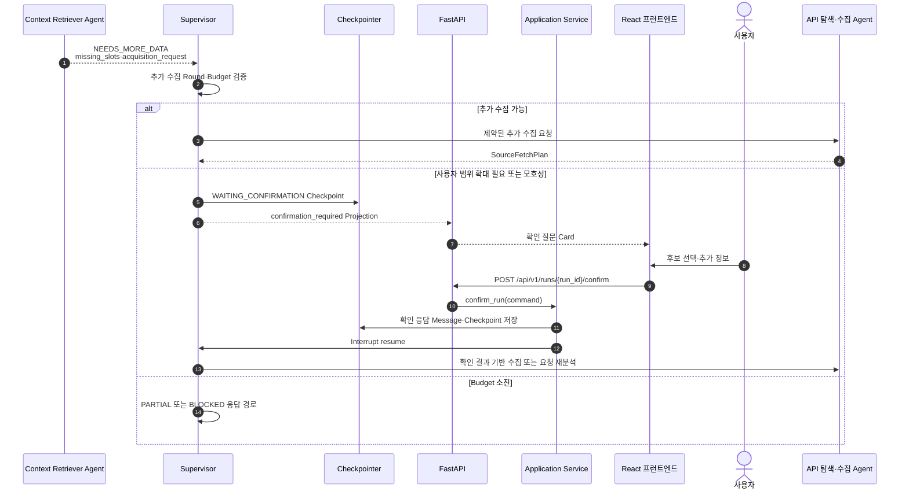
```mermaid
sequenceDiagram
    autonumber
    participant RET as Context Retriever Agent
    participant SUP as Supervisor
    participant DB as Checkpointer
    participant API as FastAPI
    participant APP as Application Service
    participant FE as React 프런트엔드
    actor U as 사용자
    participant ACQ as API 탐색·수집 Agent

    RET-->>SUP: NEEDS_MORE_DATA<br>missing_slots·acquisition_request
    SUP->>SUP: 추가 수집 Round·Budget 검증
    alt 추가 수집 가능
        SUP->>ACQ: 제약된 추가 수집 요청
        ACQ-->>SUP: SourceFetchPlan
    else 사용자 범위 확대 필요 또는 모호성
        SUP->>DB: WAITING_CONFIRMATION Checkpoint
        SUP-->>API: confirmation_required Projection
        API-->>FE: 확인 질문 Card
        U->>FE: 후보 선택·추가 정보
        FE->>API: POST /api/v1/runs/{run_id}/confirm
        API->>APP: confirm_run(command)
        APP->>DB: 확인 응답 Message·Checkpoint 저장
        APP->>SUP: Interrupt resume
        SUP->>ACQ: 확인 결과 기반 수집 또는 요청 재분석
    else Budget 소진
        SUP->>SUP: PARTIAL 또는 BLOCKED 응답 경로
    end
```

추가 수집은 최초 수집 이후 최대 2회다.

## 9. Answer-only Run 완료

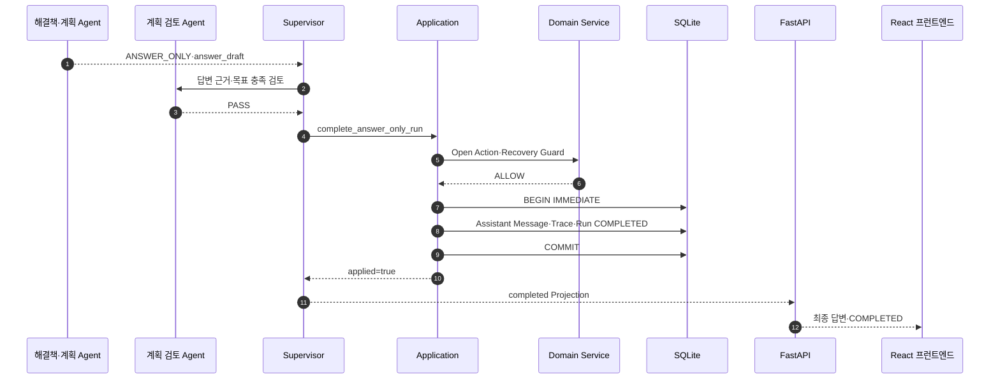
```mermaid
sequenceDiagram
    autonumber
    participant PLAN as 해결책·계획 Agent
    participant REVIEW as 계획 검토 Agent
    participant SUP as Supervisor
    participant APP as Application
    participant DOM as Domain Service
    participant DB as SQLite
    participant API as FastAPI
    participant FE as React 프런트엔드

    PLAN-->>SUP: ANSWER_ONLY·answer_draft
    SUP->>REVIEW: 답변 근거·목표 충족 검토
    REVIEW-->>SUP: PASS
    SUP->>APP: complete_answer_only_run
    APP->>DOM: Open Action·Recovery Guard
    DOM-->>APP: ALLOW
    APP->>DB: BEGIN IMMEDIATE
    APP->>DB: Assistant Message·Trace·Run COMPLETED
    APP->>DB: COMMIT
    APP-->>SUP: applied=true
    SUP-->>API: completed Projection
    API-->>FE: 최종 답변·COMPLETED
```

Answer-only Review가 `REVISE`를 반환하면 Supervisor는 `planning.revise_answer`로 답변 초안을 수정하고, 교체된 `answer_draft`로 `review.recheck`를 거친 뒤 `PASS`일 때만 `complete_answer_only_run`으로 진행한다.

Answer-only Run에는 Plan·Action·Approval·Attempt·Verification Row를 만들지 않는다.

## 10. READ-only Plan 실행

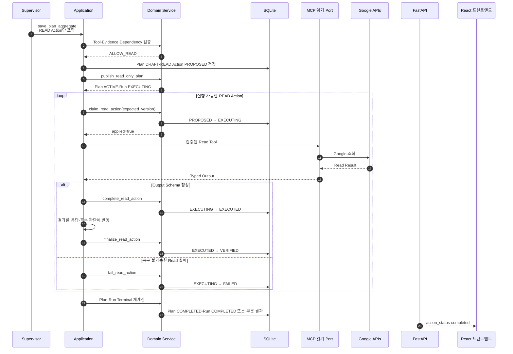
```mermaid
sequenceDiagram
    autonumber
    participant SUP as Supervisor
    participant APP as Application
    participant DOM as Domain Service
    participant DB as SQLite
    participant MCP as MCP 읽기 Port
    participant G as Google APIs
    participant API as FastAPI
    participant FE as React 프런트엔드

    SUP->>APP: save_plan_aggregate<br>READ Action만 포함
    APP->>DOM: Tool·Evidence·Dependency 검증
    DOM-->>APP: ALLOW_READ
    APP->>DB: Plan DRAFT·READ Action PROPOSED 저장
    APP->>DOM: publish_read_only_plan
    DOM-->>APP: Plan ACTIVE·Run EXECUTING

    loop 실행 가능한 READ Action
        APP->>DOM: claim_read_action(expected_version)
        DOM->>DB: PROPOSED → EXECUTING
        DOM-->>APP: applied=true
        APP->>MCP: 검증된 Read Tool
        MCP->>G: Google 조회
        G-->>MCP: Read Result
        MCP-->>APP: Typed Output
        alt Output Schema 정상
            APP->>DOM: complete_read_action
            DOM->>DB: EXECUTING → EXECUTED
            APP->>APP: 결과를 응답·후속 판단에 반영
            APP->>DOM: finalize_read_action
            DOM->>DB: EXECUTED → VERIFIED
        else 복구 불가능한 Read 실패
            APP->>DOM: fail_read_action
            DOM->>DB: EXECUTING → FAILED
        end
    end

    APP->>DOM: Plan·Run Terminal 재계산
    DOM->>DB: Plan COMPLETED·Run COMPLETED 또는 부분 결과
    API-->>FE: action_status·completed
```

- READ `VERIFIED`는 Output Schema Validation과 결과 반영 완료를 의미한다.
- Write Verification 지표에 포함하지 않는다.

## 11. WRITE Plan 저장·승인·실행·검증

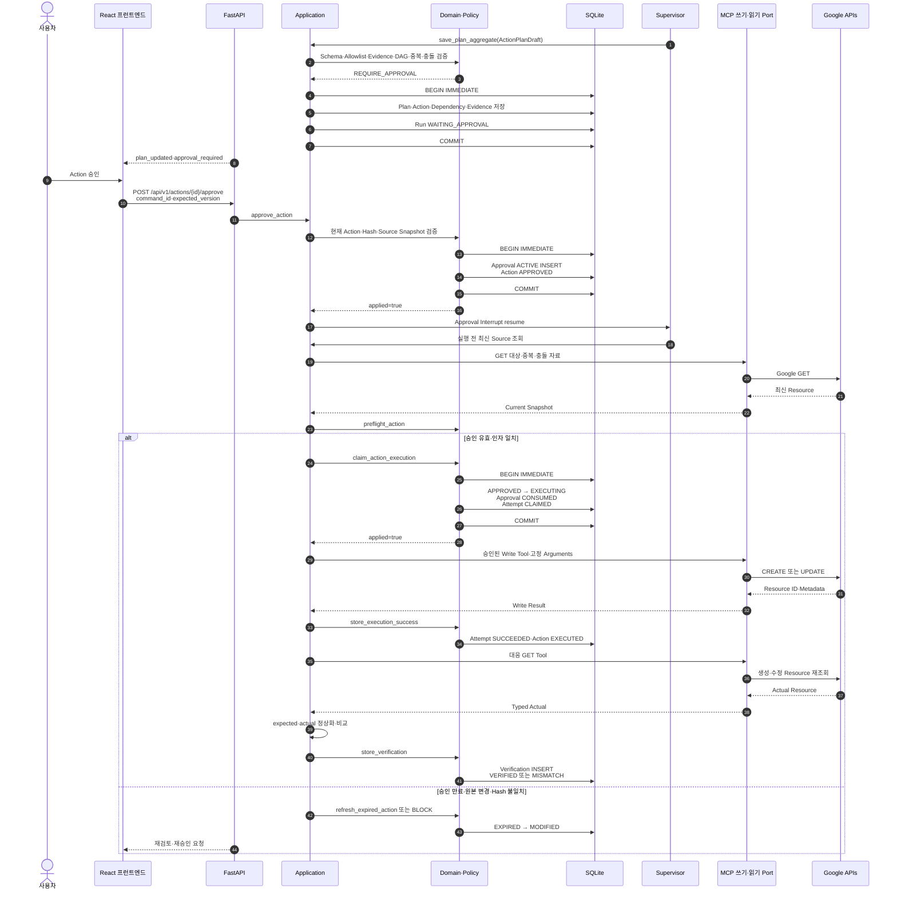
```mermaid
sequenceDiagram
    autonumber
    actor U as 사용자
    participant FE as React 프런트엔드
    participant API as FastAPI
    participant APP as Application
    participant DOM as Domain·Policy
    participant DB as SQLite
    participant SUP as Supervisor
    participant MCP as MCP 쓰기·읽기 Port
    participant G as Google APIs

    SUP->>APP: save_plan_aggregate(ActionPlanDraft)
    APP->>DOM: Schema·Allowlist·Evidence·DAG·중복·충돌 검증
    DOM-->>APP: REQUIRE_APPROVAL
    APP->>DB: BEGIN IMMEDIATE
    APP->>DB: Plan·Action·Dependency·Evidence 저장
    APP->>DB: Run WAITING_APPROVAL
    APP->>DB: COMMIT
    API-->>FE: plan_updated·approval_required

    U->>FE: Action 승인
    FE->>API: POST /api/v1/actions/{id}/approve<br>command_id·expected_version
    API->>APP: approve_action
    APP->>DOM: 현재 Action·Hash·Source Snapshot 검증
    DOM->>DB: BEGIN IMMEDIATE
    DOM->>DB: Approval ACTIVE INSERT<br>Action APPROVED
    DOM->>DB: COMMIT
    DOM-->>APP: applied=true
    APP->>SUP: Approval Interrupt resume

    SUP->>APP: 실행 전 최신 Source 조회
    APP->>MCP: GET 대상·중복·충돌 자료
    MCP->>G: Google GET
    G-->>MCP: 최신 Resource
    MCP-->>APP: Current Snapshot
    APP->>DOM: preflight_action

    alt 승인 유효·인자 일치
        APP->>DOM: claim_action_execution
        DOM->>DB: BEGIN IMMEDIATE
        DOM->>DB: APPROVED → EXECUTING<br>Approval CONSUMED<br>Attempt CLAIMED
        DOM->>DB: COMMIT
        DOM-->>APP: applied=true
        APP->>MCP: 승인된 Write Tool·고정 Arguments
        MCP->>G: CREATE 또는 UPDATE
        G-->>MCP: Resource ID·Metadata
        MCP-->>APP: Write Result
        APP->>DOM: store_execution_success
        DOM->>DB: Attempt SUCCEEDED·Action EXECUTED
        APP->>MCP: 대응 GET Tool
        MCP->>G: 생성·수정 Resource 재조회
        G-->>MCP: Actual Resource
        MCP-->>APP: Typed Actual
        APP->>APP: expected·actual 정상화·비교
        APP->>DOM: store_verification
        DOM->>DB: Verification INSERT<br>VERIFIED 또는 MISMATCH
    else 승인 만료·원본 변경·Hash 불일치
        APP->>DOM: refresh_expired_action 또는 BLOCK
        DOM->>DB: EXPIRED → MODIFIED
        API-->>FE: 재검토·재승인 요청
    end
```

외부 Write와 GET 수행 중 DB Transaction을 유지하지 않는다.

## 12. 일부 승인과 Action DAG

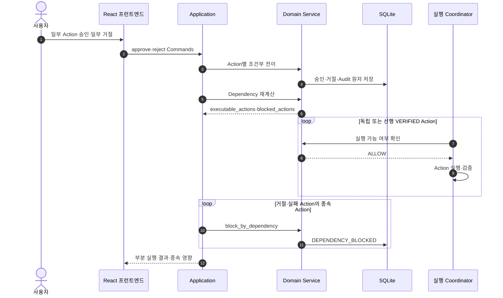
```mermaid
sequenceDiagram
    autonumber
    actor U as 사용자
    participant FE as React 프런트엔드
    participant APP as Application
    participant DOM as Domain Service
    participant DB as SQLite
    participant EXE as 실행 Coordinator

    U->>FE: 일부 Action 승인·일부 거절
    FE->>APP: approve·reject Commands
    APP->>DOM: Action별 조건부 전이
    DOM->>DB: 승인·거절·Audit 원자 저장
    APP->>DOM: Dependency 재계산
    DOM-->>APP: executable_actions·blocked_actions

    loop 독립 또는 선행 VERIFIED Action
        EXE->>DOM: 실행 가능 여부 확인
        DOM-->>EXE: ALLOW
        EXE->>EXE: Action 실행·검증
    end

    loop 거절·실패 Action의 종속 Action
        APP->>DOM: block_by_dependency
        DOM->>DB: DEPENDENCY_BLOCKED
    end

    APP-->>FE: 부분 실행 결과·종속 영향
```

- 성공한 Action은 자동 롤백하지 않는다.
- 종속 Action은 선행 Action의 `VERIFIED` 또는 계약된 성공 조건 이후에만 실행한다.

## 13. 승인 수정·거절·만료

### 13.1 사용자 수정

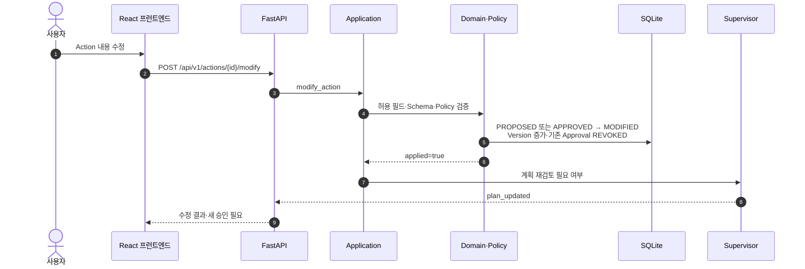
```mermaid
sequenceDiagram
    autonumber
    actor U as 사용자
    participant FE as React 프런트엔드
    participant API as FastAPI
    participant APP as Application
    participant DOM as Domain·Policy
    participant DB as SQLite
    participant SUP as Supervisor

    U->>FE: Action 내용 수정
    FE->>API: POST /api/v1/actions/{id}/modify
    API->>APP: modify_action
    APP->>DOM: 허용 필드·Schema·Policy 검증
    DOM->>DB: PROPOSED 또는 APPROVED → MODIFIED<br>Version 증가·기존 Approval REVOKED
    DOM-->>APP: applied=true
    APP->>SUP: 계획 재검토 필요 여부
    SUP-->>API: plan_updated
    API-->>FE: 수정 결과·새 승인 필요
```

### 13.2 승인 만료

```text
Approval 유효 시간 경과 또는 Source·Policy·Tool Schema 변경
→ Action EXPIRED
→ refresh_expired_action
→ 최신 Source·중복·충돌·Arguments 재검증
→ Action MODIFIED
→ 새 approval_no·idempotency_key
→ 사용자 재승인
```

기존 Approval을 다시 `ACTIVE`로 만들지 않는다.

## 14. Write 실패와 명시적 재시도

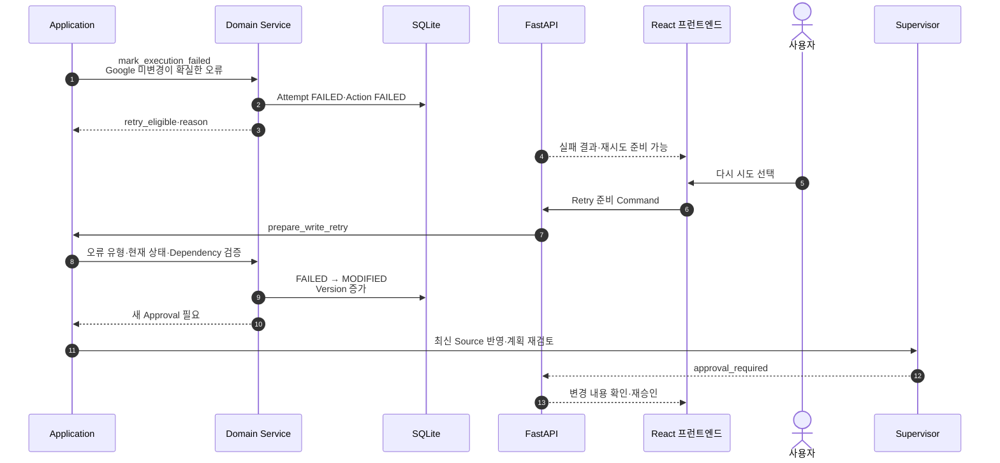
```mermaid
sequenceDiagram
    autonumber
    participant APP as Application
    participant DOM as Domain Service
    participant DB as SQLite
    participant API as FastAPI
    participant FE as React 프런트엔드
    actor U as 사용자
    participant SUP as Supervisor

    APP->>DOM: mark_execution_failed<br>Google 미변경이 확실한 오류
    DOM->>DB: Attempt FAILED·Action FAILED
    DOM-->>APP: retry_eligible·reason
    API-->>FE: 실패 결과·재시도 준비 가능

    U->>FE: 다시 시도 선택
    FE->>API: Retry 준비 Command
    API->>APP: prepare_write_retry
    APP->>DOM: 오류 유형·현재 상태·Dependency 검증
    DOM->>DB: FAILED → MODIFIED<br>Version 증가
    DOM-->>APP: 새 Approval 필요
    APP->>SUP: 최신 Source 반영·계획 재검토
    SUP-->>API: approval_required
    API-->>FE: 변경 내용 확인·재승인
```

금지 전이:

```text
FAILED → EXECUTING
UNKNOWN_RESULT → EXECUTING
```

재시도는 새 Approval, 새 Idempotency Key, 최신 Source Snapshot과 새 ExecutionAttempt ID를 사용하며 새 Approval의 `attempt_no`는 1로 시작한다.

## 15. Write 응답 유실·UNKNOWN_RESULT 복구

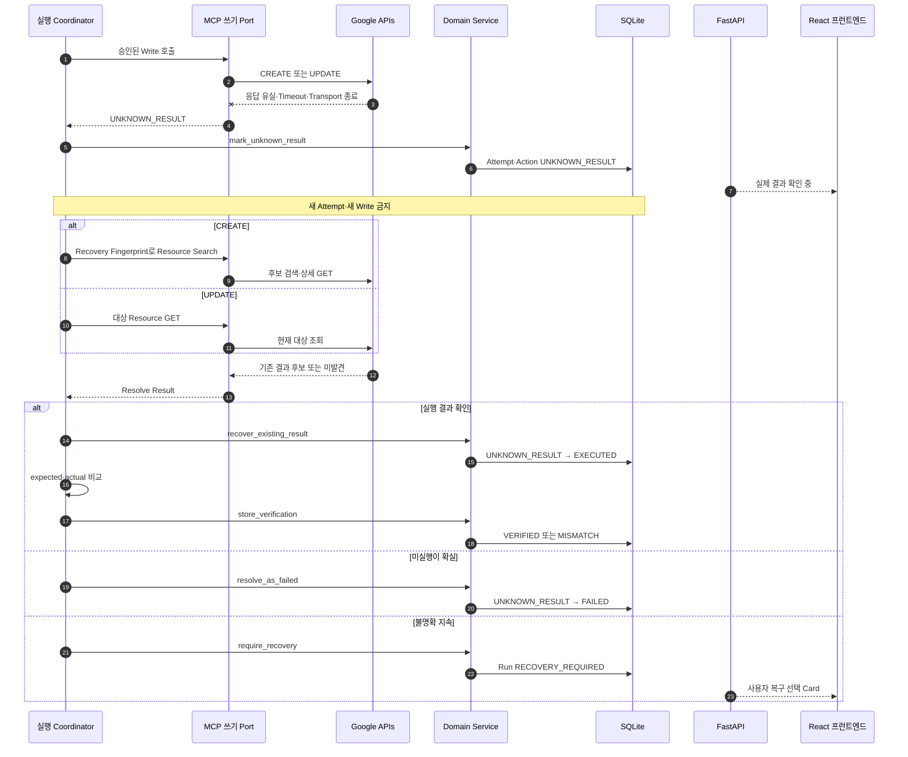
```mermaid
sequenceDiagram
    autonumber
    participant APP as 실행 Coordinator
    participant MCP as MCP 쓰기 Port
    participant G as Google APIs
    participant DOM as Domain Service
    participant DB as SQLite
    participant API as FastAPI
    participant FE as React 프런트엔드

    APP->>MCP: 승인된 Write 호출
    MCP->>G: CREATE 또는 UPDATE
    G--xMCP: 응답 유실·Timeout·Transport 종료
    MCP-->>APP: UNKNOWN_RESULT
    APP->>DOM: mark_unknown_result
    DOM->>DB: Attempt·Action UNKNOWN_RESULT
    API-->>FE: 실제 결과 확인 중

    Note over APP,DB: 새 Attempt·새 Write 금지

    alt CREATE
        APP->>MCP: Recovery Fingerprint로 Resource Search
        MCP->>G: 후보 검색·상세 GET
    else UPDATE
        APP->>MCP: 대상 Resource GET
        MCP->>G: 현재 대상 조회
    end
    G-->>MCP: 기존 결과 후보 또는 미발견
    MCP-->>APP: Resolve Result

    alt 실행 결과 확인
        APP->>DOM: recover_existing_result
        DOM->>DB: UNKNOWN_RESULT → EXECUTED
        APP->>APP: expected·actual 비교
        APP->>DOM: store_verification
        DOM->>DB: VERIFIED 또는 MISMATCH
    else 미실행이 확실
        APP->>DOM: resolve_as_failed
        DOM->>DB: UNKNOWN_RESULT → FAILED
    else 불명확 지속
        APP->>DOM: require_recovery
        DOM->>DB: Run RECOVERY_REQUIRED
        API-->>FE: 사용자 복구 선택 Card
    end
```

`NOT_FOUND` 한 번만으로 CREATE 미실행을 확정하지 않는다. 검색 범위·일관성 지연·권한 오류를 함께 판단한다.

## 16. OAuth 만료와 재인증 후 재개

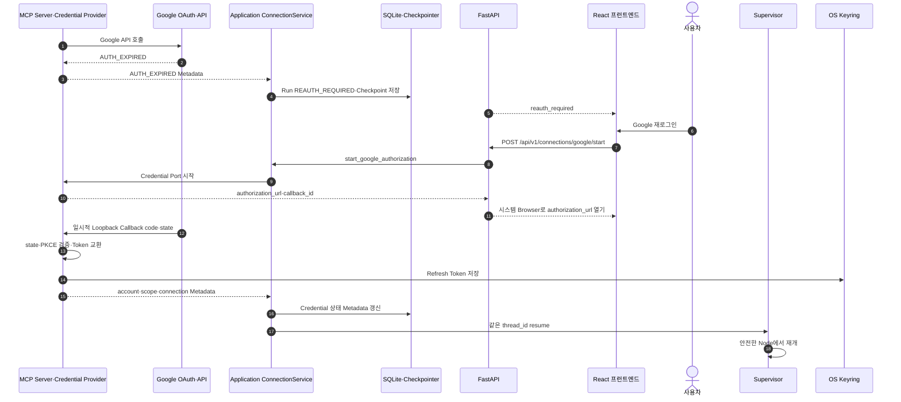
```mermaid
sequenceDiagram
    autonumber
    participant MCP as MCP Server·Credential Provider
    participant G as Google OAuth·API
    participant APP as Application ConnectionService
    participant DB as SQLite·Checkpointer
    participant API as FastAPI
    participant FE as React 프런트엔드
    actor U as 사용자
    participant SUP as Supervisor
    participant K as OS Keyring

    MCP->>G: Google API 호출
    G-->>MCP: AUTH_EXPIRED
    MCP-->>APP: AUTH_EXPIRED Metadata
    APP->>DB: Run REAUTH_REQUIRED·Checkpoint 저장
    API-->>FE: reauth_required
    U->>FE: Google 재로그인
    FE->>API: POST /api/v1/connections/google/start
    API->>APP: start_google_authorization
    APP->>MCP: Credential Port 시작
    MCP-->>API: authorization_url·callback_id
    API-->>FE: 시스템 Browser로 authorization_url 열기
    G->>MCP: 일시적 Loopback Callback code·state
    MCP->>MCP: state·PKCE 검증·Token 교환
    MCP->>K: Refresh Token 저장
    MCP-->>APP: account·scope·connection Metadata
    APP->>DB: Credential 상태 Metadata 갱신
    APP->>SUP: 같은 thread_id resume
    SUP->>SUP: 안전한 Node에서 재개
```

- Authorization Code와 Token 원문은 MCP Credential Provider 경계를 벗어나지 않는다.
- Write 전달 여부가 불명확한 시점의 인증 오류는 `UNKNOWN_RESULT` 규칙을 우선한다.
- Checkpoint가 없으면 자동 재실행하지 않고 `RECOVERY_REQUIRED`로 전환한다.

## 17. 취소

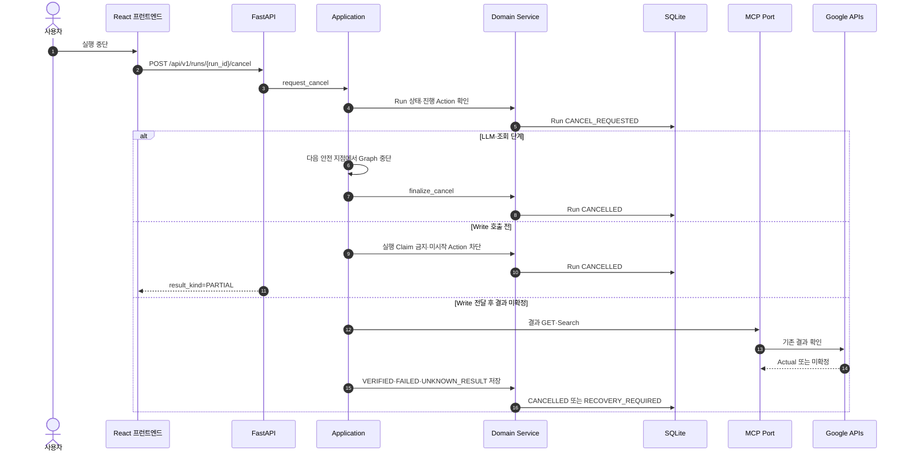
```mermaid
sequenceDiagram
    autonumber
    actor U as 사용자
    participant FE as React 프런트엔드
    participant API as FastAPI
    participant APP as Application
    participant DOM as Domain Service
    participant DB as SQLite
    participant MCP as MCP Port
    participant G as Google APIs

    U->>FE: 실행 중단
    FE->>API: POST /api/v1/runs/{run_id}/cancel
    API->>APP: request_cancel
    APP->>DOM: Run 상태·진행 Action 확인
    DOM->>DB: Run CANCEL_REQUESTED

    alt LLM·조회 단계
        APP->>APP: 다음 안전 지점에서 Graph 중단
        APP->>DOM: finalize_cancel
        DOM->>DB: Run CANCELLED
    else Write 호출 전
        APP->>DOM: 실행 Claim 금지·미시작 Action 차단
        DOM->>DB: Run CANCELLED
        API-->>FE: result_kind=PARTIAL
    else Write 전달 후 결과 미확정
        APP->>MCP: 결과 GET·Search
        MCP->>G: 기존 결과 확인
        G-->>MCP: Actual 또는 미확정
        APP->>DOM: VERIFIED·FAILED·UNKNOWN_RESULT 저장
        DOM->>DB: CANCELLED 또는 RECOVERY_REQUIRED
    end
```

취소는 성공한 Google 변경을 롤백하지 않는다.

## 18. SSE 단절·브라우저 새로고침

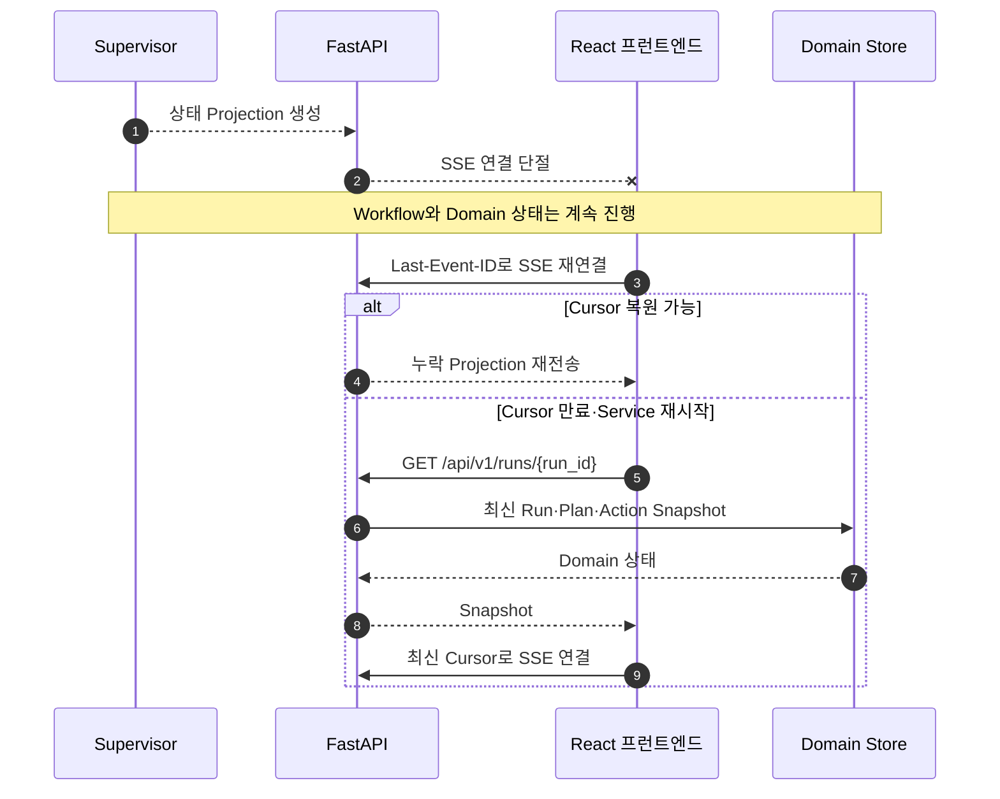
```mermaid
sequenceDiagram
    autonumber
    participant SUP as Supervisor
    participant API as FastAPI
    participant FE as React 프런트엔드
    participant DB as Domain Store

    SUP-->>API: 상태 Projection 생성
    API--xFE: SSE 연결 단절
    Note over SUP,DB: Workflow와 Domain 상태는 계속 진행
    FE->>API: Last-Event-ID로 SSE 재연결
    alt Cursor 복원 가능
        API-->>FE: 누락 Projection 재전송
    else Cursor 만료·Service 재시작
        FE->>API: GET /api/v1/runs/{run_id}
        API->>DB: 최신 Run·Plan·Action Snapshot
        DB-->>API: Domain 상태
        API-->>FE: Snapshot
        FE->>API: 최신 Cursor로 SSE 연결
    end
```

SSE 중복 Event는 `event_id`와 Aggregate Version으로 무시한다.

## 19. 앱 재시작과 Run 복구

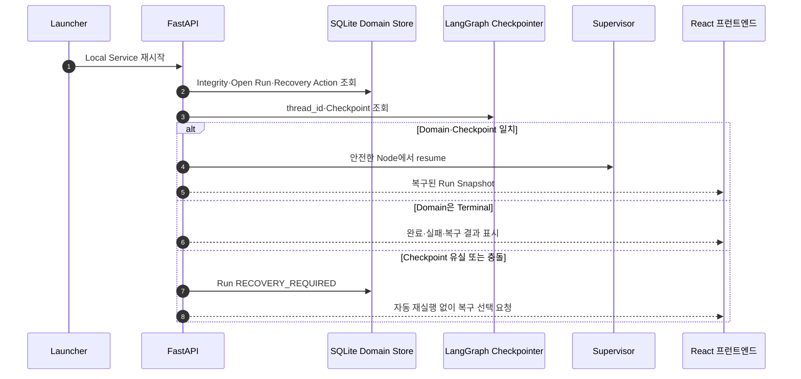
```mermaid
sequenceDiagram
    autonumber
    participant L as Launcher
    participant API as FastAPI
    participant DB as SQLite Domain Store
    participant CP as LangGraph Checkpointer
    participant SUP as Supervisor
    participant FE as React 프런트엔드

    L->>API: Local Service 재시작
    API->>DB: Integrity·Open Run·Recovery Action 조회
    API->>CP: thread_id·Checkpoint 조회
    alt Domain·Checkpoint 일치
        API->>SUP: 안전한 Node에서 resume
        API-->>FE: 복구된 Run Snapshot
    else Domain은 Terminal
        API-->>FE: 완료·실패·복구 결과 표시
    else Checkpoint 유실 또는 충돌
        API->>DB: Run RECOVERY_REQUIRED
        API-->>FE: 자동 재실행 없이 복구 선택 요청
    end
```

이미 `VERIFIED`인 Action과 `UNKNOWN_RESULT` 해결 전 Write는 재실행하지 않는다.

## 20. MCP 프로세스 장애

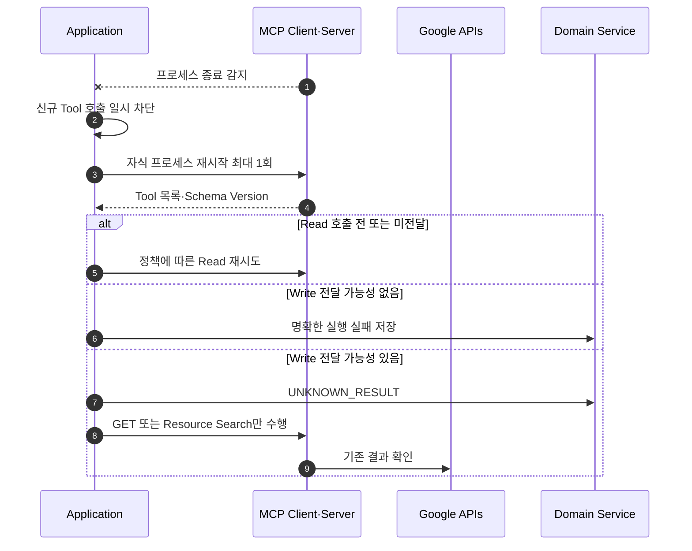
```mermaid
sequenceDiagram
    autonumber
    participant APP as Application
    participant MCP as MCP Client·Server
    participant G as Google APIs
    participant DOM as Domain Service

    MCP--xAPP: 프로세스 종료 감지
    APP->>APP: 신규 Tool 호출 일시 차단
    APP->>MCP: 자식 프로세스 재시작 최대 1회
    MCP-->>APP: Tool 목록·Schema Version

    alt Read 호출 전 또는 미전달
        APP->>MCP: 정책에 따른 Read 재시도
    else Write 전달 가능성 없음
        APP->>DOM: 명확한 실행 실패 저장
    else Write 전달 가능성 있음
        APP->>DOM: UNKNOWN_RESULT
        APP->>MCP: GET 또는 Resource Search만 수행
        MCP->>G: 기존 결과 확인
    end
```

Write는 Transport 오류만으로 즉시 재전송하지 않는다.

## 21. LLM Runtime 선택·Fallback

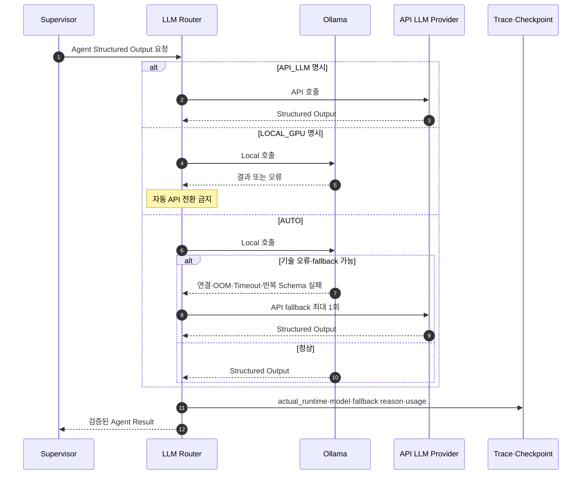
```mermaid
sequenceDiagram
    autonumber
    participant SUP as Supervisor
    participant LR as LLM Router
    participant O as Ollama
    participant P as API LLM Provider
    participant DB as Trace·Checkpoint

    SUP->>LR: Agent Structured Output 요청
    alt API_LLM 명시
        LR->>P: API 호출
        P-->>LR: Structured Output
    else LOCAL_GPU 명시
        LR->>O: Local 호출
        O-->>LR: 결과 또는 오류
        Note over LR: 자동 API 전환 금지
    else AUTO
        LR->>O: Local 호출
        alt 기술 오류·fallback 가능
            O-->>LR: 연결·OOM·Timeout·반복 Schema 실패
            LR->>P: API fallback 최대 1회
            P-->>LR: Structured Output
        else 정상
            O-->>LR: Structured Output
        end
    end
    LR->>DB: actual_runtime·model·fallback reason·usage
    LR-->>SUP: 검증된 Agent Result
```

## 22. 앱 정상 종료

```text
Launcher 종료 요청
→ 신규 Run·승인 Command 차단
→ 실행 중 Write의 전달 여부 확인
→ 결과 저장 또는 UNKNOWN_RESULT
→ LangGraph Checkpoint Flush
→ SQLite Connection 종료
→ MCP 자식 프로세스 종료
→ FastAPI 종료
→ Launcher 종료
```

브라우저 탭을 닫는 것만으로 Local Service를 강제 종료하지 않는다.

## 23. Workflow Phase·Run Status·주요 Event 매핑

| Workflow Phase | Run Status | SSE Event |
|---|---|---|
| `REQUEST_ANALYSIS` | `ANALYZING` | `phase_changed` |
| `SOURCE_PLANNING` | `RETRIEVING` | `source_planning` |
| `API_ACQUISITION` | `RETRIEVING` | `acquisition_progress` |
| `CONTEXT_RETRIEVAL` | `RETRIEVING` | `context_progress` |
| `WAITING_CONFIRMATION` | `WAITING_CONFIRMATION` | `confirmation_required` |
| `WORK_ANALYSIS` | `ANALYZING` | `analysis_progress` |
| `SOLUTION_PLANNING`, `PLAN_REVIEW` | `PLANNING` | `plan_updated` |
| `WAITING_APPROVAL` | `WAITING_APPROVAL` | `approval_required` |
| `PREFLIGHT`, `ACTION_EXECUTION` | `EXECUTING` | `action_status` |
| `VERIFICATION` | `VERIFYING` | `verification_result` |
| `RECOVERY` | `RECOVERY_REQUIRED` | `recovery_required` |
| `FINALIZE` | Terminal | `completed` 또는 `error` |

## 24. Transaction 경계 요약

| 구간 | DB Transaction | 외부 호출 |
|---|---|---|
| Run 시작 | Run·User Message 원자 저장 | 없음 |
| Agent LLM 호출 | 없음 | API LLM 또는 Ollama |
| Google Read | 없음 | MCP·Google API |
| Plan 저장 | Plan·Action·Evidence Batch | 없음 |
| 승인 | Approval·Action·Audit | 없음 |
| 실행 Claim | Action·Approval·Attempt | Commit 이후 Write |
| Write 결과 저장 | Attempt·Action·ResourceRef | Write 완료 이후 |
| 검증 저장 | Verification·Action·상위 상태 | GET 완료 이후 |
| Answer-only 완료 | Message·Trace·Run Terminal | 없음 |

## 25. 오류 처리 우선순위

```text
APPROVAL_INVALID·POLICY_BLOCKED·VERSION_CONFLICT
→ Write 호출 금지

AUTH_EXPIRED
→ REAUTH_REQUIRED·Checkpoint 재개

RATE_LIMITED·UPSTREAM_5XX
→ Read 제한 재시도 또는 부분 결과
→ Write는 전달 여부 확인 후 처리

TIMEOUT·MCP_UNAVAILABLE
→ Write 전달 가능성에 따라 FAILED 또는 UNKNOWN_RESULT

VERIFICATION_MISMATCH
→ 자동 수정 금지·사용자 Recovery
```

## 26. 정합성·테스트 완료 조건

- API 탐색·수집 Agent와 Context Retriever Agent가 시퀀스에서 분리된다.
- Context Retriever가 MCP를 직접 호출하는 경로가 없다.
- 일반 Retrieval이 Action Row를 생성하지 않는다.
- Answer-only Run이 Plan·Action 없이 완료된다.
- READ-only Plan은 승인 없이 실행된다.
- READ Action에는 Approval·Attempt·Verification Row가 없다.
- READ Output Schema 실패는 `FAILED`로 저장된다.
- Write는 Approval과 실행 Claim Commit 이후 한 번만 호출된다.
- 승인 이후 LLM이 Arguments를 다시 생성하지 않는다.
- `FAILED → MODIFIED → 새 승인`만 Write Retry로 허용된다.
- `UNKNOWN_RESULT`에서 새 Attempt·Write가 차단된다.
- 일부 승인·부분 실패 시 성공 Action을 보존한다.
- SSE 단절과 브라우저 새로고침이 Write 재실행을 만들지 않는다.
- OAuth 재인증은 같은 Thread의 안전한 Checkpoint에서 재개된다.
- 외부 호출 중 SQLite Transaction을 유지하지 않는다.
- MCP 장애에서 Write 전달 가능성을 확인하기 전 자동 재전송하지 않는다.
- `RESOURCE_SELECTED`는 React→FastAPI→Application→Supervisor 경계를 지킨다.
- 확인 응답 저장은 Application·Repository를 경유하며 FastAPI Route가 DB를 직접 수정하지 않는다.
- 07에 정의된 Source별 Read Port만 시퀀스에서 사용한다.
- Supervisor는 Node만 Routing하고 선택된 Agent·Application Node가 PromptRef를 확정하는지 검증한다.
- `/health/ready`와 `/api/v1/runtime`의 책임이 분리된다.

## 27. 후속 문서 제공 계약

- `09`: OAuth·Scope·Keyring·Local Session 보안 상세
- `10`: Installer·Launcher·Process·환경 설정 상세
- `11`: 본 문서 Event·Trace·Audit 필드 상세
- `12`: 각 시퀀스의 Unit·Integration·E2E 테스트 케이스
- `14`: 오류 코드별 운영·복구 절차


---

## 문서 권위 규칙

```text
00 → 01 → 01-A → 01-B → 02 → 03 → 04 → 05 → 06 → 07 → 08 → 09 → 10 → 11 → 12 → 13 → 14
```

- 하위 문서는 상위 문서를 변경하지 않고 구현값·절차·검증 방법만 구체화한다.
- `01-A`와 `01-B`가 충돌하면 금지·승인·개인정보 정책을 가진 `01-B`가 우선한다.
- 상위 결정을 바꿀 때는 상위 문서를 먼저 수정하고 하위 문서를 순차 갱신한다.

## 정합성 보강: LLM 호출 전 PromptRef 선택

모든 LLM 호출 전에 Supervisor가 선택한 Agent·Application Node가 다음 Key로 PromptRef를 확정한다.

```text
agent_role + subgraph_name + node_name + node_state + purpose
```

Repair·Revision은 별도 PromptRef를 사용할 수 있으며 Prompt 선택 결과는 `prompt_id`·`prompt_version`·`content_hash`로 Trace한다.


## 28. Command Receipt 시퀀스

```text
Route가 Request 검증
→ Application이 Canonical Request Hash 생성
→ BEGIN IMMEDIATE
→ command_receipts 조회
→ 신규면 RECEIVED Insert
→ Domain 변경·Audit
→ Receipt APPLIED 또는 REJECTED
→ COMMIT
```

- 동일 `command_id`·동일 Hash면 저장된 응답을 반환한다.
- 동일 ID·다른 Hash면 `DUPLICATE_COMMAND`다.
- HTTP 응답 유실 후 재전송도 새 Run·Approval·Attempt를 만들지 않는다.

## 29. Claim Token 시퀀스

```text
claim_action_execution Commit
→ ExecutionClaimService가 30초 TTL Token 생성
→ MCP Write Tool 호출
→ MCP Signature·Binding·Nonce 검증
→ Nonce 소비
→ Google Write
```

검증 실패 시 Google API를 호출하지 않고 `APPROVAL_INVALID` 또는 Claim Token 오류를 반환한다.

## 2026-08-07 v2.6 Transaction · Recovery · SEND/DELETE 시퀀스
```text
Transaction A: 상태·Version·Snapshot 확보 → COMMIT
Google/MCP/LLM 호출: DB Write Transaction 없음
Transaction B: expected_version·현재 상태 재검사 → 결과·Verification·Audit 저장 → COMMIT
```
Recovery는 `RequireRecovery`·`ResolveRecovery` Domain Command를 사용한다.

### Gmail SEND
Plan(SEND) → Domain Validation → WAITING_APPROVAL → Claim → gmail_send → Sent Lookup → VERIFIED | MISMATCH | UNKNOWN_RESULT.

### Calendar DELETE
Plan(DELETE) → Domain Validation → WAITING_APPROVAL → Claim → calendar_delete_event → target absence 확인 → VERIFIED | MISMATCH | UNKNOWN_RESULT.
