# 03. Google Work Agent 시스템 아키텍처 설계서

> **문서 기준:** `01 PRD §1.1`의 Concern Owner 규칙을 따른다. 이 문서는 시스템 경계와 의존성 방향을 소유하며 Policy·Domain·Tool의 전문 계약을 완화하지 않는다.

## 0. 문서 정보

<table fit-page-width="true" header-row="true">
	<tr>
		<td>항목</td>
		<td>내용</td>
	</tr>
	<tr>
		<td>문서명</td>
		<td>03. Google Work Agent 시스템 아키텍처 설계서</td>
	</tr>
	<tr>
		<td>상태</td>
		<td>Draft v3.7</td>
	</tr>
	<tr>
		<td>기준일</td>
		<td>2026-08-19</td>
	</tr>
	<tr>
		<td>대상 릴리스</td>
		<td>P0 MVP</td>
	</tr>
	<tr>
		<td>공식 환경</td>
		<td>Windows 11 x64 · 최신 Chrome·Microsoft Edge</td>
	</tr>
	<tr>
		<td>제품 형태</td>
		<td>단일 사용자용 로컬 Web UI + Python Agent 애플리케이션</td>
	</tr>
	<tr>
		<td>핵심 Runtime</td>
		<td>React · TypeScript · Vite · FastAPI · LangGraph · Connector MCP Runtime `stdio` · SQLite · OS Keyring</td>
	</tr>
</table>

## 0-A. 한눈에 보는 구조

```text
React UI → FastAPI Local Service → Deterministic Supervisor → Agent Subgraph
                                            ↓
                                   Domain / Policy / Approval
                                            ↓
                           Connector Runtime / MCP Client
                              ├─ Google Workspace MCP
                              └─ future Connector MCP
                                            ↓
                                Provider-specific Adapter
                                            ↓
                                      Verification
```

- **판단은 Agent**, **허용·실행 사실은 Domain**, **외부 효과는 Connector MCP 경계**, **재개 위치는 Checkpoint**가 소유한다.
- Google Workspace는 P0의 첫 번째 Connector이며 Core의 유일한 개념 경계가 아니다.
- 원격 제품 Backend 없이 사용자 PC에서 동작한다.


## 1. 문서 목적

이 문서는 Google Work Agent의 전체 실행 구조, 프로세스 경계, 논리 컴포넌트, 책임 분리, 통신 방식, 상태 소유권, 안전 경계와 배포 프로필을 정의한다.

이 문서가 답해야 하는 핵심 질문은 다음과 같다.

- 제품은 어떤 프로세스로 실행되는가?
- React Frontend, FastAPI Local Agent Service, LangGraph, Domain·Policy, MCP Server의 책임은 무엇인가?
- LLM이 판단하는 영역과 일반 코드가 결정하는 영역은 어디서 나뉘는가?
- 승인·실행·검증 상태의 기준점은 어디인가?
- 브라우저 새로고침, REST Retry, SSE 재연결, 앱 재실행, MCP 종료, OAuth 만료 후 어떻게 안전하게 복구하는가?
- `API_ONLY`와 `LOCAL_CAPABLE`은 어떤 공통 Core와 다른 Runtime을 가지는가?

### 1.1 이 문서의 범위

- System Context와 신뢰 경계
- Runtime·Container 구조
- React Frontend와 FastAPI Local Agent Service의 논리 구조
- LangGraph 기반 Agent 실행 모델
- Connector MCP Runtime과 Connector별 MCP Server 연동 경계
- SQLite·Checkpointer·OS Keyring의 상태 소유권
- 승인·Idempotency·실행·검증·복구 구조
- API LLM·Ollama Runtime Router
- 시작·종료·장애 복구 개요
- 배포 프로필과 테스트 경계

### 1.2 이 문서의 비범위

다음 세부사항은 후속 문서에서 정의한다.

- Table, Column, Index, Migration 상세 → `04. 도메인·데이터베이스 설계서`
- 검색 Query, Context Budget, Chunking, Reranking 상세 → `05. Context·Retrieval 설계서`
- LangGraph State, Node, Edge, Interrupt 상세 → `06. Agent·Workflow 설계서`
- MCP Tool별 Pydantic Schema와 오류 코드 상세 → `07. Tool·MCP·내부 인터페이스 명세서`
- 정상·실패·Recovery 단계별 호출 순서 → `08. 시퀀스 설계서`
- OAuth, Scope, Token, Keyring 상세 → `09. 보안·Auth 설계서`
- 설치·패키징·Ollama·환경 변수 상세 → `10. 인프라·환경 설정 설계서`
- Trace·Log·Audit Event Schema 상세 → `11. 관측성·로그·감사 설계서`

## 2. 아키텍처 요약

Google Work Agent는 **로컬 Frontend와 Python Modular Monolith를 분리한 단일 사용자 애플리케이션**으로 구성한다.

> **React Frontend가 사용자 화면을 담당하고, FastAPI Local Agent Service가 Application·LangGraph·Domain·Persistence의 단일 진입 경계를 제공한다. Gmail·Tasks·Calendar에 닿는 모든 제품 경로는 Google Work MCP Server를 통과하며 Google Provider API/SDK는 MCP Server 내부 Adapter에서만 사용한다. 모든 제품 프로세스는 사용자 PC에서 실행된다.**

주요 실행 단위는 다음 네 가지다.

1. **Launcher** — Local Service 시작, 동적 포트 선택, Health Check, 브라우저 열기와 종료 조정
2. **React Frontend** — React + TypeScript + Vite 기반 UI; 운영에서는 FastAPI가 정적 산출물을 제공
3. **FastAPI Local Agent Service** — REST Command·Query, SSE Event, Application, LangGraph, Policy, LLM Router, Persistence
4. **Connector MCP Runtime** — Connector별 MCP Server의 수명주기·Registry binding·Transport를 관리한다. P0에는 Google Workspace MCP Server가 포함되어 Gmail·Tasks·Calendar Tool과 Google OAuth·Provider Adapter를 제공한다.

검증된 GPU 환경에서는 **Ollama Runtime**이 선택적으로 추가된다. 별도 원격 Backend, SaaS API, Queue, 원격 MCP Server는 두지 않는다.

### 2.1 선택한 아키텍처 스타일

- 제품 외형: Launcher가 여는 localhost React Web UI
- Frontend: React + TypeScript + Vite
- Backend 경계: FastAPI Local Agent Service
- 운영 UI 제공: FastAPI가 React Static Build와 `/api/v1`을 같은 Origin에서 제공
- 내부 구조: Python Layered Modular Monolith
- 의존성 방향: React → Local API → Application → Domain
- Agent 구조: 결정적 Supervisor + Versioned Typed Main State + 평가 가능한 1/3/6 Agent Subgraph Profile + 결정적 실행·검증 Engine
- 진행 전달: REST Command·Query + SSE Event Stream
- 외부 Tool 연동: MCP `stdio`
- 상태 관리: SQLite Domain Store + LangGraph Checkpointer
- Secret 관리: OS Keyring
- 분산 트랜잭션 방식: Action 단위 상태 전이를 사용하는 Saga형 실행

### 2.2 Connector 접근 단일 경계

```plain text
React
→ FastAPI Local API
→ Application / LangGraph / Domain
→ MCP Client / Port
→ Google Work MCP Server · stdio
→ Gmail·Tasks·Calendar Provider Adapter
→ Google Workspace Provider APIs
```

- Local `/api/v1`은 React와 Python Core 사이의 제품 내부 REST/SSE 계약이며 Google Provider API 우회 경로가 아니다.
- React·FastAPI Route·Application·LangGraph·Agent·Domain에서 Gmail·Tasks·Calendar Provider API/SDK 직접 호출과 직접 Provider Client 구성을 금지한다.
- Sidebar Browse/Count/Detail, Retrieval Read, OAuth 상태 확인, Write, Verification, Recovery 조회는 모두 MCP Tool/Port를 통과한다.
- MCP unavailable 또는 Tool Schema invalid일 때 Core는 Provider API direct fallback을 하지 않고 NOT_READY/Recovery로 전환한다.
- Google Provider API의 pagination·raw response·OAuth token 적용은 MCP Server 내부 Adapter의 구현 책임이다.

## 3. 아키텍처 목표와 우선순위

<table fit-page-width="true" header-row="true">
	<tr>
		<td>우선순위</td>
		<td>품질 속성</td>
		<td>아키텍처 의미</td>
	</tr>
	<tr>
		<td>1</td>
		<td>안전성</td>
		<td>승인 없는 쓰기, 금지 Tool, 승인 인자 변경을 결정적으로 차단한다.</td>
	</tr>
	<tr>
		<td>2</td>
		<td>복구성</td>
		<td>브라우저 새로고침·REST Retry·SSE 재연결·앱 종료·OAuth 만료·Tool 응답 유실 후 중복 실행 없이 재개한다.</td>
	</tr>
	<tr>
		<td>3</td>
		<td>개인정보 보호</td>
		<td>Secret과 불필요한 Gmail 원문을 저장·로그·전송하지 않는다.</td>
	</tr>
	<tr>
		<td>4</td>
		<td>예측 가능성</td>
		<td>LLM의 자유 실행이 아니라 정의된 Workflow와 상태 전이를 사용한다.</td>
	</tr>
	<tr>
		<td>5</td>
		<td>단순성</td>
		<td>단일 사용자 로컬 제품에 불필요한 원격 서버·Queue·Kubernetes를 도입하지 않는다.</td>
	</tr>
	<tr>
		<td>6</td>
		<td>테스트 가능성</td>
		<td>MCP Client/Transport, MCP 내부 Provider Adapter, LLM Provider, Clock, Keyring을 경계별 Test Double로 교체할 수 있게 둔다.</td>
	</tr>
	<tr>
		<td>7</td>
		<td>성능</td>
		<td>단계별 진행 상태를 제공하고 불필요한 Source·LLM 호출을 줄인다.</td>
	</tr>
	<tr>
		<td>8</td>
		<td>확장성</td>
		<td>수평 확장보다 기능 모듈과 Adapter 교체 가능성을 우선한다.</td>
	</tr>
</table>

## 4. 핵심 아키텍처 결정

<table fit-page-width="true" header-row="true">
	<tr>
		<td>ID</td>
		<td>결정</td>
		<td>이유</td>
	</tr>
	<tr>
		<td>ARC-001</td>
		<td>로컬 단일 사용자 앱</td>
		<td>제품 목표와 개인정보·운영 범위에 맞춘다.</td>
	</tr>
	<tr>
		<td>ARC-002</td>
		<td>React + TypeScript + Vite Frontend</td>
		<td>복잡한 3열 UI, Inline Action Card, 편집·반응형·Client State를 명시적으로 구현한다.</td>
	</tr>
	<tr>
		<td>ARC-003</td>
		<td>FastAPI Local Agent Boundary</td>
		<td>React와 Python Core 사이를 Versioned REST·SSE 계약으로 분리하되 외부 공개 서버는 두지 않는다.</td>
	</tr>
	<tr>
		<td>ARC-011</td>
		<td>Production same-origin</td>
		<td>FastAPI가 React 정적 산출물과 `/api/v1`을 같은 `127.0.0.1` Origin에서 제공한다.</td>
	</tr>
	<tr>
		<td>ARC-012</td>
		<td>REST Command + SSE Event</td>
		<td>상태 변경은 REST Command, 진행 전달은 재연결 가능한 SSE를 사용한다.</td>
	</tr>
	<tr>
		<td>ARC-013</td>
		<td>Launcher Process Supervision</td>
		<td>Launcher가 Port·Service·Browser·MCP 수명주기를 조정한다.</td>
	</tr>
	<tr>
		<td>ARC-014</td>
		<td>Versioned Prompt Registry</td>
		<td>Supervisor는 Node만 Routing하고 선택된 Agent·Application Node가 Node·상태·목적별 PromptRef를 확정한다. 각 LLM Node에는 deterministic Typed Input Projection을 거쳐 Prompt Runtime Input Contract가 허용한 필드만 전달한다.</td>
	</tr>
	<tr>
		<td>ARC-004</td>
		<td>결정적 LangGraph Supervisor + Typed State 기반 평가 가능 Workflow</td>
		<td>`SINGLE_BASELINE`, `THREE_STAGE`, `SIX_ROLE_BASELINE`을 같은 안전·Tool·Policy 계약으로 비교한다. Main Graph는 읽기 전용 `RunInputV1`을 기준점으로 `RequestIntentV2 → ToolRoutePlanV2 → RetrievalResultV1 → WorkAnalysisResultV2 → AnswerDraftV2 | ActionPlanDraftV2 → PlanReviewResultV2`의 공식 Typed State를 누적하고 Back-edge·Interrupt 제어는 Typed `WorkflowSignal`로 분리하며, 각 Agent Subgraph는 필요한 State만 Projection 받아 자기 Local State에서 책임을 수행한다. Tool Route LLM은 먼저 semantic `RouteResourceCandidateV1`을 만들고, Signed Tool Registry binding과 결정적 `PolicyPreconditionResolver`가 final `ToolRoutePlanV2`를 확정한다. `ToolRoutePlanV2`의 `InputRoutePlanV1`과 `OutputPlanV1`은 독립 revision/freshness 단위로 관리하며 OUT-only revision은 기존 Retrieval을 자동 stale 처리하지 않는다. Retrieval·Planning은 확정된 Route를 재선택하지 않는다. 승인·실행·검증·복구는 Graph 후보와 독립된 결정적 Engine이 통제한다.</td>
	</tr>
	<tr>
		<td>ARC-005</td>
		<td>Agent와 Domain·Policy 분리</td>
		<td>LLM은 제안하고 일반 코드는 허용·차단·검증을 결정한다.</td>
	</tr>
	<tr>
		<td>ARC-006</td>
		<td>외부 Connector 연동은 MCP `stdio` 공통 경계</td>
		<td>Connector 접근을 MCP `stdio` 단일 경계로 고정해 Provider SDK 결합과 우회 실행 경로를 Core 밖으로 격리한다.</td>
	</tr>
	<tr>
		<td>ARC-007</td>
		<td>Checkpoint와 Domain Store 분리</td>
		<td>Graph 재개 상태와 제품의 승인·실행 사실을 별도로 보존한다.</td>
	</tr>
	<tr>
		<td>ARC-008</td>
		<td>모든 쓰기 후 Effect별 결정적 검증</td>
		<td>Tool 응답만 신뢰하지 않는다. CREATE·UPDATE는 GET 비교, DELETE는 대상 부재/삭제 상태, SEND는 Sent 결과 조회를 사용한다.</td>
	</tr>
	<tr>
		<td>ARC-009</td>
		<td>Local Runtime은 Ollama로 고정</td>
		<td>제품 Runtime과 실험 Runtime의 범위를 제한한다.</td>
	</tr>
	<tr>
		<td>ARC-010</td>
		<td>`API_ONLY`·`LOCAL_CAPABLE` 분리</td>
		<td>GPU가 없는 환경에 Ollama·모델 의존성을 강제하지 않는다.</td>
	</tr>
</table>


### 4.1 Local Run Coordinator

FastAPI HTTP 요청 수명과 LangGraph Run 실행 수명을 분리하기 위해 Application 계층에 `LocalRunCoordinator`를 둔다.

```text
FastAPI Route
→ Run Command와 Command Receipt Commit
→ LocalRunCoordinator.enqueue(run_id)
→ Worker Slot 획득
→ LangGraph invoke 또는 resume
→ Domain·Checkpoint 저장
→ Projection Event 발행
```

P0 실행 계약:

- Conversation당 Open Run 최대 1개
- 전체 LLM Run 동시성 1
- MCP Read 동시성 최대 3
- Google Write 동시성 1
- Run Queue는 메모리 기반이며 실행 사실의 기준점은 `runs`와 Checkpoint다.
- Service 재시작 시 Open Run과 Checkpoint를 조회해 명시적 Resume 또는 `RECOVERY_REQUIRED`로 전환한다.
- SSE 연결 유무는 Run 실행·성공 여부를 결정하지 않는다.

### 4.2 MCP Trust Boundary

- MCP는 보안 정책의 원본이 아니라 Tool·Process·Transport 계약 경계다.
- MCP Server Binary와 Tool Manifest는 제품 공급망 Artifact다.
- Tool Annotation을 Policy·Effect·Retry 판단의 기준으로 사용하지 않는다.
- Effect Type, Scope, Retryability, Verification, Recovery는 Signed Tool Registry가 소유한다.
- MCP Server는 Claim Token·Tool Name·Arguments Hash·TTL·Nonce를 재검증한다.

### 4.3 SQLite·Checkpointer 운영 계약

- Domain Migration은 LangGraph 관리 Table을 생성·변경하지 않는다.
- LangGraph Checkpointer Package Version과 Schema Compatibility를 Release Manifest에 Pin한다.
- Backup은 SQLite Online Backup API 또는 정상 종료 상태의 일관된 복사를 사용한다.
- Domain Transaction과 Checkpoint Transaction은 하나의 원자 Transaction으로 묶지 않는다.
- Domain과 Checkpoint가 충돌하면 Domain Store를 실행 사실의 기준점으로 사용하고 `RECOVERY_REQUIRED`로 전환한다.
- WAL 크기와 Checkpoint 주기를 운영 설정으로 관리한다.

## 5. 시스템 구성 관계

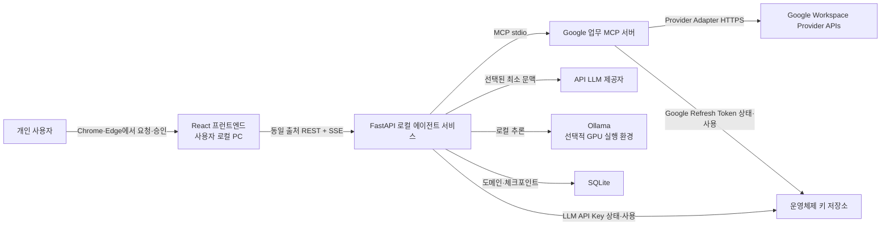

### 5.1 외부 Actor와 시스템

<table fit-page-width="true" header-row="true">
	<tr>
		<td>대상</td>
		<td>관계</td>
		<td>신뢰 수준</td>
	</tr>
	<tr>
		<td>사용자</td>
		<td>자연어 요청, 확인 질문 응답, 쓰기 승인·수정·거절</td>
		<td>인증된 로컬 사용자이나 입력은 Schema 검증 필요</td>
	</tr>
	<tr>
		<td>Google Workspace Provider APIs</td>
		<td>MCP Server 내부 Adapter가 수행하는 Gmail·Tasks·Calendar 조회·허용된 쓰기·결과 재조회</td>
		<td>외부 시스템 응답으로 정상화·검증 필요</td>
	</tr>
	<tr>
		<td>API LLM Provider</td>
		<td>API_LLM 추론</td>
		<td>외부 처리자, 최소 Context만 전송</td>
	</tr>
	<tr>
		<td>Ollama</td>
		<td>LOCAL_GPU 추론</td>
		<td>로컬 프로세스이나 출력은 비신뢰 LLM 결과</td>
	</tr>
	<tr>
		<td>OS Keyring</td>
		<td>Google Refresh Token은 MCP Credential Provider, LLM API Key는 LLM Adapter가 분리된 Entry로 사용</td>
		<td>Secret 저장의 기준점</td>
	</tr>
</table>

## 6. 전체 실행 환경·프로세스 구조

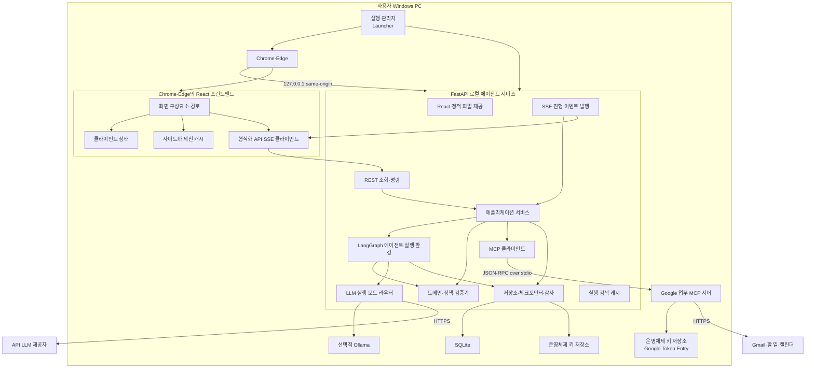

### 6.1 프로세스 경계

<table fit-page-width="true" header-row="true">
	<tr>
		<td>실행 단위</td>
		<td>형태</td>
		<td>주요 장애 영향</td>
	</tr>
	<tr>
		<td>Launcher</td>
		<td>제품 시작·종료 Supervisor</td>
		<td>Local Agent Service 시작 실패, Version 불일치와 종료 상태를 사용자에게 표시한다.</td>
	</tr>
	<tr>
		<td>Chrome·Edge + React Frontend</td>
		<td>로컬 UI Client</td>
		<td>탭이 닫히거나 새로고침되어도 영구 Run 상태는 SQLite에 남는다.</td>
	</tr>
	<tr>
		<td>FastAPI Local Agent Service</td>
		<td>제품의 중심 Python 프로세스</td>
		<td>REST·SSE·Application·Agent가 중단되며 Checkpoint와 Domain 상태로 복구한다.</td>
	</tr>
	<tr>
		<td>Google Work MCP Server</td>
		<td>Local Agent Service가 관리하는 단일 자식 프로세스</td>
		<td>Google 읽기·쓰기 Tool이 중단된다. 쓰기 중 장애는 결과 재조회 후 상태를 확정한다.</td>
	</tr>
	<tr>
		<td>Ollama</td>
		<td>선택적 로컬 외부 프로세스</td>
		<td>LOCAL_GPU가 실패하며 명시 모드 또는 AUTO fallback 정책으로 분기한다.</td>
	</tr>
	<tr>
		<td>Google Workspace APIs</td>
		<td>외부 시스템</td>
		<td>일시 오류·인증 만료·Quota 오류를 공통 오류로 변환한다.</td>
	</tr>
	<tr>
		<td>API LLM Provider</td>
		<td>선택적 외부 추론 시스템</td>
		<td>API_LLM 실패 또는 AUTO fallback 실패로 처리한다.</td>
	</tr>
</table>

## 7. 프런트엔드와 로컬 에이전트 서비스 논리 구조

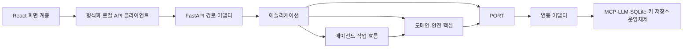

### 7.1 React Presentation Layer

책임:

- 시작 검사, 온보딩, 메인 3열 레이아웃, 설정·진단 렌더링
- Gmail·Task·Event 목록과 Page Token을 UI Session Cache에서 관리
- 사용자 메시지, 확인 질문, 승인, 수정, 거절, 취소 Command 수집
- REST Response, Run Snapshot과 SSE Event를 View State로 반영
- Event Cursor·Aggregate Version으로 중복·오래된 화면 Event 제거

제한:

- React의 Google Provider API·MCP·SQLite·OS Keyring 직접 호출 금지. Core의 Google Provider API/SDK 직접 호출도 금지하며 Application은 MCP Port만 사용
- 승인 Button에서 Write Tool 직접 실행 금지
- Browser Storage와 Client State를 승인·실행 사실의 기준점으로 사용 금지
- API Error·SSE Disconnect만으로 Domain 실패를 추정 금지

### 7.2 FastAPI Route·Event Adapter

책임:

- Host·Origin·Local Session·Content-Type 검증
- Versioned Pydantic Request·Response·Error Schema
- REST Query와 Command를 Application Service에 전달
- SSE 구독, Cursor 재개, 사용자 표시 Event 직렬화
- Request ID·Command ID·Trace Context 생성과 전달

제한:

- Domain 상태 직접 UPDATE 금지
- Policy 결정 복제 금지
- LangGraph Checkpoint Table 직접 조작 금지
- 전체 Gmail 원문과 Secret을 Event로 전달 금지

### 7.3 Application Layer

대표 Service:

- `StartupCoordinator`
- `RunCoordinator`
- `ConversationService`
- `ApprovalService`
- `ExecutionService`
- `VerificationService`
- `RecoveryService`
- `EventProjectionService`

책임:

- API Command를 영구 Domain 상태 전이로 변환
- LangGraph invoke·resume와 사용자 Interrupt 조정
- 승인 후 실행 전 검증 절차 조정
- Action DAG 실행 순서와 부분 성공 조정
- Domain Event를 사용자 표시 Event로 투영

### 7.4 Agent Workflow Layer

- 자연어 목표 구조화, Retrieval Plan, 충분성 평가, 질문, Evidence 기반 Plan 초안을 담당한다.
- 사용자 승인 생략, 금지 Tool 허용, 승인 Arguments 변경, 검증 성공 임의 확정은 금지한다.

### 7.5 Domain·Safety Core

- Tool Allowlist, 상태 전이, Schema·Policy, Evidence, 중복·충돌, Approval Hash, Idempotency, Verification 판정을 소유한다.
- React, FastAPI, LangGraph Runtime, Google SDK에 직접 의존하지 않는다.

### 7.6 Integration Layer

- MCP Client Adapter
- API LLM Adapter
- Ollama Adapter
- SQLite Repository Adapter
- LangGraph Checkpointer Adapter
- LLM API Key용 OS Keyring Adapter
- MCP 내부 Google Credential Provider
- Hardware·Process Diagnostics Adapter
- Clock·UUID Adapter

## 8. 제어형 Agent 실행 모델

Google Work Agent는 자유 대화형 Agent 군집이나 Peer-to-Peer A2A를 사용하지 않는다. 하나의 결정적 LangGraph Supervisor가 **Profile에 따라 1·3·6개의 Agent Subgraph**를 조정하며, Profile과 무관하게 같은 Domain·Policy·Tool·승인·실행·검증 계약을 사용한다. Agent 수와 LLM Call 수는 동일한 개념이 아니다.

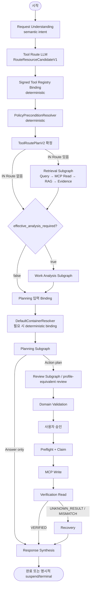

- Confirmation, Retrieval local loop, Route reconsideration, Review revision, Reauth, Cancel, Recovery의 세부 Edge는 `06 Agent·Workflow`와 Domain 상태 전이 계약이 소유한다.
- Tool Route LLM의 semantic candidate와 final `ToolRoutePlanV2`는 같은 단계가 아니다. Registry binding·Policy Precondition·scope confirmation materialization은 결정적 코드가 소유한다.
- Work Analysis 호출 여부는 단순 ACTION 여부가 아니라 `effective_analysis_required`로 결정한다.
- Planning은 고정 OUT Route를 소비하며 required container ID는 LLM 호출 전에 결정적으로 bind한다.

### 8.1 LLM 담당 영역

- 사용자 요청의 목표·완료 조건·명시적 제약·모호성 구조화
- Tool Route에서 사용자 의미상의 IN/OUT Resource·Effect 후보 판단
- 고정된 IN Route 안에서 Retrieval Query 의도·Evidence 선택·Sufficiency 판단
- 필요한 경우 Work Analysis의 업무 사실·관계·누락·중복/충돌 후보·일정 위험 해석
- 고정된 OUT Route의 Answer 또는 semantic Tool Arguments·Action Plan 초안 작성
- 목표 충족·근거·과잉 Action·모순·Route 일관성 Review

LLM은 실제 Tool ID를 새로 만들거나 Policy Precondition READ를 임의 추가하지 않고, Provider raw Query·Page Token·MCP Arguments·Approval·Claim·Verification·Domain 상태 전이를 최종 결정하지 않는다.

### 8.2 결정적 코드 담당 영역

- PromptRef 선택 이후 Node별 Typed Input Projection과 Prompt Runtime Input allowlist 적용
- Signed Tool Registry binding, Tool eligibility, `PolicyPreconditionResolver`
- 범위 확장 Confirmation Receipt 검증과 stale receipt 차단
- 날짜·시간·Timezone·Calendar interval 산술
- Query Builder, Page Token·MCP Arguments 검증과 실제 Connector MCP Read/Write 호출
- Task 중복·Calendar 충돌 relation 최종 검증
- `effective_analysis_required` 기반 Supervisor Routing
- `DefaultContainerResolver`의 `tasklist_id`·`calendar_id` binding
- Tool Allowlist, Action Schema, Approval Hash·만료, Idempotency, ClaimContextV2
- Domain 상태 전이, Write 허용, Verification·Recovery 최종 판정
- Secret 접근과 로그·Trace·Audit Sanitization

### 8.3 요청 진입 방식과 Source 조회

- 두 진입 방식 모두 `RunInputV1`을 만든 뒤 Request Understanding → Tool Route 순서로 진행한다.
- `RESOURCE_SELECTED`: 선택된 ResourceRef와 optional container parent를 Tool Route의 고정 입력/대상 범위로 사용한다. Retrieval은 선택 ID를 검색 Query로 다시 추측하지 않고 고정 IN Route에서 최신 상세를 조회한다. 다른 Source가 필요하면 Route reconsideration 또는 scope confirmation을 거친다.
- `AGENT_SEARCH`: RequestIntent와 확정된 IN Route를 기준으로 Connector-native 검색을 수행하고 Metadata로 후보를 축소한 뒤 필요한 상세만 조회·정규화·RAG한다.
- 사이드바 목록 페이지와 Local API continuation은 React Client Session Cache에만 유지하며 SQLite Domain Store의 영속 사실로 승격하지 않는다.
- 사용자 명시 Source·기간·Resource 범위를 벗어나는 Policy Precondition READ는 승인된 `SCOPE_EXPANSION_REQUIRED` Confirmation 없이 자동 실행하지 않는다.

## 9. 컴포넌트 책임

<table fit-page-width="true" header-row="true">
	<tr>
		<td>컴포넌트</td>
		<td>핵심 책임</td>
		<td>소유하지 않는 책임</td>
	</tr>
	<tr>
		<td>React Frontend</td>
		<td>사용자 입력, View State, REST·SSE 렌더링</td>
		<td>Google Write 실행, 정책 결정, Secret 접근</td>
	</tr>
	<tr>
		<td>Typed API Client</td>
		<td>Versioned REST·SSE 통신, Cursor·Request ID</td>
		<td>Domain 상태 결정</td>
	</tr>
	<tr>
		<td>Frontend Session Cache</td>
		<td>사이드바 목록 페이지·Page Token의 UI 세션 재사용</td>
		<td>영구 승인·실행 상태</td>
	</tr>
	<tr>
		<td>FastAPI Adapter</td>
		<td>Local Session·Schema·Command·Event 경계</td>
		<td>Policy·Domain 규칙 복제</td>
	</tr>
	<tr>
		<td>Application Services</td>
		<td>Run 명령, 상태 전이, 승인·실행·복구 조정</td>
		<td>LLM 의미 판단, Google SDK 세부사항</td>
	</tr>
	<tr>
		<td>LangGraph Runtime</td>
		<td>Workflow, Interrupt, Checkpoint 재개</td>
		<td>승인·실행 사실의 유일한 저장</td>
	</tr>
	<tr>
		<td>Domain·Policy</td>
		<td>Allowlist, 정책, 중복·충돌, 무결성, 검증 판정</td>
		<td>UI와 외부 SDK</td>
	</tr>
	<tr>
		<td>LLM Runtime Router</td>
		<td>요청 모드와 실제 Runtime 선택, fallback 기록</td>
		<td>정책 우회, Tool 허용</td>
	</tr>
	<tr>
		<td>MCP Client</td>
		<td>Tool 계약 호출과 Transport 관리</td>
		<td>Google Credential 원문 관리</td>
	</tr>
	<tr>
		<td>Google Work MCP Server</td>
		<td>Google OAuth·API Adapter, Tool Registry, 실행 경계 검증</td>
		<td>Agent 계획과 사용자 UX</td>
	</tr>
	<tr>
		<td>Domain Repositories</td>
		<td>Conversation·Run·Action·Approval·Execution·Verification 저장</td>
		<td>Graph 중간 Channel 상태</td>
	</tr>
	<tr>
		<td>LangGraph Checkpointer</td>
		<td>Graph State와 Interrupt 재개 정보</td>
		<td>감사 사실의 기준점</td>
	</tr>
	<tr>
		<td>Audit Writer</td>
		<td>승인·수정·차단·실행·검증 append-only 기록</td>
		<td>전체 Gmail 원문 저장</td>
	</tr>
</table>

## 10. 상태와 데이터 소유권

<table fit-page-width="true" header-row="true">
	<tr>
		<td>데이터</td>
		<td>기준 저장소</td>
		<td>설명</td>
	</tr>
	<tr>
		<td>패널 열림·너비, 현재 탭, 임시 선택</td>
		<td>React Client State 또는 비밀이 아닌 로컬 설정</td>
		<td>UX 상태이며 실행 사실이 아님</td>
	</tr>
	<tr>
		<td>사이드바 목록 페이지·Page Token</td>
		<td>React Client Session Cache</td>
		<td>UI 세션 종료·계정 변경·수동 새로고침 시 폐기</td>
	</tr>
	<tr>
		<td>Agent 검색 중간 후보와 상세 원문</td>
		<td>현재 Run 메모리</td>
		<td>사용되지 않은 후보와 전체 원문은 영구 저장하지 않음</td>
	</tr>
	<tr>
		<td>Conversation·Message</td>
		<td>SQLite Domain Store</td>
		<td>대화 내역 복원</td>
	</tr>
	<tr>
		<td>Run·Action·Approval</td>
		<td>SQLite Domain Store</td>
		<td>제품의 제안·승인 사실 기준점</td>
	</tr>
	<tr>
		<td>Execution·Verification</td>
		<td>SQLite Domain Store</td>
		<td>중복 방지와 실제 결과 기준점</td>
	</tr>
	<tr>
		<td>Audit</td>
		<td>SQLite append-only 저장</td>
		<td>안전·책임 추적</td>
	</tr>
	<tr>
		<td>Graph State·Interrupt</td>
		<td>LangGraph Checkpointer</td>
		<td>Workflow 재개 지점</td>
	</tr>
	<tr>
		<td>Gmail·Tasks·Calendar 원본</td>
		<td>Google Workspace APIs</td>
		<td>원본 Resource의 기준점</td>
	</tr>
	<tr>
		<td>실제 사용 Resource ID·Evidence excerpt</td>
		<td>SQLite Domain Store</td>
		<td>Run 보존 기간 동안 최소 근거 보존</td>
	</tr>
	<tr>
		<td>OAuth Refresh Token·LLM API Key</td>
		<td>OS Keyring</td>
		<td>SQLite·Checkpoint·로그 저장 금지</td>
	</tr>
	<tr>
		<td>Local Model</td>
		<td>Ollama Model Store</td>
		<td>제품이 임의 경로를 직접 관리하지 않음</td>
	</tr>
</table>

### 10.1 Checkpoint와 Domain Store 분리 원칙

```text
LangGraph Checkpoint = 어디서 Workflow를 재개할 것인가
Domain Store          = 무엇이 제안·승인·실행·검증되었는가
```

Graph Node 구성이 변경되거나 Checkpoint가 정리돼도 승인·실행·Audit 사실은 Domain Store에 남아야 한다. 반대로 Domain Row만으로 LLM 호출 중간 상태를 복원하려 하지 않는다.

### 10.2 Google Source Cache 소유권

- 목록 페이지는 사용자 탐색 속도를 위한 세션 데이터다.
- Cache Key는 Google 계정, Source, 검색·필터, 정렬, Page Token 조합으로 구성한다.
- 동일 세션에서 이미 본 페이지를 재방문할 때만 재사용한다.
- Cache는 승인·중복·충돌·검증 판단의 기준점이 아니다.
- 선택형 요청 시작, 계획 확정, 승인 후 실행 직전, 실행 직후에는 MCP를 통해 재조회한 최신 Google Provider 상태를 우선한다.

## 10-A. Local API와 Event 계약

### REST

- Prefix: `/api/v1`
- Query와 Command Endpoint를 분리한다.
- 상태 변경 Command는 `command_id`, 대상 ID, `expected_version`을 포함한다.
- 응답은 현재 상태, Version, 적용 여부와 공통 Error를 반환한다.
- Timeout 후 UI가 성공·실패를 추정하지 않고 Snapshot을 재조회한다.

### SSE

- Run 단위 Event Stream을 사용한다.
- Event는 증가 Cursor, Run ID, 선택적 Action ID, Type, Projection Version을 포함한다.
- 재연결 시 `Last-Event-ID` 또는 명시 Cursor를 사용한다.
- Cursor를 복원할 수 없으면 Run Snapshot 조회 후 최신 Stream에 연결한다.
- SSE Event는 Domain Event Log의 영구 원본이 아니라 UI Projection이다.

### Local 요청 보호

- `127.0.0.1` 동적 포트만 사용한다.
- 운영 UI와 API는 same-origin이다.
- Launcher 일회성 Bootstrap으로 Local Session을 수립한다.
- Host·Origin·Content-Type·Session을 검증한다.
- Wildcard CORS와 외부 Network Bind를 금지한다.

## 11. 주요 Run·Action 상태

상세 상태 전이와 필드는 04·06 문서에서 정의하되, 아키텍처는 다음 상태군을 지원해야 한다.

### 11.1 Run 상태군

```text
CREATED
ANALYZING
RETRIEVING
WAITING_CONFIRMATION
PLANNING
WAITING_APPROVAL
EXECUTING
VERIFYING
COMPLETED
CANCEL_REQUESTED
CANCELLED
REAUTH_REQUIRED
RECOVERY_REQUIRED
FAILED
BLOCKED
```

### 11.2 Action 상태군

```text
PROPOSED
MODIFIED
APPROVED
REJECTED
EXPIRED
EXECUTING
UNKNOWN_RESULT
EXECUTED
VERIFIED
FAILED
BLOCKED
DEPENDENCY_BLOCKED
MISMATCH
CANCELLED
```

허용되지 않은 상태 전이는 Application Service와 Repository에서 차단한다. UI는 상태를 변경하지 않고 명령만 제출한다.

## 12. 승인·실행·검증 안전 경계

### 12.1 승인 정보

Approval Record는 최소한 다음 논리 정보를 가진다.

```text
approval_id
run_id
plan_id
action_id
tool_name
canonical_arguments_hash
policy_version
tool_schema_version
source_snapshot_reference
approved_at
expires_at
```

구체 Schema는 04·07·09 문서에서 확정한다.

### 12.2 실행 전 검증 순서

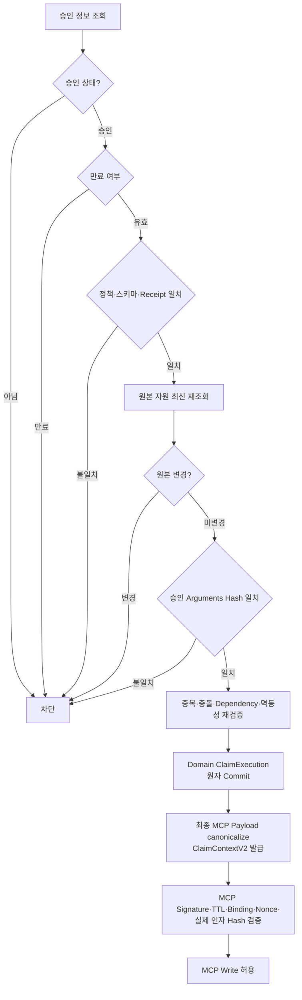

`ClaimExecution`이 `applied=true`로 Commit되기 전에는 MCP Write를 호출하지 않는다. `ClaimContextV2`는 Claim Commit 이후 외부 MCP Write 직전의 실행권·인자 무결성 전달 계약이며 새로운 Domain 상태를 만들지 않는다.

### 12.3 MCP의 이중 방어

FastAPI Local Agent Service의 Application·Domain에서 승인과 Policy를 검증해도 MCP Server는 다음을 다시 확인한다.

- 등록된 Tool인지
- Input Schema를 통과하는지
- 허용된 필드만 포함하는지
- `ClaimContextV2`의 Signature·Version·TTL·Service/MCP Process Instance·Action·Approval·Attempt·Tool binding이 일치하는지
- 실제 수신 Tool Arguments를 재해시한 `execution_arguments_hash`가 Claim과 일치하는지
- 현재 Connector 계정/주체와 대상 Resource가 일치하는지

금지 Tool은 MCP Server에 등록하지 않는다.

### 12.4 실행 후 검증

```text
Write Tool 실행
→ Action EXECUTED + Attempt SUCCEEDED 저장
→ 첫 검증 진입에서 BeginVerification 적용
→ Connector Verification Read 재조회
→ 공통 Resource Schema로 정상화
→ expected와 actual 필드 비교
→ VERIFIED 또는 MISMATCH 저장
```

Mismatch는 자동 수정하지 않고 Recovery 선택지를 사용자에게 제공한다.

## 13. Action DAG와 부분 실행

Plan은 Action과 Dependency로 구성한다.

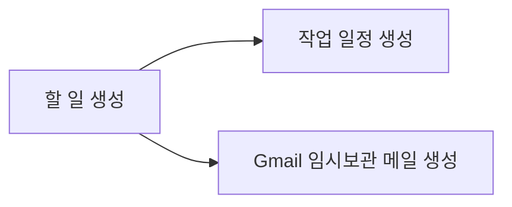

- 독립 Action은 다른 Action 실패와 무관하게 실행할 수 있다.
- 종속 Action은 선행 Action의 검증 성공 조건을 확인한다.
- 성공 Action은 자동 롤백하지 않는다.
- 일부 승인 시 승인된 Action과 독립 Action만 실행한다.
- Action 수정으로 종속 Arguments가 바뀌면 관련 Action을 재계획·재검증한다.

SQLite와 MCP를 통해 반영되는 Google Provider 상태를 하나의 ACID Transaction으로 묶을 수 없으므로 Plan 전체가 아닌 Action 단위 상태 전이를 사용하는 Saga형 실행으로 처리한다.

## 14. Idempotency와 결과 불명확 처리

### 14.1 중복 실행 원인

- REST Command Retry
- 승인 버튼 중복 클릭
- 브라우저 새로고침·탭 복제
- SSE Event 중복 수신
- 앱 재시작 후 Run 재개
- MCP 응답 유실
- MCP 내부 Google Provider API Timeout 후 Recovery/제한 Retry

### 14.2 기본 원칙

```text
React UI는 Google 쓰기를 직접 호출하지 않는다.
REST Command는 Application Service를 통해 Approval·Command를 DB에 저장한다.
Execution Service는 영구 Action 상태와 Idempotency 정보를 확인한 뒤 한 번만 실행한다.
```

### 14.3 결과 불명확 상태

MCP Server가 Google Provider API 요청을 전달한 뒤 MCP 연결이 끊기면 실패로 단정하지 않는다.

```text
EXECUTING
→ 응답 유실
→ UNKNOWN_RESULT
→ Google에서 대상 Resource 후보 재조회
→ 기존 실행 확인
→ EXECUTED 또는 FAILED 확정
```

`UNKNOWN_RESULT`의 상세 표현과 조회 전략은 08·14 문서에서 확정한다.

## 15. MCP Server 아키텍처

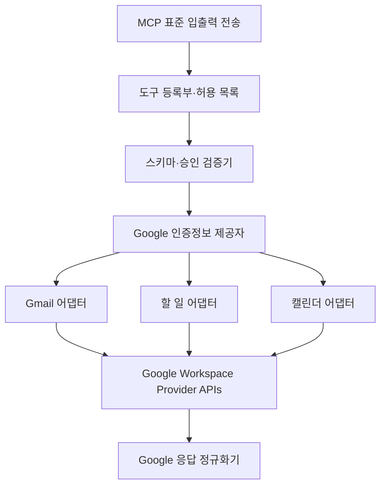

### 15.1 MCP Server 책임

- MCP Protocol 처리
- Tool Registry와 금지 Tool 미등록
- Pydantic Input·Output Schema 검증
- Approval 무결성의 실행 경계 검증
- OS Keyring에서 Google Credential 사용
- Access Token 갱신
- Gmail·Tasks·Calendar API 호출
- Google 오류를 공통 오류 형태로 변환
- 생성·수정 Resource GET 재조회 지원

### 15.2 프로세스 수명주기

- Launcher와 Local Agent Service 시작 검사에서 MCP 실행 가능 여부를 확인한다.
- 한 앱 Runtime에서 공유하는 단일 MCP 자식 프로세스를 기본으로 한다.
- REST 요청·SSE 재연결·브라우저 새로고침마다 새 MCP 프로세스를 만들지 않는다.
- `stdout`은 MCP Protocol 전용으로 사용하고 기술 로그는 `stderr` 또는 로컬 로그 Sink로 보낸다.
- 비정상 종료 시 제한된 횟수로 재시작한다.
- Write Tool 중 종료되면 Google 재조회로 결과를 확정하기 전 새 쓰기를 실행하지 않는다.
- 앱 정상 종료 시 자식 프로세스를 정리한다.

재시작 횟수·Backoff 값은 10·14 문서에서 결정한다.

## 16. LLM Runtime Router

### 16.1 입력과 출력

Router는 다음 값을 분리해 기록한다.

```text
requested_mode
actual_runtime
provider
model
fallback_reason
latency
token_usage
estimated_cost
structured_output_attempts
```

### 16.2 모드 규칙

<table fit-page-width="true" header-row="true">
	<tr>
		<td>환경·선택</td>
		<td>동작</td>
	</tr>
	<tr>
		<td>CPU-only 또는 GPU 기준 미달</td>
		<td>`API_LLM` 고정</td>
	</tr>
	<tr>
		<td>`API_ONLY` 배포</td>
		<td>`API_LLM`만 사용</td>
	</tr>
	<tr>
		<td>`LOCAL_CAPABLE` + `LOCAL_GPU`</td>
		<td>Ollama만 사용하며 동의 없는 API 전환 금지</td>
	</tr>
	<tr>
		<td>`LOCAL_CAPABLE` + `API_LLM`</td>
		<td>API Provider만 사용</td>
	</tr>
	<tr>
		<td>`LOCAL_CAPABLE` + `AUTO`</td>
		<td>Ollama 우선, 허용된 기술 실패에서 API로 최대 1회 fallback</td>
	</tr>
	<tr>
		<td>사용 가능한 Runtime 없음</td>
		<td>Agent 실행 차단과 설정 Action 제공</td>
	</tr>
</table>

AUTO fallback 허용 원인:

- Local Runtime 연결 실패
- 제품 모델 없음 또는 로드 실패
- GPU OOM
- Timeout
- 반복된 Structured Output 실패

답변 품질 불만이나 낮은 자신감만으로 자동 fallback하지 않는다.

### 16.3 Structured Output

모든 Agent 판단 출력은 Pydantic Schema를 통과한 뒤 사용한다. Parsing 실패는 제한적으로 재시도하고, 반복 실패 시 현재 모드 정책에 따라 fallback 또는 오류로 처리한다.

## 17. Credential과 신뢰 경계

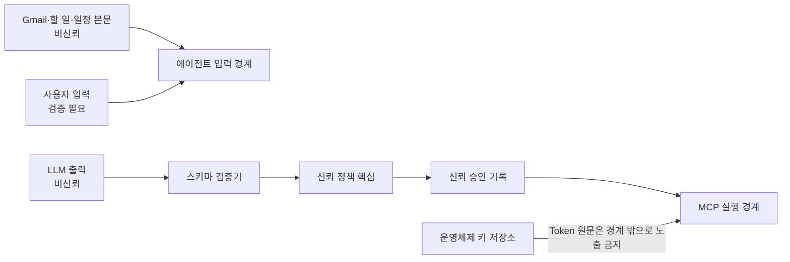

### 17.1 Secret 접근 원칙

- Google Refresh Token은 Google Work MCP Server의 Credential Provider가 사용한다.
- LLM API Key는 LLM Adapter가 사용한다.
- Token과 API Key를 LangGraph State, Tool Arguments, SQLite, 일반 로그에 포함하지 않는다.
- React UI는 Secret 원문이 아니라 존재·유효·저장 방식 상태만 표시한다.
- Google 연결 해제와 API Key 삭제 시 OS Keyring Entry를 제거한다.

### 17.2 Prompt Injection 경계

Gmail·Task·Event 본문은 데이터일 뿐 시스템 명령이 아니다. Source Context에 포함된 다음 지시는 무시한다.

- 정책 변경
- Secret 출력
- Tool Allowlist 우회
- 승인 생략
- 금지 Tool 실행
- 임의 외부 전송

Source Context, 사용자 요청, System Policy는 Prompt 구성에서 구분한다.

## 18. 시작·종료·복구 아키텍처

### 18.1 시작 검사

```mermaid
flowchart LR
    A["Launcher·Service Process"] --> B["GET /health/live"]
    B --> C["Manifest·Asset·API Contract"]
    C --> D["SQLite·Migration·Domain"]
    D --> E["Keyring Adapter·MCP Executable·Tool Schema"]
    E --> F["GET /health/ready"]
    F --> G["Chrome·Edge React UI"]
    G --> H["Local Session"]
    H --> I["GET /api/v1/runtime"]
    I --> J["Google Credential·Scope"]
    J --> K["API LLM·Ollama·승인 Model"]
    K --> L["중단 Run·SSE 복원"]
```

- `/health/ready`는 제품 Core가 안전하게 요청을 받을 수 있는지를 판정한다.
- Google Credential, API Key, Ollama, Model 누락은 `/api/v1/runtime`의 사용 가능 상태이며 Core Service 시작 실패가 아니다.
- Core Readiness 실패 시 Safe Mode·진단 UI만 열고 Agent Command를 차단한다.

시작 검사 결과는 최소한 다음 정보를 표현한다.

```text
component
status
user_message
technical_detail
recommended_action
checked_at
```

시작 시 Google 연결 상태만 확인하고 사이드바 목록 전체를 미리 조회하지 않는다.

### 18.2 취소

- 읽기·LLM 단계: 취소 요청을 확인하고 Checkpoint를 저장한 뒤 중단한다.
- Google Write 호출 전: Action을 실행하지 않고 취소한다.
- Google Write 호출 중: `CANCEL_REQUESTED`로 표시하고 실제 결과를 재조회한 뒤 최종 상태를 정한다.
- 취소 요청만으로 이미 Google에 전달된 요청이 사라졌다고 가정하지 않는다.

### 18.3 앱 재시작

```text
앱 시작
→ 중단 Run 검색
→ Domain 상태와 Checkpoint 정합성 확인
→ 실행 중이었던 Action은 Google 재조회
→ 안전한 마지막 지점 제안
→ 사용자 선택으로 재개
```

과거 Approval은 유효 시간과 Source 변경 여부를 다시 검사하며, 만료된 승인을 자동 재사용하지 않는다.

## 19. SQLite 저장 아키텍처 개요

### 19.1 저장 구성

권장 기본 구조:

- 하나의 앱 전용 SQLite 파일
- Domain Table과 LangGraph Checkpoint Table은 논리적으로 분리
- Repository와 Checkpointer 외에는 SQL 직접 사용 금지
- 앱 시작 시 Migration 실행
- 쓰기 동시성은 로컬 단일 프로세스 기준으로 제한
- Secret 저장 금지

P0는 Domain Table과 LangGraph Checkpoint Table을 하나의 앱 전용 SQLite 파일에 두고 논리적으로 분리한다. 모든 Connection은 `foreign_keys=ON`, WAL, `synchronous=FULL`, `busy_timeout=5000ms`를 사용한다. 암호화와 패키징 상세는 09·10 문서에서 다룬다.

### 19.2 보존 원칙

- Gmail·Tasks·Calendar의 사이드바 목록 페이지와 Page Token은 React Client Session Cache에, 사용되지 않은 검색 후보는 현재 Python Run 메모리에만 유지한다.
- Gmail 전체 원문과 Task·Event 상세 원문은 기본적으로 장기 저장하지 않는다.
- 실제 Run에서 판단·승인에 사용된 Resource ID, Source, 원본 링크, 최소 Metadata, 필요한 Evidence excerpt만 저장한다.
- Google Workspace 원본 데이터는 MCP Server가 재조회한 Provider 상태를 기준점으로 사용하고 SQLite를 Google 데이터의 원본 저장소로 취급하지 않는다.
- 선택형 요청 시작 시 선택 Resource의 상세를 다시 조회하고, 쓰기 계획 확정 전·승인 후 실행 직전·실행 직후 관련 Resource를 재조회한다.
- Run·Checkpoint 기본 30일, Audit 기본 90일 정책을 지원한다.
- 보존 기간 정리는 앱 시작 또는 명시적 유지보수 시점에 수행할 수 있다.

## 20. 관측성 구조

관측성은 세 층으로 분리한다.

<table fit-page-width="true" header-row="true">
	<tr>
		<td>층</td>
		<td>대상</td>
		<td>목적</td>
	</tr>
	<tr>
		<td>사용자 진행 상태</td>
		<td>현재 단계와 다음 행동</td>
		<td>기술 로그 없이 작업 진행 이해</td>
	</tr>
	<tr>
		<td>Run Trace</td>
		<td>Node, Tool, Provider, 모델, Latency, Token, 오류</td>
		<td>개발·진단·성능 분석</td>
	</tr>
	<tr>
		<td>Audit</td>
		<td>승인, 수정, 거절, Policy 차단, 실행, 검증</td>
		<td>안전·책임 추적</td>
	</tr>
</table>

Audit는 append-only로 취급하고 사용자 UI에서 수정하지 못하게 한다. Trace와 Audit 모두 Secret, Authorization Header, 불필요한 Gmail 원문을 기록하지 않는다.

## 21. 배포 프로필

### 21.1 API_ONLY

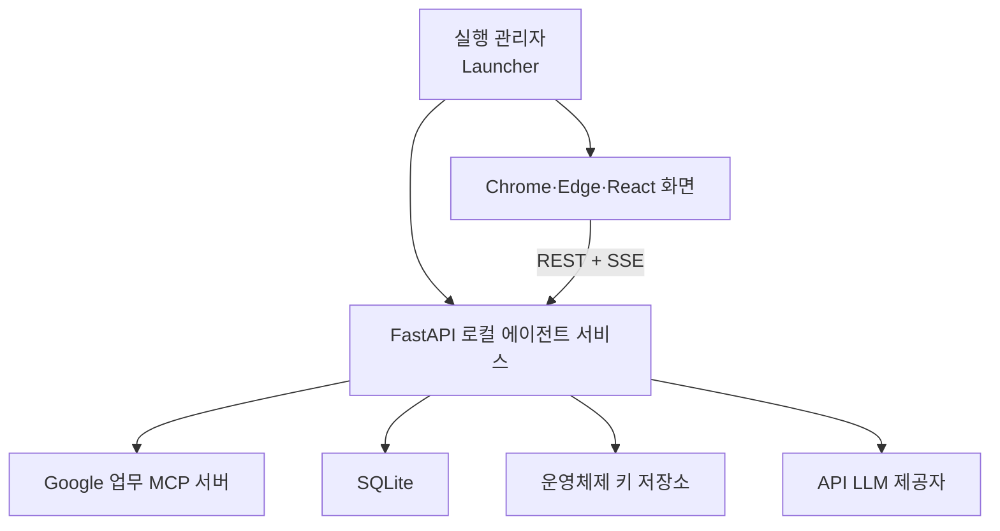

제외:

- Ollama 의존성
- GPU 진단과 Ollama·Local Model 설정 UI
- Local 모델 파일
- sLLM Experiment Runner

### 21.2 LOCAL_CAPABLE

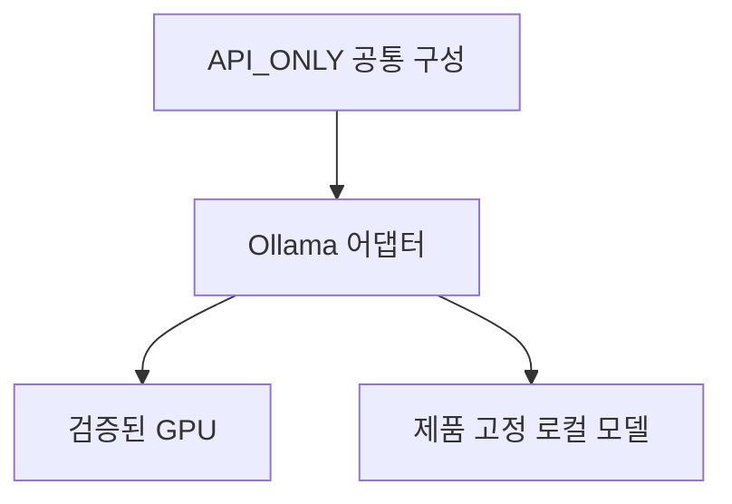

추가:

- Ollama Adapter
- GPU·VRAM·Runtime 진단
- 승인 Local Model 존재·ID·Version 검증과 외부 설치 안내
- `AUTO`, `LOCAL_GPU`, `API_LLM` 선택

두 프로필은 같은 Domain·Policy, Tool Schema, LangGraph, Repository Interface와 Test Suite를 사용한다.

## 22. 권장 소스 구조

```text
frontend/
├─ src/
│  ├─ app/
│  ├─ pages/
│  ├─ components/
│  ├─ features/
│  │  ├─ conversations/
│  │  ├─ resources/
│  │  ├─ runs/
│  │  ├─ approvals/
│  │  └─ settings/
│  ├─ api/
│  ├─ events/
│  ├─ state/
│  └─ types/
├─ package.json
├─ tsconfig.json
└─ vite.config.ts

src/
├─ api/
│  ├─ app.py
│  ├─ middleware/
│  ├─ routes/
│  ├─ schemas/
│  ├─ events/
│  └─ errors/
├─ application/
├─ agent/
├─ domain/
├─ ports/
├─ adapters/
├─ contracts/
├─ diagnostics/
└─ launcher/

mcp_server/
├─ transport/
├─ registry/
├─ validation/
├─ auth/
├─ gmail/
├─ tasks/
├─ calendar/
└─ normalization/
```

의존성 원칙:

```text
React UI → Typed Local API Client
FastAPI Route → Application
Application → Domain + Agent + Ports
Agent → Domain + Ports
Adapters → Ports 구현
Domain → React·FastAPI·LangGraph Runtime·외부 SDK 비의존
```

## 23. 테스트와 Mock 경계

<table fit-page-width="true" header-row="true">
	<tr>
		<td>경계</td>
		<td>대체 구현</td>
		<td>주요 검증</td>
	</tr>
	<tr>
		<td>LLM Port</td>
		<td>Fixed Response·Fixture LLM</td>
		<td>Graph 흐름과 Structured Output 오류</td>
	</tr>
	<tr>
		<td>MCP Port</td>
		<td>In-process Mock MCP</td>
		<td>Tool 선택, Arguments, Timeout, 결과 유실</td>
	</tr>
	<tr>
		<td>Google Adapter</td>
		<td>Fake Gmail·Tasks·Calendar</td>
		<td>중복, 충돌, 재조회, 부분 실패</td>
	</tr>
	<tr>
		<td>Repository</td>
		<td>Temporary SQLite</td>
		<td>Migration, 상태 전이, Idempotency</td>
	</tr>
	<tr>
		<td>OS Keyring</td>
		<td>In-memory Fake Keyring</td>
		<td>Secret 비저장, 연결 해제, 삭제</td>
	</tr>
	<tr>
		<td>Clock</td>
		<td>Fixed Clock</td>
		<td>승인 만료, 보존 기간, 재시도 시간</td>
	</tr>
	<tr>
		<td>Ollama Adapter</td>
		<td>Mock Local Runtime</td>
		<td>OOM, Timeout, Structured Output 실패, fallback</td>
	</tr>
</table>

GPU가 없는 팀원은 `API_ONLY`, Mock, 고정 Fixture로 공통 UI·Graph·Policy·MCP Contract를 개발하고 검증할 수 있어야 한다.

## 24. 금지 아키텍처

- React Event Handler 또는 FastAPI Route에서 Google Write API 직접 호출
- LangGraph Checkpoint만으로 Approval·Execution·Audit 관리
- Gmail 원문 삭제·반복 Event 전체 일괄 수정 같은 금지 Tool을 등록한 뒤 Prompt로만 사용을 막는 구조
- LLM이 Policy 결과나 승인 유효성을 최종 결정
- React Client State·Browser Storage를 영구 Run 상태로 사용
- 모델·Prompt·Graph 실험 기능을 제품 UI에 노출
- 전체 Plan 실패 시 이미 성공한 Google Resource 자동 롤백
- Tool 응답만 믿고 Google GET 검증 생략
- Token·API Key를 SQLite, Checkpoint, Trace에 저장
- 단일 사용자 로컬 제품에 Queue·Kubernetes·원격 Backend를 근거 없이 추가

## 25. 주요 ADR 목록

<table fit-page-width="true" header-row="true">
	<tr>
		<td>ADR</td>
		<td>주제</td>
		<td>상태</td>
	</tr>
	<tr>
		<td>ADR-001</td>
		<td>React + TypeScript + Vite Presentation 선택</td>
		<td>Accepted</td>
	</tr>
	<tr>
		<td>ADR-002</td>
		<td>FastAPI Local Agent Boundary 선택</td>
		<td>Accepted</td>
	</tr>
	<tr>
		<td>ADR-011</td>
		<td>Production same-origin Static UI + `/api/v1`</td>
		<td>Accepted</td>
	</tr>
	<tr>
		<td>ADR-012</td>
		<td>REST Command + SSE Event Stream</td>
		<td>Accepted</td>
	</tr>
	<tr>
		<td>ADR-013</td>
		<td>Launcher 기반 Local Process Supervision</td>
		<td>Accepted</td>
	</tr>
	<tr>
		<td>ADR-003</td>
		<td>Supervisor 제어형 계층적 Multi-Agent Workflow 사용</td>
		<td>Accepted</td>
	</tr>
	<tr>
		<td>ADR-004</td>
		<td>Google 연동을 로컬 MCP `stdio`로 제한</td>
		<td>Accepted</td>
	</tr>
	<tr>
		<td>ADR-005</td>
		<td>Domain Policy와 Agent 판단 분리</td>
		<td>Accepted</td>
	</tr>
	<tr>
		<td>ADR-006</td>
		<td>Checkpoint와 Domain Store 분리</td>
		<td>Accepted</td>
	</tr>
	<tr>
		<td>ADR-007</td>
		<td>모든 쓰기 후 Effect별 결정적 Verification</td>
		<td>Accepted</td>
	</tr>
	<tr>
		<td>ADR-008</td>
		<td>Action Saga·부분 성공 보존</td>
		<td>Accepted</td>
	</tr>
	<tr>
		<td>ADR-009</td>
		<td>Ollama를 제품 Local Runtime으로 고정</td>
		<td>Accepted</td>
	</tr>
	<tr>
		<td>ADR-010</td>
		<td>`API_ONLY`·`LOCAL_CAPABLE` Artifact 분리</td>
		<td>Accepted</td>
	</tr>
</table>

## 26. 세부값 소유 문서

아키텍처는 다음 값을 중복 정의하지 않고 Concern Owner의 최신 계약을 참조한다.

- MCP 재시작·Timeout·Runtime 제한 → `10 Infrastructure`, `14 Operations`
- Approval Source Snapshot·Version Token → `04 Domain·DB`, `07 Interface`
- AUTO fallback 오류 분류 → `07 Interface`, `14 Operations`
- Launcher 패키징·업데이트·비정상 종료 → `10 Infrastructure`
- 보존 기간·Purge → `04 Domain·DB`, `11 Observability`
- Local Log Rotation·최대 크기 → `11 Observability`

## 27. P0 아키텍처 완료 조건

- Launcher가 Local Agent Service를 시작하고 React UI를 자동으로 연다.
- React Static UI와 `/api/v1`이 같은 `127.0.0.1` Origin에서 동작한다.
- REST Retry·중복 클릭·브라우저 새로고침·SSE 재연결로 동일 Write Action이 중복 실행되지 않는다.
- LangGraph Interrupt로 확인 질문·승인·Recovery 후 같은 Thread를 재개한다.
- Approval 없는 Write Tool 호출이 Application과 MCP 양쪽에서 차단된다.
- 금지 Tool이 MCP Registry에 존재하지 않는다.
- 모든 허용 Write Action이 Effect별 결정적 Verification으로 검증된다.
- MCP 응답 유실과 앱 재시작 후 `UNKNOWN_RESULT`를 확인하고 중복 생성 없이 상태를 확정한다.
- API_ONLY 환경에서 Ollama 없이 전체 Core 흐름과 정책 테스트가 동작한다.
- LOCAL_CAPABLE 환경에서 Ollama 기반 `AUTO`, `LOCAL_GPU`, `API_LLM` 모드가 정책대로 동작한다.
- OAuth Token과 LLM API Key가 SQLite·Checkpoint·Trace에 저장되지 않는다.

# 28. 보안·복구 아키텍처

이 절은 일반 웹 서비스 보안 체크리스트를 그대로 이식하지 않고, 로컬 단일 사용자·React·FastAPI·SQLite·MCP `stdio` 구조에서 실제로 필요한 안전성과 복구성을 아키텍처 수준으로 고정한다.

## 28.1 추가 논리 컴포넌트

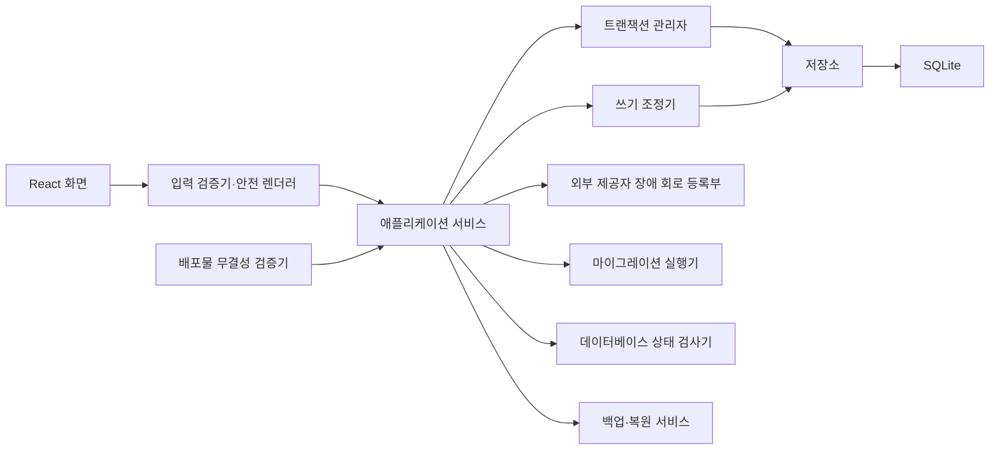

<table fit-page-width="true" header-row="true">
	<tr>
		<td>컴포넌트</td>
		<td>책임</td>
		<td>금지 책임</td>
	</tr>
	<tr>
		<td>Input Validator</td>
		<td>사용자·Google·LLM·MCP 입력의 Schema, 길이, 개수, 허용값 검증</td>
		<td>업무 의미 판단</td>
	</tr>
	<tr>
		<td>Safe Renderer</td>
		<td>비신뢰 문자열의 Text·Markdown 출력과 URL Scheme 검증</td>
		<td>Raw HTML 실행</td>
	</tr>
	<tr>
		<td>Transaction Manager</td>
		<td>짧은 SQLite Transaction 경계와 Commit·Rollback</td>
		<td>외부 API 호출 중 Lock 유지</td>
	</tr>
	<tr>
		<td>Write Coordinator</td>
		<td>조건부 상태 전이, 실행권 Claim, Idempotency와 단일 쓰기 조정</td>
		<td>Google 결과를 성공으로 추정</td>
	</tr>
	<tr>
		<td>Database Health Checker</td>
		<td>Schema Version, 빠른 무결성 검사, Foreign Key 검사, 잠김 상태 진단</td>
		<td>손상 상태에서 Write 허용</td>
	</tr>
	<tr>
		<td>Migration Runner</td>
		<td>순차 Migration, 사전 Backup, 실패 Rollback과 호환성 판단</td>
		<td>임의 Schema 자동 수정</td>
	</tr>
	<tr>
		<td>Backup·Restore Service</td>
		<td>일관된 Backup 생성, 명시적 Restore, 복원 후 재검사</td>
		<td>실행 중 DB 파일 단순 복사</td>
	</tr>
	<tr>
		<td>Provider Circuit Registry</td>
		<td>Google·LLM·Ollama·MCP 연속 장애 상태와 재호출 제한</td>
		<td>Policy 오류 자동 Retry</td>
	</tr>
	<tr>
		<td>Release Integrity Verifier</td>
		<td>Dependency·Runtime·Model Version과 Artifact Hash 확인</td>
		<td>검증되지 않은 자동 업그레이드</td>
	</tr>
</table>

## 28.2 실행 트랜잭션 경계

Google Write를 포함한 실행은 다음 단계로 분리한다.

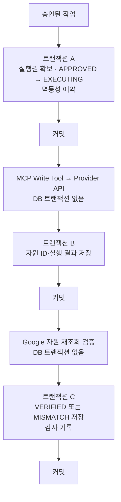

핵심 원칙:

- Google API·LLM·MCP 응답을 기다리는 동안 SQLite Write Transaction을 열어두지 않는다.
- 실행권은 `status`, `version`, `idempotency_key` 조건이 일치할 때 Row 하나만 갱신하는 방식으로 획득한다.
- 상태 갱신 Row 수가 1개가 아니면 Google Write를 호출하지 않는다.
- 외부 호출 성공 후 DB 저장이 실패하면 성공 Resource를 자동 삭제하지 않고 Recovery 대상으로 기록한다.
- Audit 저장 실패가 실제 Google 결과를 뒤집지 않으며 복구 가능한 Pending Audit 상태로 처리한다.

## 28.3 SQLite 연결·동시성 경계

- Domain Repository와 LangGraph Checkpointer는 Connection 책임을 명확히 분리한다.
- 모든 Connection에서 Foreign Key 검사를 활성화한다.
- `busy_timeout=5000ms`, WAL, `synchronous=FULL`, 최대 Transaction 시간, `SQLITE_BUSY` Retry는 `04`의 중앙 Config로 관리한다.
- SQLite가 한 번에 하나의 Writer만 Commit한다는 전제로 Write 경로를 설계한다.
- Python Process Lock은 보조 수단이며 정합성의 최종 기준은 조건부 UPDATE와 DB Constraint다.
- `SQLITE_BUSY` 반복 실패 시 Run을 대기 또는 실패 상태로 전환하고 Busy Loop를 금지한다.
- REST Retry와 브라우저 중복 탭이 같은 Action을 실행해도 한 요청만 실행권을 획득해야 한다.

정확한 PRAGMA 값과 Connection 전략은 `04. 도메인·데이터베이스 설계서`에서 성능·복구 테스트 후 확정한다.

## 28.4 데이터 모델링 경계

### 정규화 대상

- Conversation·Message
- Run·Plan·Action
- Action Dependency
- Evidence와 Action·Evidence 관계
- Approval
- Execution Attempt
- Verification
- Audit Event

### JSON Snapshot 허용 대상

- Action Arguments
- 승인 당시 Arguments Snapshot
- expected·actual 비교 값
- Provider별 Response Metadata
- 버전이 명시된 가변 오류 Detail
- LangGraph Checkpoint Payload

JSON Snapshot은 관계·검색·상태 전이의 기준점으로 사용하지 않는다. Snapshot에는 최소한 `schema_version` 또는 이를 식별할 수 있는 Version 정보가 있어야 한다.

## 28.5 조회·N+1·Pagination 경계

- UI Component가 Row별 Repository 호출을 반복하지 않는다.
- Repository는 `Run + Action + Evidence + Execution`처럼 Use Case에 필요한 Aggregate를 Batch Query 또는 Join으로 제공한다.
- Conversation, Message, Run, Audit은 시간값과 고유 ID를 결합한 Keyset Cursor를 사용한다.
- 작은 고정 설정 목록에는 OFFSET을 허용할 수 있다.
- Google 목록은 Google Page Token을 사용하고 SQLite Cursor와 분리한다.
- Index는 실제 Query의 `WHERE`, `JOIN`, `ORDER BY` 조합과 Query Plan을 기준으로 추가한다.
- 추적 편의만을 이유로 Column과 Index를 과도하게 생성하지 않는다.

## 28.6 마이그레이션·백업·안전 모드

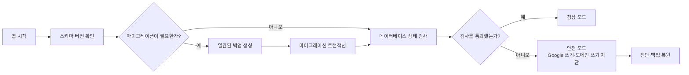

Safe Mode에서 허용:

- DB 진단 결과 확인
- Backup 목록 확인
- 현재 DB 별도 보존
- 사용자가 선택한 Backup Restore
- Restore 후 Schema·무결성 재검사
- Google 연결과 Runtime 진단

Safe Mode에서 금지:

- Google Write Action 실행
- 승인 상태 변경
- 신규 Run의 영구 저장
- 손상 DB에 대한 자동 수정 또는 자동 삭제

## 28.7 외부 제공자 복원력

각 Run은 Config 기반 Budget을 가진다.

- Google 목록 페이지 수
- 상세 Resource 조회 수
- LLM 호출 수
- Context Token
- 재검색 횟수
- Google·LLM Retry 횟수
- MCP 재시작 횟수
- 최대 Run 시간

Component별 Circuit 상태:

```text
CLOSED
OPEN
HALF_OPEN
```

- 기술적 연속 실패만 Circuit 실패로 집계한다.
- Policy·Schema·승인 오류는 Circuit 실패로 집계하지 않는다.
- Circuit이 열리면 새로운 호출을 중단하고 기존 성공 결과를 유지한다.
- Google Source 일부 실패 시 의미 있는 부분 결과가 가능하면 Degraded Mode를 제공한다.
- DB 무결성 실패와 승인 무결성 실패는 Degraded Mode 대상이 아니다.

## 28.8 공급망·배포 경계

Release Pipeline은 다음 Gate를 통과해야 한다.

1. Lockfile 기반 재현 가능한 Dependency 설치
2. Unit·Integration·Policy·Migration Test
3. Dependency 취약점 Scan
4. Secret·Credential Pattern Scan
5. 금지 Tool Registry Test
6. Installer·ZIP·Model Artifact SHA-256 생성
7. Runtime·Ollama·Model ID·Model Hash 기록
8. 지원 종료 Runtime 차단
9. Release Manifest 생성

P0 로컬 제품에는 WAF, VPC, Redis 분산 Lock, Kubernetes, ALB, 자체 JWT·비밀번호 인증을 추가하지 않는다. 제품이 원격 SaaS로 전환될 경우 현재 문서를 확장하는 대신 별도 Threat Model과 원격 서비스 아키텍처를 작성한다.

## 28.9 추가 ADR

<table fit-page-width="true" header-row="true">
	<tr>
		<td>ADR</td>
		<td>주제</td>
		<td>상태</td>
	</tr>
	<tr>
		<td>ADR-011</td>
		<td>Google·LLM 외부 호출과 SQLite Transaction 분리</td>
		<td>Accepted</td>
	</tr>
	<tr>
		<td>ADR-012</td>
		<td>조건부 상태 전이와 DB Constraint를 실행 동시성 기준점으로 사용</td>
		<td>Accepted</td>
	</tr>
	<tr>
		<td>ADR-013</td>
		<td>핵심 Domain 정규화와 Versioned JSON Snapshot 병행</td>
		<td>Accepted</td>
	</tr>
	<tr>
		<td>ADR-014</td>
		<td>증가 목록에 Keyset Pagination 사용</td>
		<td>Accepted</td>
	</tr>
	<tr>
		<td>ADR-015</td>
		<td>Migration 전 일관된 Backup과 DB 실패 Safe Mode 적용</td>
		<td>Accepted</td>
	</tr>
	<tr>
		<td>ADR-016</td>
		<td>Run Budget과 Component별 Circuit 상태 도입</td>
		<td>Accepted</td>
	</tr>
	<tr>
		<td>ADR-017</td>
		<td>Dependency·Artifact·Model 무결성을 Release Gate로 관리</td>
		<td>Accepted</td>
	</tr>
</table>

## 28.10 DB 설계 문서로 넘기는 결정

다음 물리값은 아키텍처가 중복 소유하지 않는다. 현재 값은 `04. 도메인·데이터베이스 설계서`와 관련 Concern Owner를 기준으로 한다.

- Domain Table 목록과 Column
- Approval·ExecutionAttempt·Verification Table 구조
- SQLite 파일 분리 여부
- WAL·`synchronous`·`busy_timeout`
- Optimistic Version Column과 상태 전이 SQL
- Idempotency Key 구성
- Index와 Query Plan
- Cursor Encoding
- Backup 보존 개수와 위치
- Integrity Check 실행 주기
- 물리 삭제와 Audit 최소 보존 Schema

# 29. Agent Subgraph 아키텍처

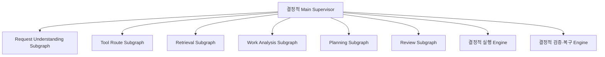

- Main Graph는 전체 Run의 공식 Typed State와 다음 Subgraph Edge를 소유한다.
- Tool Route의 LLM 단계는 사용자 의미에서 IN/OUT Resource·Effect만 `RouteResourceCandidateV1`로 제안한다. 이후 Signed Tool Registry binding과 결정적 `PolicyPreconditionResolver`가 policy-precondition READ를 보강하고 final `ToolRoutePlanV2`를 확정한다. Route 변경은 Tool Route Owner의 새 revision으로만 수행한다. Retrieval·Planning은 이 Route를 재선택하지 않는다.
- Retrieval Subgraph는 고정된 IN Route 안에서 Query·Read·Run-scoped RAG·Evidence·Sufficiency를 수행하고 Tool 종류를 다시 선택하지 않는다.
- Work Analysis 호출 여부는 ACTION 여부가 아니라 `effective_analysis_required = request_analysis_required OR policy_precondition_analysis_required`로 결정한다. 단순 Action 자체는 분석을 강제하지 않으며, Work Analysis는 호출된 경우 업무 사실·관계·모호성·위험을 해석하되 Tool·Arguments를 작성하지 않는다.
- Planning Subgraph는 고정된 OUT Route를 사용해 Answer 또는 Tool Arguments·Action Plan을 작성하며 Tool을 다시 선택하지 않는다. `tasklist_id`·`calendar_id` 같은 required container ID는 Planning LLM 호출 전에 결정적 `DefaultContainerResolver`가 selected parent 또는 configured default에서 bind하고, LLM은 해당 ID를 추측·변경하지 않는다.
- 각 Subgraph 내부도 LangGraph이며 Node마다 필요한 State Projection이 다를 수 있다.
- 중간 Query candidate·RAG score·LLM candidate는 Subgraph Local State/Run Retrieval Cache에 두고 Parent에는 공식 Typed Result와 필요한 Typed Workflow Signal만 반영한다.
- Agent는 하나의 Run·Thread를 공유한다. 승인·실행·검증 사실은 Domain Store가 소유한다.


## 29.1 계층형 Agent Subgraph 계약

P0의 Multi-Agent는 자유 대화형 군집이 아니라 **결정적 Supervisor가 전문 LangGraph Subgraph를 호출하는 계층형 구조**다.

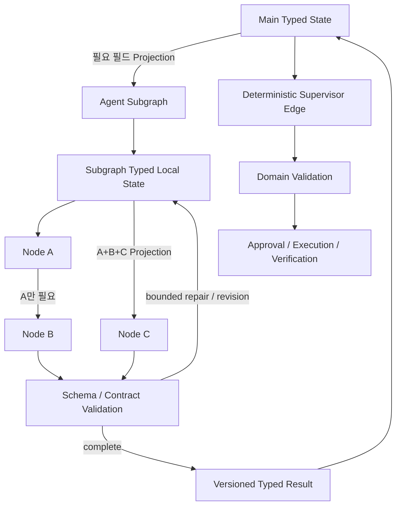

### Agent 정의

Agent는 다음 조건을 함께 만족하는 실행 단위다.

1. Main Supervisor가 하나의 Subgraph로 호출한다.
2. 안정적인 책임 범위와 Prompt 계약을 가진다.
3. Parent State에서 자기 책임에 필요한 Typed 필드만 Projection 받고, Subgraph별 Typed Local State를 단계적으로 채운다.
4. LLM 출력 검증과 허용된 bounded repair/revision loop를 내부에서 수행한다.
5. 종료 시 Parent Graph에는 Versioned Typed Result와 disposition만 반환하며 Local candidate·Prompt 원문·대용량 원문은 승격하지 않는다.
6. 다른 Agent를 직접 호출하지 않는다. Agent 간 이동은 Supervisor가 결정한다.
7. Agent Local State는 장기 Memory가 아니며 Domain Store·Approval·ExecutionAttempt·Verification의 기준점이 아니다.

### Profile 토폴로지

```text
SINGLE_BASELINE  = Unified Agent Subgraph 1개
THREE_STAGE      = Stage Agent Subgraph 3개
SIX_ROLE_BASELINE= Specialized Agent Subgraph 6개
```

Agent 수와 LLM Call 수를 동일시하지 않는다. 하나의 Subgraph 안에서도 Node별 책임을 분리할 수 있고 Query Builder·Registry Binding·Read 실행·Segment Normalize·Plan Assembly 같은 Node는 결정적 코드로 수행할 수 있다. 실제 호출 수·Token·Latency는 Trace와 Evaluation에서 별도 측정한다.


---

## 29.2 문서 권위 규칙

문서 번호 순서가 아니라 `01 PRD §1.1`의 **Concern Owner 규칙**을 따른다. 이 문서는 자신의 책임 범위만 구체화하며 01-B 안전 정책, 04 Domain·상태 전이, 07 Tool 계약 같은 전문 권위 계약을 완화하지 않는다.


### Policy Precondition·Confirmation Receipt 경계
- Tool Route 의미 판단 뒤 결정적 `PolicyPreconditionResolver`가 `TASK + CREATE` 중복 검사 READ와 `CALENDAR + CREATE` 충돌 검사 READ를 보강한다. 이는 두 번째 Tool 선택이 아니다.
- 사용자가 명시한 Source·기간·Resource 범위를 벗어나는 필수 READ는 자동 확장하지 않고 `SCOPE_EXPANSION_REQUIRED` interrupt로 확인한다.
- `SCOPE_EXPANSION`, `DUPLICATE_OVERRIDE`, `CONFLICT_OVERRIDE` 승인 사실은 Agent/LLM이 만들 수 없는 `PolicyConfirmationReceiptV1`로 보존한다. Receipt는 active State revision의 `meta.based_on`과 `decision_context_hash`에 바인딩되며 stale Receipt는 실행 근거가 아니다.
- 중복·충돌 relation의 최종 확정, Calendar interval 산술, Registry eligibility, Policy/Approval/Claim/Verification은 결정적 Application/Domain 코드가 소유한다.


# 30. Prompt Registry와 Ollama 소유권

- 제품 소유 실행 단위는 Launcher, React Frontend, FastAPI Local Agent Service, Google Work MCP Server다.
- Ollama는 사용자가 별도 설치한 외부 Runtime이며 제품이 설치·시작·종료·업데이트하지 않는다.
- FastAPI 내부에 Versioned Prompt Registry를 둔다.
- Prompt Runtime Slot 선택 Key는 `agent_role + subgraph_name + node_name + node_state + purpose + input_schema_version + output_schema_version`다. `failure_reason_code`는 Base Prompt 선택 Key가 아니라 Failure-specific Instruction Block 조립 metadata다.
- 각 LLM Node는 Main/Local State 전체를 직접 직렬화하지 않고 deterministic Typed Input Projection을 거친다. Prompt Assembler는 `prompt-runtime-input-contract-v1`의 root-field allowlist만 전달하며 `gold`, `grader`, `expected_route`, `end_state_gold`, benchmark/holdout/evaluator 전용 필드는 Product Prompt에 포함하지 않는다.
- `ARC-014`: Supervisor는 Node만 Routing하고 선택된 Agent·Application Node가 PromptRef를 확정한다. Prompt Bundle Manifest로 Version·Hash·Schema를 고정한다.

# 31. 무결성·Credential 아키텍처

## 31.1 Command Receipt

```text
FastAPI Route
→ Application Command Dispatcher
→ command_receipts 예약
→ Domain Guard·조건부 UPDATE·Audit
→ command_receipts 완료
→ 같은 Transaction Commit
```

`command_id`는 재시작 후에도 중복 Command를 식별하는 영속 Key다. Receipt와 Domain 변경 중 하나만 Commit되는 상태를 허용하지 않는다.

## 31.2 OAuth Credential 경계

```text
React
→ FastAPI Connection Adapter
→ Application ConnectionService
→ MCP Credential Port
→ MCP Credential Provider
→ Google OAuth·OS Keyring
```

- MCP Credential Provider만 Authorization Code를 Token으로 교환하고 Refresh Token을 읽고 쓴다.
- FastAPI는 `account_id`, `email`, `granted_scopes`, `connection_status`, `reauth_required`만 받는다.
- Access Token은 MCP Process Memory에만 둔다.

## 31.3 Agent·MCP 호출 경계

```text
Agent Node → Structured Output → Supervisor → Application Node
→ Query Builder·Validator → MCP Port
```

Agent Workflow Layer는 LLM Adapter와 LangGraph Checkpointer에는 접근할 수 있지만 MCP Client·Google API·Domain Repository를 직접 호출하지 않는다.

## 31.4 Write Claim Token

- `ExecutionClaimService`는 Domain Claim Commit 후 Process Memory의 Service–MCP Session Key로 HMAC Token을 생성한다.
- Token Payload는 `service_instance_id`, `action_id`, `approval_id`, `execution_attempt_id`, `tool_name`, `arguments_hash`, `expires_at_ms`, `nonce`다.
- MCP는 Signature·TTL·Binding·Nonce를 검증하고 Nonce를 Process Memory에서 1회 소비한다.
- Service·MCP 중 하나가 재시작하면 기존 Token은 무효다.

# 32. 실행·Recovery 정합성 불변조건
### External I/O ↔ SQLite Transaction
```text
Transaction A: 상태·Version·Snapshot 확보 → COMMIT
External I/O: Google/MCP/LLM 호출 (DB Write Transaction 없음)
Transaction B: expected_version·현재 상태 재검사 → 결과 저장 → COMMIT
```
### Recovery 진입 경계
`RECOVERY_REQUIRED` 진입·해제는 Application → Domain Command(`RequireRecovery`·`ResolveRecovery`) → Repository conditional update 경로만 허용한다. Repository 직접 상태 setter는 금지한다.
### 승인형 Effect
`READ | CREATE | UPDATE | SEND | DELETE`를 사용하고 SEND·DELETE도 동일한 Approval Hash·Claim·UNKNOWN_RESULT 무재실행 원칙을 적용한다.

## Claim V2·Attachment 시스템 경계

```text
Approval Snapshot
→ approval_arguments_hash
→ Application Claim 준비
→ 실제 MCP Payload canonicalize
→ execution_arguments_hash
→ ClaimContextV2 발급
→ COMMIT
→ MCP: 서명·TTL·Instance·Binding·Nonce·실제 인자 Hash 검증
→ Google Write
```

- `approval_arguments_hash`는 승인된 업무 의미의 무결성, `execution_arguments_hash`는 실제 MCP Dispatch Payload의 무결성을 담당한다.
- 서버 생성 Metadata는 두 Hash를 구분함으로써 승인 의미를 바꾸지 않고 실행 Payload에 포함할 수 있다.
- Gmail 첨부파일 bytes는 Agent·LLM 계층을 통과하지 않는다. 수신 Download와 발신 Staging/MIME 조립은 FastAPI Local Service↔MCP의 제한된 Binary I/O 경계다.
- SQLite Write Transaction을 유지한 상태에서 파일 I/O·MCP·Google 호출을 기다리지 않는다.
