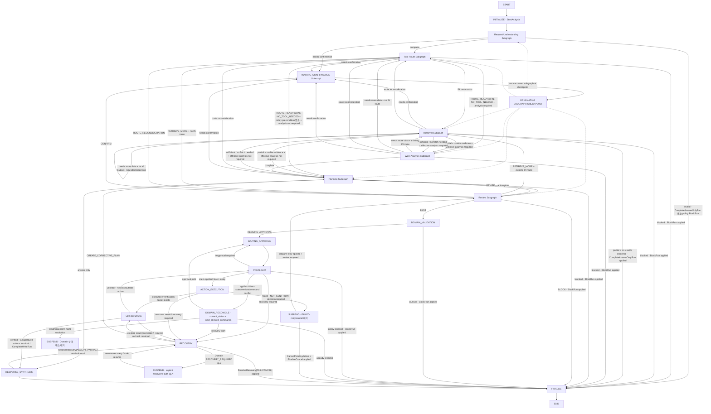

# 06. Google Work Agent · Agent · Workflow 설계서

> **2026-08-19 Canonical Sync — Runtime Closure**
>
> - `conversation_id`는 Main State 상속 Key가 아니다. Terminal Run 뒤 새 USER 요청은 새 `run_id + langgraph_thread_id + RunInputV1`로 시작한다.
> - 6개 native Agent Subgraph는 Parent/Main State 전체가 아니라 역할별 Typed Input Projection만 받으며 owner field + 허용 workflow signal만 patch merge한다.
> - Confirmation은 `RequestConfirmation → WAITING_CONFIRMATION → interrupt → ConfirmationResponseV1 검증 → ResumeConfirmation → same owner subgraph checkpoint` 순서다. 모든 확인을 Request Understanding부터 재시작하지 않는다.
> - Product Prompt resume 입력에는 originating owner의 bounded `confirmation_response`만 추가할 수 있다. Raw resume payload, `interrupt_id`, checkpoint metadata, `RegisteredResumeTargetRefV1`은 Prompt 입력이 아니다.
> - Planning은 frozen `ToolRoutePlanV2.output_plan.output_routes`를 순회해 `OutputToolRouteV1` **한 개씩** Argument Writer에 전달한다.
> - Planning LLM은 business arguments + evidence만 작성한다. Tool identity/effect, Action ID, dependency authority, approval, execution, expected verification authority는 결정적 코드가 소유한다.
> - Dependency는 frozen route order에서 **같은 stable external resource의 downstream Action**에만 결정적으로 생성하며 CREATE 또는 다른 Resource 사이에는 추론하지 않는다.
> - `planning.compose_dependencies` Product Prompt를 두지 않는다.
> - Review.REVISE는 affected route/action candidate만 다시 작성하고 unaffected candidate는 보존한 뒤 deterministic Plan Assembler가 `ActionPlanDraftV2`를 다시 만든다.

> **문서 기준:** `01 PRD v2.11`, `01-A v2.18`, `01-B v2.12`, `02 UI·UX v2.14`, `03 Architecture v3.7`, `04 Database v1.20`, `05 Retrieval v2.13`, `07 Interface v2.23`, Domain 상태 전이 계약 v1.5와 테스트 매트릭스 v1.5를 기준으로 한다.
>
> **상태:** Draft v7.20 · **기준일:** 2026-08-19 · **DB Schema:** v1.6 · **대상:** P0 MVP
>
> Main LangGraph는 결정적 Supervisor와 Versioned Typed Main State를 소유한다. 전문 Agent는 LangGraph Subgraph이며 Parent State에서 자기 책임에 필요한 필드만 Projection 받아 Local State를 단계적으로 채우고, 완료 시 공식 Typed Result만 Main State에 병합한다. Schema는 출력 가능 범위를 통제하고, State는 확정 정보를 기억하며, Prompt는 각 LLM Node의 단일 작업만 지시한다. 승인·실행·검증 사실은 SQLite Domain Store가 소유한다.

## 0. 먼저 이해할 것

- **Main Graph:** 전체 Run의 순서·분기·Interrupt·Back-edge를 결정하는 결정적 LangGraph Supervisor다.
- **Main State:** 다음 단계가 재사용해야 하는 확정된 Versioned Typed Result만 누적한다.
- **Agent Subgraph:** 하나의 전문 책임을 수행하는 LangGraph다. 내부에 여러 LLM·Deterministic Node와 Local State를 가질 수 있다.
- **Subgraph Local State:** 해당 invocation의 작업 메모리다. Parent에 자동 승계되지 않는다.
- **Node Input Projection:** Node가 실제로 필요한 State 필드만 전달한다. 모든 Node가 전체 State를 보지 않는다.
- **Schema:** Node·Subgraph가 만들 수 있는 구조와 닫힌 값을 통제한다.
- **Prompt:** 선택된 Node가 지금 해야 할 한 가지 판단·작성 작업만 지시한다.
- **Edge:** Node Result와 공식 State를 기준으로 코드가 결정한다. LLM 자유 텍스트가 다음 Node를 선택하지 않는다.
- **Tool Route:** IN에서 어떤 Connector·Resource·Read Tool을 사용할지, OUT으로 어떤 Connector·Resource·Effect·Tool을 사용할지 한 번 결정해 Main State에 저장한다. P0 첫 Connector는 Google Workspace다. Downstream Agent는 재선택하지 않는다.
- **Write:** 어떤 Agent Subgraph도 직접 실행하지 않는다.

## 1. Main LangGraph

### 1.1 Release 후보 기준 흐름



### 1.1-A 전역 Domain 상태 오버레이

- `REAUTH_REQUIRED`: Connector 접근 중 Credential 갱신 실패 시 checkpoint와 in-flight 사실을 보존하고 suspend한다. `ResumeAfterReauth` 후 저장된 안전 Phase로 돌아가며 이미 dispatch된 Write를 재전송하지 않는다.
- `CANCEL_REQUESTED`: Claim 전이면 미실행 Action·Approval을 정리하고 `FinalizeCancel`로 닫을 수 있다. Claim 이후 in-flight Action은 먼저 `EXECUTED | UNKNOWN_RESULT | FAILED`로 확정한다. cancel intent는 APPLIED `RequestCancel` Receipt에서 재구성한다.
- `RECOVERY_REQUIRED`: Recovery Node가 소유한다. 재검증, 부분 수용, corrective plan, cancel, fail 중 등록된 `ResolveRecovery`만 허용한다.
- `BLOCKED`: Claim 전 `BlockRun`이 실제 적용된 경우만 Terminal이다. in-flight Write 사실을 `BLOCKED`로 덮어쓰지 않는다.

### 1.1-B FINALIZE 계약

`FINALIZE`는 임의의 Run 상태 변경 Node가 아니다.

```text
Answer-only·처리 불가 안내 → CompleteAnswerOnlyRun → COMPLETED → FINALIZE
Policy block              → BlockRun → BLOCKED → FINALIZE
Write 정상 완료           → CompleteWriteRun → COMPLETED → FINALIZE
Cancel 완료               → FinalizeCancel → CANCELLED → FINALIZE
Recovery 실패             → ResolveRecovery(FAIL) → FAILED → FINALIZE
Recovery 부분 수용        → ResolveRecovery(ACCEPT_PARTIAL) → COMPLETED → FINALIZE
```

Run이 `WAITING_APPROVAL | VERIFYING | REAUTH_REQUIRED | RECOVERY_REQUIRED | CANCEL_REQUESTED` 같은 비Terminal 상태인데 대응 Domain Command가 적용되지 않았다면 `FINALIZE → END`로 진행하지 않고 suspend한다.

### 1.2 Main Supervisor 불변조건

- Supervisor는 **Workflow Controller**이며 업무 의미·Tool Argument·계획 내용을 생성하지 않는다.
- Agent는 다른 Agent/Subgraph를 직접 호출하지 않는다. 필요한 다음 단계는 Typed Disposition으로 Parent에 반환한다.
- 모든 공식 Result/Disposition은 정확히 하나의 다음 Edge·Interrupt·Terminal 경로를 가진다. bounded Schema Repair 뒤에도 알 수 없는 Enum·Version·Disposition이면 `RequireRecovery(CONTRACT_VIOLATION)`로 `RECOVERY_REQUIRED`에 두며 추측 Routing/FINALIZE를 금지한다.
- 공식 `NEEDS_CONFIRMATION`은 Application이 `RequestConfirmation`을 적용해 `WAITING_CONFIRMATION`을 만든 뒤 `owner_subgraph + RegisteredResumeTargetRefV1 + interrupt_id`를 checkpoint에 저장한다. 사용자 응답 검증 후 `ResumeConfirmation`으로 발생 전 안전 Domain 상태를 복원하고 같은 owner checkpoint에서 재개한다.
- Main State Artifact는 **단일 Owner + 다수 Consumer**다. downstream은 upstream을 직접 수정하지 않고 재판단이 필요하면 Owner로 Back-edge한다.
- `policy_confirmation_receipts`는 Agent Artifact가 아니다. 실제 interrupt 응답을 검증한 Application/Confirmation Controller만 append한다.
- Subgraph 반환은 전체 State 교체가 아니라 owner field + 허용 workflow signal의 patch merge다.
- Tool identity는 Tool Route가 소유하고 Planning의 결정적 Assembler가 복사한다. Argument Writer가 Tool을 재선택하지 않는다.
- Back-edge로 upstream revision이 바뀌면 `meta.based_on`으로 downstream freshness를 재판정한다.
- Signed Registry binding은 결정적 eligibility filtering만 허용한다. 후보가 하나면 코드가 확정하고 의미 선택이 필요한 복수 후보만 작은 LLM Node가 판단한다.
- 모든 외부 Connector READ는 `InputRoutePlanV1 → Retrieval`이 소유한다. 실제 호출은 결정적 Application Node가 Connector MCP Read Port/Tool을 사용한다. Provider API/SDK 직접 호출과 direct fallback은 금지한다.
- `TASK + CREATE`, `CALENDAR + CREATE`의 필수 Policy Precondition READ는 결정적으로 Route에 보강한다. 사용자 명시 범위를 넓혀야 하면 `SCOPE_EXPANSION_REQUIRED` Confirmation이 선행한다.
- `INITIALIZE`는 Run 생성 직후 `StartAnalysis: CREATED → ANALYZING`을 정확히 한 번 적용한다. `applied=false`이면 Request Agent를 호출하지 않고 Domain 상태를 조정한다.
- 새 Retrieval invocation에서 Run이 `ANALYZING | PLANNING`이면 `BeginRetrieval → RETRIEVING`; 같은 Retrieval local loop처럼 이미 `RETRIEVING`이면 반복하지 않는다.
- 새 Planning 진입에서 Run이 `ANALYZING | RETRIEVING`이면 `BeginPlanning → PLANNING`; 이미 `PLANNING`인 bounded revision에서는 반복하지 않는다.
- `PREFLIGHT applied=false`는 실행/FINALIZE로 fall-through하지 않는다. `current_status + next_allowed_commands`로 재승인·Recovery·Reauth·Cancel/in-flight·Terminal 중 하나를 결정적으로 조정한다.
- `ACTION_EXECUTION`: `EXECUTED`만 Verification, `UNKNOWN_RESULT`는 Recovery, `FAILED + NOT_SENT`는 retry/cancel 대기 suspend로 보낸다. `prepare_write_retry` 후 `MODIFIED → Review → Domain Validation → 새 Approval`을 다시 거친다.
- 승인형 Write의 첫 Verification은 `BeginVerification: WAITING_APPROVAL → VERIFYING`이다. 실행 중 취소 뒤 이미 반영된 결과는 `CANCEL_REQUESTED → VERIFYING`을 허용하되 durable cancel intent를 유지한다. 다중 Action DAG에서 Run이 이미 VERIFYING이면 `BeginVerification`을 반복하지 않는다.
- 각 종속 Action은 predecessor가 `VERIFIED`된 뒤에만 실행한다. 모든 승인 Action이 Terminal이고 미해결 결과가 없을 때 cancel intent가 없으면 `CompleteWriteRun`, 있으면 `FinalizeCancel`을 우선한다.
- 실행 중 Cancel은 즉시 Terminal Edge가 아니다. 새 Claim/Write를 막고 in-flight 결과를 먼저 확정하며, `UNKNOWN_RESULT`는 Recovery, `EXECUTED`는 Verification을 통과한다.
- Recovery는 기존 결과 회수/재검증이 필요할 때만 Verification으로 돌아간다. `CREATE_CORRECTIVE_PLAN`은 `RECOVERY_REQUIRED → PLANNING` Back-edge와 새 Plan Revision을 만든다. cancel intent가 활성인 동안 corrective-plan과 일반 accept-partial 완료를 금지한다.
- `workflow_phase`는 LangGraph routing/checkpoint 위치이며 Domain `Run.status`의 권위 복제본이 아니다. 충돌 시 Domain Store를 우선한다.

### 1.3 Supervisor Disposition → Edge 완전성

```text
Request.COMPLETE → Tool Route
Request.NEEDS_CONFIRMATION → interrupt(Request owner)
Request.INVALID → CompleteAnswerOnlyRun 또는 BlockRun → FINALIZE

ToolRoute.ROUTE_READY + IN 있음 → Retrieval
ToolRoute.ROUTE_READY + IN 없음 → Work Analysis 또는 Planning
ToolRoute.NO_TOOL_NEEDED → Work Analysis 또는 Planning
ToolRoute.NEEDS_CONFIRMATION → interrupt(Tool Route owner)
ToolRoute.BLOCKED → BlockRun → FINALIZE

Retrieval.SUFFICIENT / NO_FETCH_NEEDED → Work Analysis 또는 Planning
Retrieval.NEEDS_MORE_DATA + local budget → bounded Retrieval local loop
  - 이 Edge는 Parent Supervisor handoff가 아니라 Retrieval Subgraph 내부 Edge다.
  - self-loop 중 `workflow_signal`과 `RetrievalRequiredV1`을 만들지 않는다.
  - 다음 Page/Detail은 05 Retrieval v2.13의 `read_result_handle → Run Retrieval Cache` continuation 계약으로 결정적 Read Node가 resolve한다.
  - changed SEARCH는 `ConstraintDeltaV2`의 typed semantic value를 사용하며 결정적 `SourceFetchPlanBuilder`가 prior effective constraints와 merge한다. QueryAttempt의 이름 summary는 실행 권위가 아니다.
budget exhausted → NEEDS_CONFIRMATION | PARTIAL | BLOCKED 중 하나로 정규화
Retrieval.PARTIAL + usable Evidence → Work Analysis 또는 Planning
Retrieval.PARTIAL + usable Evidence 없음 → CompleteAnswerOnlyRun → FINALIZE
Retrieval.ROUTE_RECONSIDERATION_REQUIRED → Tool Route
Retrieval.NEEDS_CONFIRMATION → interrupt(Retrieval owner)
Retrieval.BLOCKED → BlockRun → FINALIZE

WorkAnalysis.COMPLETE → Planning
WorkAnalysis.NEEDS_MORE_DATA + current IN route → Retrieval
WorkAnalysis.NEEDS_MORE_DATA + no IN route → Tool Route
WorkAnalysis.ROUTE_RECONSIDERATION_REQUIRED → Tool Route
WorkAnalysis.NEEDS_CONFIRMATION → interrupt(Analysis owner)
WorkAnalysis.BLOCKED → BlockRun → FINALIZE

Planning.ANSWER_ONLY → Response Synthesis
Planning.PLAN_READY → Review
Planning.ROUTE_RECONSIDERATION_REQUIRED → Tool Route
Planning.NEEDS_CONFIRMATION → interrupt(Planning owner)
Planning.BLOCKED → BlockRun → FINALIZE

Review.PASS → Domain Validation
Review.REVISE → Planning
Review.RETRIEVE_MORE → Retrieval 또는 Tool Route
Review.ROUTE_RECONSIDERATION → Tool Route
Review.CONFIRM → interrupt(Review owner)
Review.BLOCK → BlockRun → FINALIZE
```

### 1.4 Graph Profile

<table fit-page-width="true" header-row="true">
	<tr>
		<td>Profile</td>
		<td>구조</td>
		<td>목적</td>
	</tr>
	<tr>
		<td>`SINGLE_BASELINE`</td>
		<td>통합 Agent Subgraph 1개. 요청 이해·Tool Route·Retrieval·업무 분석·계획·self-review 책임을 한 Subgraph 안에 배치한다.</td>
		<td>단일 Agent Baseline</td>
	</tr>
	<tr>
		<td>`THREE_STAGE`</td>
		<td>Agent Subgraph 3개. ① 요청 이해+Tool Route+Retrieval ② 업무 분석+Planning ③ 독립 Review</td>
		<td>계층형 3-Agent 후보</td>
	</tr>
	<tr>
		<td>`SIX_ROLE_BASELINE`</td>
		<td>Agent Subgraph 6개. Request Understanding / Tool Route / Retrieval / Work Analysis / Planning / Review</td>
		<td>최대 전문화 Multi-Agent Baseline</td>
	</tr>
</table>

공통 불변조건:

- Domain·Policy·승인·Claim·실행·검증·복구 코드는 모든 Profile에서 동일하다.
- Profile 간 독립변수는 책임의 Subgraph 분해 수준이다. Tool·Policy·Domain 안전 계약은 바꾸지 않는다.
- E06-A는 각 Profile의 자연스러운 Agent Invocation·LLM Call·Token·Latency를 측정한다.
- E06-B는 `CONTEXT_READY_V1` 호환 Snapshot을 사용해 post-retrieval reasoning 분해만 비교한다. Snapshot은 새 `RetrievalResultV1`에서 생성한다.
- Gold를 사용하는 Oracle 입력은 제품 후보가 아니라 상한 분석용이다.

## 2. Main Graph State

### 2.1 Main State 계약

```python
class SelectedResourceRefV1:
    source: Literal["GMAIL", "TASKS", "CALENDAR"]
    resource_id: str
    container_id: str | None

class RunInputV1:
    entry_mode: Literal["AGENT_SEARCH", "RESOURCE_SELECTED"]
    user_request: str
    selected_resource_refs: list[SelectedResourceRefV1]

WorkflowPhaseV2 = Literal[
    "INITIALIZE", "REQUEST_UNDERSTANDING", "TOOL_ROUTING", "RETRIEVAL",
    "WORK_ANALYSIS", "PLANNING", "REVIEW", "DOMAIN_VALIDATION",
    "WAITING_CONFIRMATION", "WAITING_APPROVAL", "PREFLIGHT", "ACTION_EXECUTION",
    "VERIFICATION", "RECOVERY", "RESPONSE_SYNTHESIS", "FINALIZE"
]

class MultiAgentGraphStateV2:
    schema_version: Literal[2]
    run_id: str
    conversation_id: str
    thread_id: str
    workflow_phase: WorkflowPhaseV2
    run_input: RunInputV1

    request_intent: RequestIntentV2 | None
    tool_route_plan: ToolRoutePlanV2 | None
    retrieval_result: RetrievalResultV1 | None
    work_analysis_result: WorkAnalysisResultV2 | None
    planning_result: AnswerDraftV2 | ActionPlanDraftV2 | None
    plan_review: PlanReviewResultV2 | None

    approved_plan_id: str | None
    execution_summary: ExecutionSummaryV1 | None
    verification_summary: VerificationSummaryV1 | None

    policy_confirmation_receipts: list[PolicyConfirmationReceiptV1]
    workflow_signal: WorkflowSignalV1 | None
    retry_budget: RunBudgetV2
    prompt_context: PromptContextV1
    trace_context: TraceContextV1
```

### 2.2 Main State에 저장하는 것

Main State에는 다음 단계가 재사용해야 하는 **Run 입력과 공식 결과**만 둔다. `run_input`은 사용자가 이번 Run에 실제로 제출한 요청과 Entry Context의 기준점이며 downstream이 임의로 변경하지 않는다.

```text
run_input
→ request_intent
→ tool_route_plan
→ retrieval_result
→ work_analysis_result
→ planning_result
→ plan_review
→ approval / execution / verification reference
```

저장하지 않는 것:

- LLM raw completion
- Prompt 원문
- Repair 중간 candidate
- Query 후보 전체
- Page Token
- 전체 Gmail·Calendar·Tasks 원문
- RAG 후보 전체와 내부 score 전체
- Subgraph 내부 임시 validation state
- 아직 확정되지 않은 confirmation/reconsideration용 candidate (이 값은 `workflow_signal`로만 전달)

대용량 원문과 세부 Retrieval 후보는 Run Retrieval Cache Handle로 참조한다.

### 2.3 State Owner

<table fit-page-width="true" header-row="true">
	<tr>
		<td>Main State</td>
		<td>유일한 Owner</td>
		<td>Downstream 사용 규칙</td>
	</tr>
	<tr>
		<td>`run_input`</td>
		<td>Run 생성 경계</td>
		<td>읽기 전용. 사용자 새 입력/Interrupt Resume에서만 새 값 또는 명시적 continuation을 만든다</td>
	</tr>
	<tr>
		<td>`request_intent`</td>
		<td>Request Understanding</td>
		<td>읽기만 가능. 변경 필요 시 Request Subgraph 재진입</td>
	</tr>
	<tr>
		<td>`tool_route_plan`</td>
		<td>Tool Route</td>
		<td>Retrieval은 IN, Planning은 OUT만 소비. 직접 변경 금지</td>
	</tr>
	<tr>
		<td>`retrieval_result`</td>
		<td>Retrieval</td>
		<td>Analysis·Planning·Review가 Evidence Reference로 소비</td>
	</tr>
	<tr>
		<td>`work_analysis_result`</td>
		<td>Work Analysis</td>
		<td>Planning이 업무 사실·관계로 소비</td>
	</tr>
	<tr>
		<td>`planning_result`</td>
		<td>Planning</td>
		<td>Review·Domain Validation이 소비</td>
	</tr>
	<tr>
		<td>`plan_review`</td>
		<td>Review</td>
		<td>Supervisor·Domain Validation이 소비</td>
	</tr>
</table>

### 2.4 Revision·Invalidation

공식 State Artifact는 `artifact_id`, `revision`, `based_on`을 가진다.

```python
class StateArtifactRefV1:
    artifact_id: str
    revision: int

class StateArtifactMetaV1:
    artifact_id: str
    revision: int
    based_on: list[StateArtifactRefV1]
```

규칙:

- Supervisor는 각 Artifact의 `meta.based_on`이 현재 active revision과 일치하는지 확인한다. 불일치하면 존재하더라도 stale로 취급한다.
- 하드코딩된 “X 변경 시 A/B/C 무효화” 목록은 설명용일 뿐 권위가 아니다. 실제 stale 계산은 dependency reference로 수행한다.
- `InputRoutePlanV1` 변경은 이를 기반으로 한 Retrieval·Analysis·Planning·Review를 stale 처리할 수 있다.
- `OutputPlanV1`만 변경되면 Retrieval은 유효하게 유지하고 Planning·Review만 stale 처리한다.
- `retrieval_result` revision이 바뀌면 이를 참조한 Analysis·Planning·Review가 stale이다.
- `work_analysis_result`가 바뀌면 이를 참조한 Planning·Review가 stale이다.
- Domain Store의 Approval·ExecutionAttempt·Verification 사실은 Graph State invalidation으로 소급 변경하지 않는다.

## 3. Typed Schema 계약

### 3.1 RequestIntentV2

Request Understanding은 사용자 요청의 의미만 구조화한다. 실제 Tool을 선택하지 않는다.

```python
class ConstraintV1:
    kind: Literal["PERSON", "EMAIL", "DATE", "TIME", "RESOURCE", "SCOPE", "USER_REQUIREMENT"]
    field: str
    value: str | list[str]

class AmbiguityV1:
    requires_confirmation: bool
    reason_codes: list[str]
    missing_fields: list[str]

class RequestIntentV2:
    schema_version: Literal[2]
    meta: StateArtifactMetaV1
    goal: str
    completion_conditions: list[str]
    constraints: list[ConstraintV1]
    requested_effect_hints: list[Literal["READ", "CREATE", "UPDATE", "SEND", "DELETE"]]
    requested_resource_hints: list[str]
    analysis_requirement: Literal["NONE", "REQUIRED"]
    ambiguity: AmbiguityV1
```

- `requested_*_hints`는 사용자 요청의 의미 힌트이며 Registry Tool 이름이 아니다.
- `analysis_requirement=NONE`은 단순 답변·조회·직접 Action처럼 입력만으로 Arguments가 충분하고 관계·충돌·파생 사실 해석이 필요 없는 경우다.
- `REQUIRED`는 관계, 누락 업무, 중복·충돌, 일정/마감 위험, 파생 사실 등 업무 해석이 필요한 경우다. ACTION 자체만으로 `REQUIRED`를 강제하지 않는다. 다만 Task Create 중복검사와 Calendar Create 충돌검사는 Policy Precondition이므로 effective analysis가 필요하다.

### 3.2 ToolRoutePlanV2

Tool Route는 한 invocation에서 IN/OUT 의미를 확정하되 두 결과를 독립 revision Artifact로 보존한다.

```python
class InputRoutePlanV1:
    schema_version: Literal[1]
    meta: StateArtifactMetaV1
    input_routes: list[InputToolRouteV1]

class AnswerOutputPlanV1:
    schema_version: Literal[1]
    meta: StateArtifactMetaV1
    output_mode: Literal["ANSWER"]

class ActionOutputPlanV1:
    schema_version: Literal[1]
    meta: StateArtifactMetaV1
    output_mode: Literal["ACTION"]
    output_routes: list[OutputToolRouteV1]  # minItems=1

OutputPlanV1 = AnswerOutputPlanV1 | ActionOutputPlanV1

class ToolRoutePlanV2:
    schema_version: Literal[2]
    input_plan: InputRoutePlanV1
    output_plan: OutputPlanV1
    tool_registry_version: str

class InputToolRouteV1:
    route_id: str
    resource_type: str
    connector_id: str
    allowed_read_tool_ids: list[str]
    required: bool
    reason_codes: list[str]

class OutputToolRouteV1:
    route_id: str
    resource_type: str
    connector_id: str
    effect: Literal["CREATE", "UPDATE", "SEND", "DELETE"]
    selected_tool_id: str
    reason_codes: list[str]
```

- `ANSWER` branch에는 `output_routes` 필드 자체가 없다. `ACTION` branch는 최소 1개 Output Route가 필요하다.
- Planning과 Retrieval은 Tool을 재선택하지 않는다. Route 변경은 명시적 Tool Route back-edge에서만 허용한다.
- Tool Route 내부는 `determine_io_resources → deterministic registry eligibility binding → select_tool_if_needed(복수 후보일 때만) → finalize → validate`로 분리한다.
- `input_plan`과 `output_plan`은 independent revision/freshness 단위다.

### 3.3 RetrievalResultV1

```python
class MissingInformationV1:
    code: str
    description: str
    required_for: Literal["RETRIEVAL", "ANALYSIS", "PLANNING", "USER_CONFIRMATION"]

class RetrievalSourceStatusV1:
    route_id: str
    status: Literal["COMPLETE", "PARTIAL", "FAILED", "NOT_ATTEMPTED"]
    reason_codes: list[str]

class RetrievalResultV1:
    schema_version: Literal[1]
    meta: StateArtifactMetaV1
    coverage: Literal["SUFFICIENT", "PARTIAL", "NO_FETCH_NEEDED"]
    context_bundle_ref: str | None
    evidence_refs: list[str]
    selected_segment_ids: list[str]
    source_resource_refs: list[str]
    source_statuses: list[RetrievalSourceStatusV1]
    missing_information: list[MissingInformationV1]
    retrieval_rounds: int
```

Raw Query Plan·Page Token·read result handle·RAG 후보 전체·내부 score는 Retrieval Local State 또는 Run Cache에 둔다. `PARTIAL`은 usable evidence가 있으면 coverage를 유지한 채 Analysis/Planning으로 넘기고 usable evidence가 없으면 Finalize한다. Retrieval이 직접 Answer 내용을 작성하지 않는다.

### 3.4 WorkAnalysisResultV2

```python
class WorkFactV1:
    fact_id: str
    fact_type: str
    value: str | list[str]
    evidence_refs: list[str]

class WorkRelationV1:
    relation_type: str
    left_ref: str
    right_ref: str
    evidence_refs: list[str]
    validator_codes: list[str]

class WorkAmbiguityV1:
    code: str
    description: str
    evidence_refs: list[str]

class WorkRiskV1:
    code: str
    severity: Literal["INFO", "WARNING", "BLOCKING"]
    description: str
    evidence_refs: list[str]

class WorkAnalysisResultV2:
    schema_version: Literal[2]
    meta: StateArtifactMetaV1
    work_facts: list[WorkFactV1]
    relations: list[WorkRelationV1]
    ambiguities: list[WorkAmbiguityV1]
    risks: list[WorkRiskV1]
    evidence_refs: list[str]
    policy_confirmation_receipt_refs: list[StateArtifactRefV1]
    action_necessity: Literal["REQUIRED", "NOT_REQUIRED"]
```

업무 분석은 Evidence의 의미와 관계를 해석하지만 Tool 선택·Tool Arguments·정책 최종 판정을 하지 않는다. `DUPLICATES`·`CONFLICTS_WITH` 같은 최종 관계는 LLM 후보를 그대로 승격하지 않고 결정적 validator를 통과한 경우에만 공식 Result에 포함한다.

### 3.5 Planning Result

```python
CanonicalArguments = dict[str, JsonValue]  # Tool별 Versioned Schema로 검증된 canonical object

class ToolArgumentCandidateV1:
    route_id: str
    tool_id: str
    arguments: CanonicalArguments

class ActionDependencyCandidateV1:
    action_id: str
    depends_on_action_id: str
    reason: str

class AnswerDraftV2:
    schema_version: Literal[2]
    meta: StateArtifactMetaV1
    answer: str
    evidence_refs: list[str]

class ActionPlanDraftV2:
    schema_version: Literal[2]
    meta: StateArtifactMetaV1
    actions: list[PlannedActionV2]

class PlannedActionV2:
    action_id: str
    route_id: str
    tool_id: str
    effect: Literal["CREATE", "UPDATE", "SEND", "DELETE"]
    arguments: CanonicalArguments
    evidence_refs: list[str]
    depends_on_action_ids: list[str]
```

불변조건:

- `tool_id`와 `effect`는 `ActionOutputPlanV1.output_routes`의 고정값을 결정적 Assembler가 복사한다.
- Planning LLM은 새로운 Tool 이름을 만들거나 Route를 변경하지 않는다.
- Argument Writer는 `user_request + one OutputToolRouteV1 + selected Tool Schema + optional Analysis + evidence refs`만 받는다.
- Answer Composer는 `user_request + request_intent + optional analysis + evidence refs`를 받는다.
- 여러 Action의 최종 Typed Plan 조립과 dependency validation은 결정적 코드가 수행한다.

### 3.6 PlanReviewResultV2

Review는 판정 종류에 따라 필요한 필드가 다르므로 discriminated union으로 제한한다.

```python
class ReviewIssueV1:
    code: str
    description: str
    action_id: str | None

class ReviewEvidenceGapV1:
    code: str
    description: str
    required_information: list[str]

class ReviewRouteIssueV1:
    code: str
    description: str
    route_id: str | None

class ReviewConfirmationV1:
    reason_code: str
    question: str
    options: list[str]

class ReviewBlockerV1:
    code: str
    description: str

class ReviewBaseV2:
    schema_version: Literal[2]
    meta: StateArtifactMetaV1

class ReviewPassV2(ReviewBaseV2):
    status: Literal["PASS"]
    summary: str

class ReviewReviseV2(ReviewBaseV2):
    status: Literal["REVISE"]
    issues: list[ReviewIssueV1]

class ReviewRetrieveMoreV2(ReviewBaseV2):
    status: Literal["RETRIEVE_MORE"]
    evidence_gaps: list[ReviewEvidenceGapV1]

class ReviewRouteReconsiderationV2(ReviewBaseV2):
    status: Literal["ROUTE_RECONSIDERATION"]
    route_issues: list[ReviewRouteIssueV1]

class ReviewConfirmV2(ReviewBaseV2):
    status: Literal["CONFIRM"]
    confirmation: ReviewConfirmationV1

class ReviewBlockV2(ReviewBaseV2):
    status: Literal["BLOCK"]
    blockers: list[ReviewBlockerV1]

PlanReviewResultV2 = (
    ReviewPassV2 | ReviewReviseV2 | ReviewRetrieveMoreV2
    | ReviewRouteReconsiderationV2 | ReviewConfirmV2 | ReviewBlockV2
)
```

- `PASS + confirmation`처럼 계약상 불가능한 조합을 Schema 단계에서 표현할 수 없게 한다.
- Review는 Plan 품질을 검토하지만 실행 허용의 최종 권위가 아니다.

### 3.7 WorkflowSignalV1
확정 업무 Artifact와 흐름 제어 요청을 분리한다.
```python
class RegisteredResumeTargetRefV1:
    subgraph_id: Literal["REQUEST_UNDERSTANDING", "TOOL_ROUTE", "RETRIEVAL", "WORK_ANALYSIS", "PLANNING", "REVIEW"]
    node_id: str
    graph_version: str

class ConfirmationRequiredV1:
    kind: Literal["CONFIRMATION_REQUIRED"]
    interrupt_id: str
    owner_subgraph: str
    resume_target: RegisteredResumeTargetRefV1
    question: str
    options: list[str]

class RouteReconsiderationRequiredV1:
    kind: Literal["ROUTE_RECONSIDERATION_REQUIRED"]
    reason_codes: list[str]

class RetrievalNeedV1:
    required_information: str
    reason_codes: list[str]

class RetrievalRequiredV1:
    kind: Literal["RETRIEVAL_REQUIRED"]
    reason_codes: list[str]
    needs: list[RetrievalNeedV1]

class BlockedSignalV1:
    kind: Literal["BLOCKED"]
    reason_codes: list[str]

WorkflowSignalV1 = ConfirmationRequiredV1 | RouteReconsiderationRequiredV1 | RetrievalRequiredV1 | BlockedSignalV1
```
Confirmation resume는 `owner_subgraph + resume_target + interrupt_id`로 결정하며 모든 확인 응답을 Request Understanding으로 되돌리지 않는다. Review `REVISE`는 별도 미정의 Signal을 만들지 않고 `ReviewReviseV2.issues`를 Planning Projection으로 전달한다.

`RetrievalNeedV1`은 다른 Subgraph가 Retrieval owner에게 **추가로 필요한 정보의 의미**만 전달하는 최소 handoff다. `required_information`은 비어 있을 수 없고 `reason_codes`는 최소 1개여야 한다. Connector·Resource·Tool·raw query·page token·MCP argument를 이 타입에 넣지 않는다. Work Analysis `NEEDS_MORE_DATA`와 Review `RETRIEVE_MORE`는 결정적 Projection으로 `RetrievalNeedV1[] → RetrievalRequiredV1`을 만든다. Retrieval 자신의 `NEEDS_MORE_DATA`는 `RetrievalRequiredV1`을 만들지 않고 같은 frozen IN Route에서 bounded local loop를 수행한다. 현재 IN Route로 충족할 수 없으면 `RouteReconsiderationRequiredV1`을 사용한다.

`RegisteredResumeTargetRefV1`의 authority는 active compiled Main Graph의 Resume Target Registry다. Registry는 Graph composition/compile boundary가 소유하며 LLM·Agent 자유 문자열·사용자 입력은 `subgraph_id`, `node_id`, `graph_version`을 발급할 수 없다. `graph_version`은 compiled Main Graph의 **resume-contract version**이며 Prompt·Dataset·DB Schema·Tool Registry version과 별개다. 등록 가능한 subgraph/node 또는 interrupt-resume topology가 바뀌면 새 graph version을 사용한다. Checkpoint의 `graph_version`이 현재 Registry와 다르거나 target이 등록되지 않았으면 임의 node로 resume하지 않고 Unknown Contract fail-closed 경로를 따른다.

`ConfirmationRequiredV1.options=[]`는 자유 텍스트 응답을 뜻하고, 하나 이상의 option이 있으면 등록된 값 중 하나만 허용하는 닫힌 선택 응답을 뜻한다. 닫힌 선택에서 임의 텍스트를 승인·정책 동의로 추측하지 않는다. Core workflow truth는 `workflow_signal + LangGraph checkpoint + Domain confirmation state`이며, 기존 UI/API가 `UserInterruptV1` 형태를 요구하는 경우에만 Canonical confirmation state에서 **one-way presentation projection**으로 만들 수 있다. `UserInterruptV1`을 Main State의 독립 workflow authority로 저장하지 않는다.

#### PolicyConfirmationReceiptV1
```python
class PolicyConfirmationReceiptV1:
    schema_version: Literal[1]
    meta: StateArtifactMetaV1
    confirmation_receipt_id: str
    interrupt_id: str
    confirmation_kind: Literal["SCOPE_EXPANSION", "DUPLICATE_OVERRIDE", "CONFLICT_OVERRIDE"]
    decision: Literal["APPROVED", "DECLINED"]
    decision_context_hash: str
    affected_route_ids: list[str]
    affected_resource_refs: list[str]
```
이 Receipt는 LLM/Agent가 만들 수 없고 Application/Confirmation Controller만 실제 사용자 응답을 검증해 생성한다.

### 3.8 Subgraph 반환 Envelope

```python
class SubgraphReturnV2[T]:
    disposition: str
    typed_result: T | None
    workflow_signal: WorkflowSignalV1 | None
```

규칙:

- Schema·Contract가 완결된 공식 `typed_result`만 Main State의 해당 Owner field에 병합한다. 성공 disposition이 아니어도 독립적으로 유효한 `PARTIAL` Retrieval Result나 Review Result는 저장할 수 있다.
- confirmation·route 재검토·block처럼 아직 완결되지 않은 candidate는 업무 Artifact로 저장하지 않고 Typed `workflow_signal`로만 전달한다.
- `workflow_signal`은 다음 Subgraph의 Node Input Projection에 필요한 경우에만 전달한다.

## 4. Agent Subgraph 공통 계약

### 4.1 Agent와 LLM Call

- **Agent:** Main Supervisor가 호출하는 LangGraph Subgraph다.
- **Role:** 해당 Subgraph가 Main State에 추가하는 공식 결과와 책임 경계다.
- **Node:** Subgraph 내부의 한 단계다. LLM Node 또는 Deterministic Node일 수 있다.
- **LLM Call:** 모델 추론 1회다. Agent 수·Node 수와 동일하지 않다.
- **Local State:** 해당 Subgraph invocation 안에서 단계적으로 채워지는 작업 메모리다.
- **Node Projection:** Local/Main State 중 현재 Node에 필요한 Typed 필드만 전달하는 입력 계약이다.

### 4.2 공통 Runtime Envelope

```python
class AgentRuntimeEnvelopeV2:
    schema_version: Literal[2]
    agent_role: str
    invocation_id: str
    node_state: str
    attempt_no: int
    schema_repair_count: int
    semantic_revision_count: int
    failure_record: AgentFailureRecord | None
    disposition: str | None
```

이 Envelope는 모든 Agent의 공통 실행 metadata만 가진다. 업무 데이터는 범용 `input_projection: dict` 하나에 몰지 않고 **Subgraph별 Typed Local State**에 둔다.

### 4.3 Node Input Projection 원칙

예를 들어 Main State가 `A=request_intent`, `B=tool_route`, `C=retrieval_result`, `D=work_analysis`를 갖더라도 모든 Node가 `A+B+C+D`를 받지 않는다.

```text
Tool Route determine resources ← request_intent
Retrieval plan_query          ← request_intent + tool_route.input_routes
Retrieval RAG select          ← request_intent + fetched segment handles
Retrieval sufficiency         ← request_intent + selected evidence
Work Analysis fact extraction ← request_intent + evidence
Planning argument writer      ← tool_route.output_route + work_analysis + evidence refs
Review inspect                ← request_intent + action_plan + evidence/policy summary
```

Node는 자신의 Output Schema에 필요한 최소 State만 본다. Request Subgraph는 `run_input`을 projection하고, Back-edge로 재진입한 Subgraph는 필요한 `workflow_signal`만 추가 projection한다.

### 4.3-A Prompt Runtime Contract Closure (2026-08-18)

- Retrieval Product Prompt에는 raw `user_request`를 별도 권위 입력으로 재주입하지 않는다.
- `select_evidence`는 `request_intent + ranked/top RAG candidates`만 소비한다.
- `assess_sufficiency`도 Retrieval 내부의 typed intent/evidence projection만 소비한다.
- Prompt Slot topology는 Workflow가 숫자로 소유하지 않는다. 실제 Runtime caller와 deterministic owner를 기준으로 `15 Prompt Contract`가 Active/Retired PromptRef를 정규화한다.

### 4.4 Local Loop

- Schema Repair는 해당 Node의 Output Shape만 고친다.
- Semantic Revision은 같은 Subgraph 책임 안에서만 수행한다.
- 다른 전문 책임이 필요한 경우 Subgraph 내부에서 다른 Agent를 호출하지 않고 Parent disposition을 반환한다.
- Repair Budget은 호출당 최대 1회를 기본으로 한다.

## 5. 전문 Agent Subgraph

### 5.1 책임 표

<table fit-page-width="true" header-row="true">
	<tr>
		<td>Agent Subgraph</td>
		<td>유일한 책임</td>
		<td>금지</td>
		<td>Parent 반환</td>
	</tr>
	<tr>
		<td>Request Understanding</td>
		<td>사용자 목표·완료조건·제약·모호성 구조화</td>
		<td>Tool 선택·Google 조회·Action 작성</td>
		<td>`RequestIntentV2`</td>
	</tr>
	<tr>
		<td>Tool Route</td>
		<td>IN Resource/Read Tool 범위와 OUT Resource/Effect/Tool 결정</td>
		<td>Query 작성·Evidence 판단·Arguments 작성</td>
		<td>`ToolRoutePlanV2`</td>
	</tr>
	<tr>
		<td>Retrieval</td>
		<td>고정된 IN Route에서 Query→Read→RAG→Evidence→Sufficiency</td>
		<td>OUT Tool 변경·업무 의미 최종 해석·Write</td>
		<td>`RetrievalResultV1`</td>
	</tr>
	<tr>
		<td>Work Analysis</td>
		<td>Evidence를 업무 사실·관계·모호성·위험으로 해석</td>
		<td>Tool 선택·Arguments 작성·정책 최종 판정</td>
		<td>`WorkAnalysisResultV2`</td>
	</tr>
	<tr>
		<td>Planning</td>
		<td>고정된 OUT Route를 실제 Answer 또는 Tool Arguments/Action Plan으로 표현</td>
		<td>Tool 재선택·승인·실행</td>
		<td>`AnswerDraftV2` 또는 `ActionPlanDraftV2`</td>
	</tr>
	<tr>
		<td>Review</td>
		<td>목표·근거·과잉·모순·실행 가능성 검토</td>
		<td>Tool 실행·Domain 허용 최종 판정</td>
		<td>`PlanReviewResultV2`</td>
	</tr>
</table>

### 5.1.1 Subgraph Local Candidate Schema

Local State도 LLM 자유 `dict`를 저장하지 않고 Node 책임에 맞는 Typed Candidate를 사용한다.

```python
class RequestGoalCandidateV1:
    goal: str
    completion_conditions: list[str]
    constraints: list[ConstraintV1]
    requested_effect_hints: list[Literal["READ", "CREATE", "UPDATE", "SEND", "DELETE"]]
    requested_resource_hints: list[str]
    analysis_requirement: Literal["NONE", "REQUIRED"]

class RouteResourceCandidateV1:
    input_resource_types: list[str]
    output_resource_types: list[str]
    output_effects: list[Literal["CREATE", "UPDATE", "SEND", "DELETE"]]

class RegistryRouteCandidatesV1:
    route_id: str
    eligible_tool_ids: list[str]
```

### 5.2 Request Understanding Subgraph

```text
START
→ identify_goal
→ detect_ambiguity
→ finalize_intent
→ validate
→ END
```

권장 Local State:

```python
class RequestUnderstandingStateV2:
    user_request: str
    entry_mode: Literal["AGENT_SEARCH", "RESOURCE_SELECTED"]
    selected_resource_refs: list[SelectedResourceRefV1]
    goal_candidate: RequestGoalCandidateV1 | None
    ambiguity_candidate: AmbiguityV1 | None
    final_intent: RequestIntentV2 | None
```

각 LLM Node는 목표 파악 또는 모호성 판단 중 자기 책임만 수행한다. 구현에서 한 호출로 합치는 Profile이 존재해도 Output Contract의 의미 책임은 분리해 평가한다.

### 5.3 Tool Route Subgraph

```text
START
→ determine_io_resources
→ bind_registry_candidates
→ select_tool_if_needed
→ finalize_route
→ validate_route
→ END
```

권장 Local State:

```python
class ToolRouteStateV1:
    request_intent: RequestIntentV2
    registry_snapshot_ref: str
    io_resource_candidate: RouteResourceCandidateV1 | None
    registry_candidates: list[RegistryRouteCandidatesV1]
    bound_input_routes: list[InputToolRouteV1]
    bound_output_routes: list[OutputToolRouteV1]
    final_route: ToolRoutePlanV2 | None
```

- `determine_io_resources`: 사용자 의미에서 IN Resource와 OUT Resource·Effect만 판단하며 실제 Tool 이름을 생성하지 않는다.
- `bind_registry_candidates`: Signed Tool Registry에서 해당 Resource·Effect를 수행할 수 있는 실제 Tool 후보를 결정적으로 결합한다.
- Registry 후보가 하나면 추가 LLM 호출 없이 자동 선택한다.
- 후보가 여러 개일 때만 `select_tool_if_needed`가 **그 Route의 Registry 후보 안에서** 하나를 고른다. 전체 Registry를 임의로 축소하거나 새 Tool 이름을 만들지 않는다.
- 확정 Route를 Main State에 병합한 뒤 downstream은 Tool을 다시 선택하지 않는다.

### 5.4 Retrieval Subgraph

Retrieval은 **Run-scoped RAG**를 포함한다. 영구 Vector Index는 필수가 아니지만, Google에서 가져온 후보를 그대로 LLM에 전달하지 않고 관련 Segment를 Retrieval/Reranking하여 Evidence를 구성한다.

```text
START
→ plan_query
→ build_query
→ execute_read
→ normalize_segment
→ rag_retrieve_rerank
→ select_evidence
→ assess_sufficiency
→ finalize_retrieval
→ END
```

권장 Local State:

```python
class RetrievalStateV2:
    request_intent: RequestIntentV2
    input_route_ref: StateArtifactRefV1
    input_routes: list[InputToolRouteV1]
    query_plan: RetrievalQueryPlanV2 | None
    query_attempts: list[QueryAttempt]
    source_statuses: list[SourceRetrievalStatusV1]
    read_result_handles: list[str]
    segment_handles: list[str]
    availability_results: list[AvailableIntervalV1]
    rag_candidates: list[RagCandidateV1]
    evidence_selection: EvidenceSelectionResultV2 | None
    sufficiency: SufficiencyResultV2 | None
    final_result: RetrievalResultV1 | None
```

Node 입력:

- `plan_query`: `request_intent + input_routes + retrieval_budget`; follow-up에서만 `current_round_no + prior QueryAttempt + unresolved SufficiencyIssueV2 + bounded read-result summary` 추가
- `build_query`: `RetrievalQueryPlanV2 + input_routes + prior SourceFetchPlanV1` — deterministic. INITIAL/CHANGED SEARCH를 검증·merge해 `SourceFetchPlanV1`과 query identity를 materialize한다.
- `execute_read`: 검증된 Query + `allowed_read_tool_ids` — deterministic
- `normalize_segment`: Read Result Handle — deterministic
- `rag_retrieve_rerank`: `request_intent + segment_handles`
- `select_evidence`: `request_intent + top rag candidates`
- `assess_sufficiency`: `request_intent + selected evidence`

같은 IN Route 안에서 Query·Page·상세 조회를 추가하는 것은 Retrieval Subgraph Local Loop다. 새로운 Provider/Resource Route가 필요하면 `ROUTE_RECONSIDERATION_REQUIRED`를 Parent에 반환한다.

### 5.5 Work Analysis Subgraph

```text
START
→ extract_work_facts
→ resolve_relations
→ assess_analysis_gaps
→ assemble_analysis
→ validate
→ END
```

권장 Local State:

```python
class WorkAnalysisStateV2:
    user_request: str
    request_intent: RequestIntentV2
    evidence_refs: list[str]
    fact_candidates: list[WorkFactV1]
    relation_candidates: list[WorkRelationV1]
    validated_relations: list[WorkRelationV1]
    relation_validation_ambiguities: list[WorkAmbiguityV1]
    ambiguity_candidates: list[WorkAmbiguityV1]
    final_analysis: WorkAnalysisResultV2 | None
```

- `extract_work_facts`: Evidence에 명시되거나 근거로 추론 가능한 업무 사실만 구조화한다.
- `resolve_relations`: 사람·업무·날짜·의존성·중복·충돌 관계만 분석한다.
- Tool·Action Arguments는 생성하지 않는다.

- `validate_relations`: 결정적 Node다. `DUPLICATES`·`CONFLICTS_WITH` 후보를 정규화된 Source 데이터와 Calendar availability/Task 현재 상태로 검증한다. LLM 후보만으로 정확 중복·충돌을 확정하지 않는다.
- `WorkAnalysisResultV2.relations`에는 `validated_relations`만 들어갈 수 있다. 유사 후보·검증 불가 관계는 ambiguity/risk/추가 확인으로 남긴다.
- 정확 중복은 기본 `action_necessity=NOT_REQUIRED`다. 사용자가 추가 생성을 원하면 `DUPLICATE_OVERRIDE_REQUIRED`, 검증된 일정 충돌을 Override하려면 `CONFLICT_OVERRIDE_REQUIRED` 2차 Confirmation을 요구한다. 승인 후 결과는 현재 Context에 유효한 `policy_confirmation_receipt_refs`를 포함한다.


### 5.6 Planning Subgraph

Planning 진입 시 Tool Route는 이미 확정되어 있다.

```text
START
→ choose_answer_or_action_from_route (deterministic)
→ [ANSWER] compose_answer
→ [ACTION] compose_arguments_per_output_route
→ [ACTION] compose_dependencies_if_needed
→ assemble_plan
→ validate
→ END
```

권장 Local State:

```python
class PlanningStateV2:
    user_request: str
    request_intent: RequestIntentV2
    output_plan: OutputPlanV1
    work_analysis: WorkAnalysisResultV2 | None
    evidence_refs: list[str]
    argument_candidates: list[ToolArgumentCandidateV1]
    dependency_candidates: list[ActionDependencyCandidateV1]
    final_result: AnswerDraftV2 | ActionPlanDraftV2 | None
```

규칙:

- `compose_arguments_per_output_route`는 현재 Route의 `selected_tool_id`와 해당 Tool Schema만 본다.
- 19개 Tool 전체를 Planning Node에 다시 노출해 Tool을 재선택하게 하지 않는다.
- Tool Candidate shortlisting을 Planning에서 수행하지 않는다. Tool 선택 책임은 Tool Route가 이미 소유한다.
- Arguments 작성과 다중 Action Dependency 판단은 분리할 수 있다.
- 최종 `ActionPlanDraftV2` 조립은 결정적 Application Node가 수행한다.

### 5.7 Review Subgraph

```text
START
→ inspect
→ validate
→ [REVISE 이후] recheck
→ END
```

- Function/Tool Calling을 사용할 수 있으나 Adapter는 `name + arguments`의 일반 계약만 알고 Domain Result 매핑은 Application Layer가 수행한다.
- `PASS`, `REVISE`, `RETRIEVE_MORE`, `ROUTE_RECONSIDERATION`, `CONFIRM`, `BLOCK`은 함수 이름 또는 닫힌 Schema로 구조적으로 제한한다.
- Review가 Route 오류를 발견해도 `tool_route_plan`을 직접 변경하지 않는다.

## 6. Workflow Phase

Main Phase는 전문 책임 경계만 표현한다.

```text
INITIALIZE
REQUEST_UNDERSTANDING
WAITING_CONFIRMATION
TOOL_ROUTING
RETRIEVAL
WORK_ANALYSIS
PLANNING
REVIEW
DOMAIN_VALIDATION
WAITING_APPROVAL
PREFLIGHT
ACTION_EXECUTION
VERIFICATION
RESPONSE_SYNTHESIS
RECOVERY
FINALIZE
```

Query 계획·Read 실행·RAG Evidence 선택·Sufficiency는 Main Phase가 아니라 Retrieval Subgraph 내부 Node State다.

Run Status는 기존 Domain 계약의 `CREATED, ANALYZING, RETRIEVING, WAITING_CONFIRMATION, PLANNING, WAITING_APPROVAL, EXECUTING, VERIFYING, CANCEL_REQUESTED, CANCELLED, REAUTH_REQUIRED, RECOVERY_REQUIRED, COMPLETED, BLOCKED, FAILED`를 유지한다.

## 7. Node Result·Edge 계약

- Request Understanding: `COMPLETE | NEEDS_CONFIRMATION | INVALID`
- Tool Route: `ROUTE_READY | NO_TOOL_NEEDED | NEEDS_CONFIRMATION | BLOCKED`
- Retrieval: `SUFFICIENT | NO_FETCH_NEEDED | NEEDS_MORE_DATA | NEEDS_CONFIRMATION | ROUTE_RECONSIDERATION_REQUIRED | PARTIAL | BLOCKED`
- Work Analysis: `COMPLETE | NEEDS_MORE_DATA | NEEDS_CONFIRMATION | ROUTE_RECONSIDERATION_REQUIRED | BLOCKED`
- Planning: `ANSWER_ONLY | PLAN_READY | NEEDS_CONFIRMATION | ROUTE_RECONSIDERATION_REQUIRED | BLOCKED`
- Review: `PASS | REVISE | RETRIEVE_MORE | ROUTE_RECONSIDERATION | CONFIRM | BLOCK`
- Domain: `ALLOW_READ | REQUIRE_APPROVAL | BLOCK`

결정적 Edge:

```text
Request COMPLETE → Tool Route
Tool Route ROUTE_READY + IN 있음 → Retrieval
Tool Route ROUTE_READY + IN 없음 + `analysis_requirement=NONE` + ANSWER → Planning
Tool Route ROUTE_READY + IN 없음 + effective analysis required → Work Analysis
Tool Route NO_TOOL_NEEDED + `analysis_requirement=NONE` → Planning(answer)
Tool Route NO_TOOL_NEEDED + `analysis_requirement=REQUIRED` → Work Analysis → Planning(answer)
Retrieval SUFFICIENT/NO_FETCH_NEEDED + effective analysis required → Work Analysis
Retrieval SUFFICIENT/NO_FETCH_NEEDED + `analysis_requirement=NONE` + ANSWER → Planning
Retrieval NEEDS_MORE_DATA + local budget → Retrieval local loop (Parent 반환 없음, workflow_signal 없음)
Retrieval NEEDS_MORE_DATA + budget exhausted → Confirmation 또는 PARTIAL/BLOCKED를 정책에 따라 반환
Retrieval ROUTE_RECONSIDERATION_REQUIRED → Tool Route (RouteReconsiderationRequiredV1 전달)
Analysis NEEDS_MORE_DATA → Retrieval (RetrievalRequiredV1 전달)
Analysis ROUTE_RECONSIDERATION_REQUIRED → Tool Route (RouteReconsiderationRequiredV1 전달)
Analysis COMPLETE → Planning
Planning ANSWER_ONLY → Response Synthesis
Planning PLAN_READY → Review
Planning ROUTE_RECONSIDERATION_REQUIRED → Tool Route
Review REVISE → Planning (ReviewReviseV2.issues 전달)
Review RETRIEVE_MORE → Retrieval (RetrievalRequiredV1 전달)
Review ROUTE_RECONSIDERATION → Tool Route (RouteReconsiderationRequiredV1 전달)
Review PASS → Domain Validation
```

## 8. Tasks 시간 의미

- Request Understanding은 `~까지`를 실제 업무 `business_deadline` 후보로, `~에 하다`를 Task `scheduled_date` 후보로 구분해 의미 힌트로 구조화한다.
- Work Analysis가 Evidence와 사용자 요청을 결합해 실제 `business_deadline`·`scheduled_date` 의미를 확정한다.
- 두 값을 자동 동일시하지 않는다.
- 업무 마감만 확인되면 Task 예정일이나 Google `due`를 생성하지 않는다.
- 정확한 시간 구간이 필요한 요청은 Tasks API가 시간을 설정했다고 성공 선언하지 않는다. 필요한 경우 사용자 확인을 거쳐 Tool Route 재검토로 Calendar Event 대안을 별도 Action으로 제안할 수 있다.
- 예정일 경과는 완료 근거가 아니다. 완료 여부는 실제 Provider status에서만 판단한다.

## 9. Answer-only / READ / WRITE

### 9.1 Answer-only

`ToolRoutePlanV2.output_mode=ANSWER`이고 외부 IN Route가 없으면 Retrieval을 건너뛸 수 있다.

```text
Request → Tool Route → Planning.answer → COMPLETED
```

### 9.2 Read-backed Answer

```text
Request → Tool Route(IN only) → Retrieval/RAG → [필요할 때만 Work Analysis] → Planning.answer → COMPLETED
```

일반 Retrieval API 호출은 Action Row를 만들지 않는다. `ALLOW_READ`는 기존 명시적 READ Action/Domain 호환 경로에만 남기며, 새 표준 Retrieval-backed Answer는 Domain Action을 만들지 않고 Planning.answer에서 Response로 간다.

### 9.3 WRITE

```text
Request → Tool Route(IN/OUT) → Retrieval → Work Analysis → Planning(arguments only)
→ Review → Domain Validation → Approval → Claim → MCP Write → Verification
```

승인 이후 Tool·Effect·Arguments·Target을 LLM이 변경하지 않는다.

## 10. Retry·Recovery·Interrupt

### 10.1 Retry Kind

```text
SCHEMA_REPAIR
SEMANTIC_REVISION
WORKFLOW_REDIRECTION
DETERMINISTIC_RETRY
DETERMINISTIC_RECOVERY
```

- Schema Repair는 현재 Node Output Shape만 교정한다.
- Semantic Revision은 같은 Subgraph 책임 범위에서만 허용한다.
- 다른 책임이 필요하면 Workflow Redirection을 사용한다.
- 401·429·5xx·Timeout은 일반 코드 Retry·Reauth 대상이다.
- `UNKNOWN_RESULT`와 Verification `MISMATCH`는 LLM 재계획 대상이 아니다.

### 10.2 Interrupt

- `WAITING_CONFIRMATION`
- `WAITING_APPROVAL`
- `REAUTH_REQUIRED`
- `RECOVERY_REQUIRED`

Interrupt 전에 Main Checkpoint를 저장하고 같은 Thread에서 재개한다.

## 11. Budget

```text
SCHEMA_REPAIR_PER_NODE_CALL=1
SEMANTIC_REVISION_SAME_FAILURE=1
MAX_ADDITIONAL_RETRIEVAL_ROUNDS=2
PLANNING_REVISION_PER_RUN=2
REVIEW_RECHECK_PER_PLANNING_REVISION=1
NORMAL_TARGET_LLM_CALLS<=10
ABSOLUTE_MAX_LLM_CALLS=16
```

- 책임 분리를 위해 Subgraph 내부 Node 수가 증가해도 모든 Node가 LLM Call일 필요는 없다.
- Query Builder, Registry Binding, Read 실행, Segment Normalize, Plan Assembly, Validator는 결정적 코드 우선이다.
- LLM Call 수가 Agent 수 또는 Node 수와 같다고 가정하지 않는다.

## 12. 실행·검증 경계

READ:

```text
publish_read_only_plan
→ claim_read_action
→ complete_read_action
→ finalize_read_action
```

READ Action은 Approval·ExecutionAttempt·Verification Row를 만들지 않는다.

WRITE:

```text
PROPOSED | MODIFIED
→ approve_action
→ APPROVED
→ claim_action_execution
→ EXECUTING
→ MCP Write
→ EXECUTED | FAILED | UNKNOWN_RESULT
→ Google re-read Verification
→ VERIFIED | MISMATCH
```

Claim 전 Write 금지. 승인 이후 인자를 LLM이 재생성하지 않는다.

FAILED:

```text
FAILED → prepare_write_retry → MODIFIED → 새 승인 → 새 Attempt
```

UNKNOWN_RESULT:

```text
CREATE → Recovery Fingerprint Search
UPDATE → Target GET
SEND/DELETE → blind repeat 금지
```

## 13. Agent Failure 계약

`15. Agent Capability · Failure · Prompt 공통 계약 v1.23`을 따른다.

```python
class AgentFailureRecord:
    failure_reason_code: str
    failure_origin: str
    detected_by: str
    runtime_disposition: Literal[
        "RETRYABLE", "REDIRECT", "DETERMINISTIC", "TERMINAL", "NOT_AVAILABLE"
    ]
    experiment_disposition: str
    affected_field_paths: list[str]
```

Tool 관련 실패 Owner:

- `TOOL_ROUTE_WRONG_INPUT`
- `TOOL_ROUTE_WRONG_OUTPUT`
- `TOOL_ROUTE_UNREGISTERED_TOOL`
- `TOOL_ROUTE_EFFECT_MISMATCH`

Planning에서 발견된 Tool 불일치는 `TOOL_ROUTE_EFFECT_MISMATCH` 또는 대응 Route failure로 정규화하고 Tool Route 재검토로 redirect한다.

## 14. Node Registry

Node Registry는 **Subgraph와 Node의 실제 책임**을 나타내며 Prompt 수와 동일하지 않다.

<table fit-page-width="true" header-row="true">
	<tr>
		<td>node_id</td>
		<td>subgraph</td>
		<td>type</td>
		<td>주요 입력</td>
		<td>주요 출력</td>
	</tr>
	<tr>
		<td>`request.identify_goal`</td>
		<td>request_understanding</td>
		<td>LLM</td>
		<td>request</td>
		<td>goal candidate</td>
	</tr>
	<tr>
		<td>`request.detect_ambiguity`</td>
		<td>request_understanding</td>
		<td>LLM/conditional</td>
		<td>request + goal</td>
		<td>ambiguity</td>
	</tr>
	<tr>
		<td>`request.finalize`</td>
		<td>request_understanding</td>
		<td>deterministic</td>
		<td>local candidates</td>
		<td>`RequestIntentV2`</td>
	</tr>
	<tr>
		<td>`route.determine_resources`</td>
		<td>tool_route</td>
		<td>LLM</td>
		<td>`RequestIntentV2`</td>
		<td>IN/OUT resource·effect candidate</td>
	</tr>
	<tr>
		<td>`route.bind_candidates`</td>
		<td>tool_route</td>
		<td>deterministic</td>
		<td>resource/effect candidate + Registry</td>
		<td>registry candidates</td>
	</tr>
	<tr>
		<td>`route.select_tool`</td>
		<td>tool_route</td>
		<td>LLM/conditional</td>
		<td>route candidate + registered candidates</td>
		<td>selected candidate</td>
	</tr>
	<tr>
		<td>`route.finalize`</td>
		<td>tool_route</td>
		<td>deterministic</td>
		<td>selected candidate + Registry</td>
		<td>`ToolRoutePlanV2`</td>
	</tr>
	<tr>
		<td>`route.validate`</td>
		<td>tool_route</td>
		<td>deterministic</td>
		<td>final route</td>
		<td>validated route</td>
	</tr>
	<tr>
		<td>`retrieval.plan_query`</td>
		<td>retrieval</td>
		<td>LLM</td>
		<td>intent + input routes</td>
		<td>`RetrievalQueryPlanV2`</td>
	</tr>
	<tr>
		<td>`retrieval.build_query`</td>
		<td>retrieval</td>
		<td>deterministic</td>
		<td>query plan + route</td>
		<td>validated query</td>
	</tr>
	<tr>
		<td>`retrieval.execute_read`</td>
		<td>retrieval</td>
		<td>deterministic</td>
		<td>query + allowed read tools</td>
		<td>read handles</td>
	</tr>
	<tr>
		<td>`retrieval.normalize_segments`</td>
		<td>retrieval</td>
		<td>deterministic</td>
		<td>read handles</td>
		<td>segment handles</td>
	</tr>
	<tr>
		<td>`retrieval.rag_retrieve`</td>
		<td>retrieval</td>
		<td>deterministic/optional model</td>
		<td>intent + segments</td>
		<td>ranked candidates</td>
	</tr>
	<tr>
		<td>`retrieval.select_evidence`</td>
		<td>retrieval</td>
		<td>LLM</td>
		<td>intent + ranked candidates</td>
		<td>`EvidenceSelectionResultV2`</td>
	</tr>
	<tr>
		<td>`retrieval.assess_sufficiency`</td>
		<td>retrieval</td>
		<td>LLM</td>
		<td>intent + evidence</td>
		<td>`SufficiencyResultV2`</td>
	</tr>
	<tr>
		<td>`retrieval.finalize`</td>
		<td>retrieval</td>
		<td>deterministic</td>
		<td>local results</td>
		<td>`RetrievalResultV1`</td>
	</tr>
	<tr>
		<td>`analysis.extract_facts`</td>
		<td>work_analysis</td>
		<td>LLM</td>
		<td>intent + evidence</td>
		<td>work facts</td>
	</tr>
	<tr>
		<td>`analysis.resolve_relations`</td>
		<td>work_analysis</td>
		<td>LLM/conditional</td>
		<td>facts + evidence</td>
		<td>relations/ambiguities</td>
	</tr>
	<tr>
		<td>`analysis.finalize`</td>
		<td>work_analysis</td>
		<td>deterministic</td>
		<td>local analysis</td>
		<td>`WorkAnalysisResultV2`</td>
	</tr>
	<tr>
		<td>`planning.compose_answer`</td>
		<td>planning</td>
		<td>LLM</td>
		<td>intent + analysis + evidence</td>
		<td>`AnswerDraftV2`</td>
	</tr>
	<tr>
		<td>`planning.compose_arguments`</td>
		<td>planning</td>
		<td>LLM/tool-schema</td>
		<td>output route + analysis + evidence</td>
		<td>tool arguments</td>
	</tr>
	<tr>
		<td>`planning.compose_dependencies`</td>
		<td>planning</td>
		<td>LLM/conditional</td>
		<td>planned actions</td>
		<td>dependency candidate</td>
	</tr>
	<tr>
		<td>`planning.assemble`</td>
		<td>planning</td>
		<td>deterministic</td>
		<td>route + arguments + dependencies</td>
		<td>`ActionPlanDraftV2`</td>
	</tr>
	<tr>
		<td>`review.inspect`</td>
		<td>review</td>
		<td>LLM/tool-calling</td>
		<td>intent + plan + evidence/policy</td>
		<td>review decision</td>
	</tr>
	<tr>
		<td>`review.validate`</td>
		<td>review</td>
		<td>deterministic</td>
		<td>review candidate</td>
		<td>`PlanReviewResultV2`</td>
	</tr>
	<tr>
		<td>`review.recheck`</td>
		<td>review</td>
		<td>LLM/conditional</td>
		<td>revised plan + prior issue</td>
		<td>`PlanReviewResultV2`</td>
	</tr>
</table>

## 15. 구현 순서

```text
1. Main LangGraph Phase·Edge·Back-edge 재정의
2. MultiAgentGraphStateV2와 State Owner·Invalidation 구현
3. RequestIntentV2 / ToolRoutePlanV2 / RetrievalResultV1 / WorkAnalysisResultV2 / PlanningResult Schema
4. Main↔Subgraph Typed Projection/Handoff
5. Tool Route Subgraph
6. Retrieval Subgraph + Run-scoped RAG
7. Work Analysis Subgraph Node 분해
8. Planning Subgraph에서 Tool 선택 제거 + Arguments/Assembler 분리
9. Review Subgraph 호환 정리
10. Node별 Contract Stability Gate
11. Prompt/Repair 최종 정합
12. E01~E08 실험
```

구현은 Graph→State→Schema→Subgraph→Node→Edge Validator→Prompt 순서를 지킨다.

## 16. Prompt Registry

Prompt는 구조가 확정된 뒤 마지막으로 정합한다.

Prompt 선택 Key:

```text
agent_role
subgraph_name
node_name
node_state
purpose
input_schema_version
output_schema_version
```

PromptRef:

```text
prompt_bundle_version
prompt_id
prompt_version
content_hash
agent_role
subgraph_name
node_name
node_state
purpose
input_schema_version
output_schema_version
```

규칙:

- Supervisor는 Prompt 원문을 읽거나 선택하지 않는다.
- 선택된 LLM Node가 Prompt Registry에서 PromptRef를 확정한다.
- Prompt는 해당 Node가 받은 Projection 밖의 State를 가정하지 않는다.
- Prompt는 다른 Subgraph의 책임을 다시 수행하도록 지시하지 않는다.
- Tool Route 이후 Retrieval·Planning Prompt가 Tool을 재선택하도록 지시하지 않는다.
- Repair·Revision은 별도 Purpose를 사용하고 호출당 최대 1회 Schema Repair를 기본으로 한다.
- Prompt 원문·Completion 원문은 Main Graph State·일반 Trace·Audit에 저장하지 않는다.
- 실행·검증·승인·정책 판정에는 LLM Prompt를 사용하지 않는다.
- 신규/변경 Prompt는 Node DEV/HOLDOUT·Safety Gate 전 `RUNTIME_ACTIVE`로 승격하지 않는다.

## Attachment Agent 경계

- 첨부파일 기능을 별도 Agent Capability로 만들지 않는다.
- Agent는 파일명·MIME Type·크기·Attachment/Stage Descriptor 같은 Metadata만 사용할 수 있다.
- 첨부파일 bytes는 Main State, Agent Local State, ContextBundle, Evidence, Prompt 입력에 포함하지 않는다.
- 실제 Download·Staging·MIME 조립은 결정적 Application·MCP 경계가 수행한다.
- ClaimContextV2 생성·검증은 Agent Node가 아니라 공통 결정적 Execution Engine 책임이다.

## PHASE 7.5 · analysis requirement와 effective analysis 정합화

Request Understanding의 `analysis_requirement`와 실제 Work Analysis 호출 여부를 분리한다.

```text
request_analysis_required
= RequestIntentV2.analysis_requirement == REQUIRED

policy_precondition_analysis_required
= TASK+CREATE duplicate check
  OR CALENDAR+CREATE conflict check
  OR 그 밖의 결정적 policy precondition이 명시적으로 요구하는 analysis

effective_analysis_required
= request_analysis_required OR policy_precondition_analysis_required
```

- 단순 lookup·직접 Action이라는 이유만으로 `analysis_requirement=REQUIRED`를 강제하지 않는다.
- Task CREATE/Calendar CREATE의 duplicate/conflict 검사는 Request Understanding의 의미 분석 요구가 아니라 downstream deterministic Policy Precondition이다.
- Supervisor는 `output_mode=ACTION` 자체가 아니라 `effective_analysis_required`로 Work Analysis 호출 여부를 결정한다.
